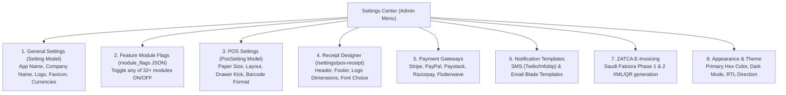

# Admin Dashboard & Company Settings Architecture

This manual covers the Admin Panel Dashboard metric calculation engine, dynamic widget layout system, and the Company Administration Settings workflow.

---

## 1. Admin Panel Dashboard Architecture

Located at `DashboardController.php` and rendered via `src/pages/dashboard/`, the executive dashboard coordinates real-time KPIs, financial summaries, and interactive charts.

### 1.1 KPI Calculation Engine & Formulas

```
+---------------------------------------------------------------------------------------+
| DASHBOARD METRIC TILES                                                                |
+-------------------+--------------------+--------------------+-------------------------+
| TOTAL REVENUE     | TOTAL PURCHASES    | EXPENSES           | NET PROFIT              |
| $145,280.00       | $82,400.00         | $12,350.00         | $50,530.00              |
| ▲ +12.4% vs last  | ▼ -3.2% vs last    | ▲ +1.1% vs last    | (Revenue - COGS - Exp)  |
+-------------------+--------------------+--------------------+-------------------------+
```

1. **Gross Sales Revenue**:
   $$\text{Revenue} = \sum (\text{sales.GrandTotal}) - \sum (\text{sale\_returns.GrandTotal})$$
2. **Cost of Goods Sold (COGS)** (via `CalculatesCogsAndAverageCost` trait):
   Calculated per line item using the moving average unit purchase cost at the time of sale.
3. **Net Profit**:
   $$\text{Net Profit} = \text{Gross Revenue} - \text{COGS} - \sum (\text{expenses.amount})$$
4. **Current Stock Asset Valuation**:
   $$\text{Stock Asset Value} = \sum (\text{product\_warehouse.qte} \times \text{products.cost})$$

### 1.2 Dynamic Dashboard Customization Engine

Stocky allows company admins to customize the visual structure of the dashboard without code changes, stored in the `settings` table:

*   **`dashboard_grid_layout`**: JSON grid coordinates defining widget positions and column widths (e.g. 2-column vs 3-column).
*   **`dashboard_section_order`**: Reorderable JSON array specifying the vertical sequence of sections:
    ```json
    ["kpi_cards", "sales_purchases_chart", "payment_donut", "top_products", "stock_alerts", "cash_flow"]
    ```
*   **`dashboard_font_family`**: Dynamic font stack applied to charts and metric tiles (e.g. `Poppins`, `Inter`, `Roboto`).
*   **`dashboard_font_size`**: Base font size scaling (`small`, `medium`, `large`).

### 1.3 Chart Data Pipelines

| Chart Widget | Library | Data Endpoint | Visual Representation |
| :--- | :--- | :--- | :--- |
| **Sales & Purchases Trends** | ApexCharts Area | `GET /api/dashboard_data` -> `sales`, `purchases` | Dual gradient area curves comparing sales vs purchase orders over date range |
| **Payment Flow** | ApexCharts Bar | `dashboard_data` -> `payments` | Stacked bars showing cash in vs cash out |
| **Payment Method Distribution**| ApexCharts Donut | `dashboard_data` -> `sales_by_payment` | Donut breakdown (Cash %, Card %, Transfer %, Credit %) |
| **Top 5 Selling Products** | Horizontal Bar | `dashboard_data` -> `product_report` | Ranked products by quantity and revenue |
| **3D Category Explorer** | ECharts-GL | `/reports/sales-3d-dashboard` | WebGL 3D volumetric cylinder chart showing categories vs sales volume |

---

## 2. Company Admin Settings Workflow

All global company settings are handled through `SettingsController.php` and stored across dedicated models.



### 2.1 Dynamic Module Toggle Engine (`module_flags`)
Admins can disable any ERP module entirely (e.g. disable Hospital, School, Fleet for a pure retail store). Stored in `settings.module_flags` as a JSON key-value map:
```json
{
  "hospital": false,
  "school": false,
  "fleet": false,
  "mrp": true,
  "accounting_v2": true,
  "woocommerce": false
}
```
When disabled, the sidebar menu node is hidden automatically via `src/stores/menu.js` and the corresponding API endpoints return `403 Forbidden`.

### 2.2 POS & Receipt Designer Settings (`pos_settings` Table)

| Field Name | Type | Options & Meaning |
| :--- | :--- | :--- |
| **`receipt_layout`** | String | `standard`, `bilingual` (English + Arabic), `compact` |
| **`receipt_paper_size`** | String | `80mm` (Standard thermal roll) or `58mm` (Mobile roll) |
| **`receipt_font_family`** | String | `Inter`, `Roboto`, `Ubuntu`, or browser monospace |
| **`receipt_font_size`** | Unsigned TinyInt | Base font size in pixels (e.g. `11`, `12`, `14`) |
| **`cash_drawer_auto_open`** | Boolean | Kicks the RJ11 cash drawer via ESC/POS hex pulse upon payment completion |
| **`direct_network_printing`**| Boolean | Bypasses browser print dialog using direct raw TCP socket (Port 9100) or QZ-Tray |
| **`show_barcode`** | Boolean | Prints barcode of invoice number at the bottom of the receipt |
| **`show_customer`** | Boolean | Includes customer name and current loyalty points balance |

### 2.3 Appearance & Theme Customizer Engine

Managed via `Customizer.vue` and stored in `localStorage` + `settings` table:
*   **`primaryColor`**: Custom hex code (default `#6d28d9`). Immediately updates Ant Design's CSS-in-JS design tokens.
*   **`themeMode`**:
    *   `light`: `#ffffff` surfaces with `#fafafa` layout background.
    *   `dark`: `#141414` elevated surfaces with `#000000` base background via Ant Design's `darkAlgorithm`.
    *   `auto`: Automatically syncs with browser `prefers-color-scheme`.
*   **`direction`**: Full **RTL (Right-to-Left)** support for Arabic (`ar`), Hebrew (`he`), Farsi (`fa`), and Urdu (`ur`).
