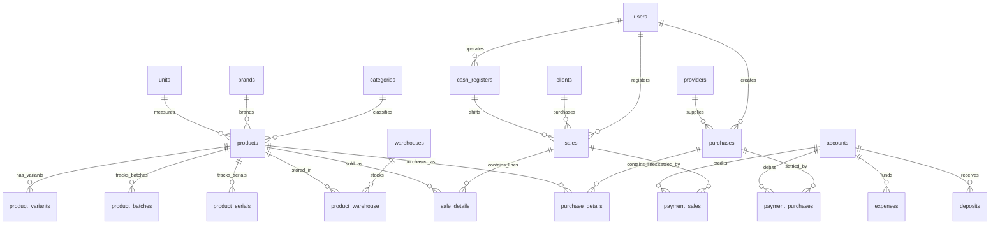

# Master Database Schema & Complete SQL DDL Architecture

This manual provides the comprehensive, copy-pasteable MySQL/MariaDB database DDL schemas, table structures, indexes, foreign key constraints, and 3-decimal precision specifications required to build the entire Stocky database from scratch.

---

## 1. High-Level Entity Relationship Diagram (ERD)



---

## 2. Complete Production SQL DDL (All Core Tables)

Run this SQL script to create the complete schema with full relational integrity and `DECIMAL(16, 3)` monetary accuracy:

```sql
SET FOREIGN_KEY_CHECKS = 0;

-- --------------------------------------------------------
-- 1. AUTHENTICATION & ACCESS CONTROL (RBAC)
-- --------------------------------------------------------

CREATE TABLE IF NOT EXISTS `roles` (
  `id` INT UNSIGNED AUTO_INCREMENT PRIMARY KEY,
  `name` VARCHAR(191) NOT NULL,
  `label` VARCHAR(191) NULL,
  `status` TINYINT(1) NOT NULL DEFAULT 1,
  `description` TEXT NULL,
  `created_at` TIMESTAMP NULL,
  `updated_at` TIMESTAMP NULL,
  `deleted_at` TIMESTAMP NULL
) ENGINE=InnoDB DEFAULT CHARSET=utf8mb4 COLLATE=utf8mb4_unicode_ci;

CREATE TABLE IF NOT EXISTS `permissions` (
  `id` INT UNSIGNED AUTO_INCREMENT PRIMARY KEY,
  `name` VARCHAR(191) NOT NULL UNIQUE,
  `label` VARCHAR(191) NULL,
  `description` TEXT NULL,
  `created_at` TIMESTAMP NULL,
  `updated_at` TIMESTAMP NULL
) ENGINE=InnoDB DEFAULT CHARSET=utf8mb4 COLLATE=utf8mb4_unicode_ci;

CREATE TABLE IF NOT EXISTS `permission_role` (
  `id` INT UNSIGNED AUTO_INCREMENT PRIMARY KEY,
  `permission_id` INT UNSIGNED NOT NULL,
  `role_id` INT UNSIGNED NOT NULL,
  INDEX (`permission_id`),
  INDEX (`role_id`),
  CONSTRAINT `fk_perm_role_permission` FOREIGN KEY (`permission_id`) REFERENCES `permissions` (`id`) ON DELETE CASCADE,
  CONSTRAINT `fk_perm_role_role` FOREIGN KEY (`role_id`) REFERENCES `roles` (`id`) ON DELETE CASCADE
) ENGINE=InnoDB DEFAULT CHARSET=utf8mb4 COLLATE=utf8mb4_unicode_ci;

CREATE TABLE IF NOT EXISTS `users` (
  `id` INT UNSIGNED AUTO_INCREMENT PRIMARY KEY,
  `firstname` VARCHAR(191) NOT NULL,
  `lastname` VARCHAR(191) NOT NULL,
  `username` VARCHAR(191) NOT NULL UNIQUE,
  `email` VARCHAR(191) NOT NULL UNIQUE,
  `password` VARCHAR(191) NOT NULL,
  `avatar` VARCHAR(191) DEFAULT 'avatar-default.jpg',
  `phone` VARCHAR(191) NULL,
  `role_id` INT UNSIGNED NOT NULL,
  `statut` TINYINT(1) NOT NULL DEFAULT 1,
  `is_all_warehouses` TINYINT(1) NOT NULL DEFAULT 0,
  `record_view` TINYINT(1) NOT NULL DEFAULT 1,
  `remember_token` VARCHAR(100) NULL,
  `created_at` TIMESTAMP NULL,
  `updated_at` TIMESTAMP NULL,
  `deleted_at` TIMESTAMP NULL,
  INDEX (`role_id`),
  CONSTRAINT `fk_users_role` FOREIGN KEY (`role_id`) REFERENCES `roles` (`id`)
) ENGINE=InnoDB DEFAULT CHARSET=utf8mb4 COLLATE=utf8mb4_unicode_ci;

CREATE TABLE IF NOT EXISTS `warehouses` (
  `id` INT UNSIGNED AUTO_INCREMENT PRIMARY KEY,
  `name` VARCHAR(191) NOT NULL,
  `city` VARCHAR(191) NULL,
  `mobile` VARCHAR(191) NULL,
  `zip` VARCHAR(191) NULL,
  `email` VARCHAR(191) NULL,
  `country` VARCHAR(191) NULL,
  `created_at` TIMESTAMP NULL,
  `updated_at` TIMESTAMP NULL,
  `deleted_at` TIMESTAMP NULL
) ENGINE=InnoDB DEFAULT CHARSET=utf8mb4 COLLATE=utf8mb4_unicode_ci;

CREATE TABLE IF NOT EXISTS `user_warehouse` (
  `user_id` INT UNSIGNED NOT NULL,
  `warehouse_id` INT UNSIGNED NOT NULL,
  PRIMARY KEY (`user_id`, `warehouse_id`),
  CONSTRAINT `fk_uw_user` FOREIGN KEY (`user_id`) REFERENCES `users` (`id`) ON DELETE CASCADE,
  CONSTRAINT `fk_uw_warehouse` FOREIGN KEY (`warehouse_id`) REFERENCES `warehouses` (`id`) ON DELETE CASCADE
) ENGINE=InnoDB DEFAULT CHARSET=utf8mb4 COLLATE=utf8mb4_unicode_ci;

-- --------------------------------------------------------
-- 2. PRODUCT CATALOG & INVENTORY MASTER
-- --------------------------------------------------------

CREATE TABLE IF NOT EXISTS `categories` (
  `id` INT UNSIGNED AUTO_INCREMENT PRIMARY KEY,
  `code` VARCHAR(191) NOT NULL,
  `name` VARCHAR(191) NOT NULL,
  `created_at` TIMESTAMP NULL,
  `updated_at` TIMESTAMP NULL,
  `deleted_at` TIMESTAMP NULL
) ENGINE=InnoDB DEFAULT CHARSET=utf8mb4 COLLATE=utf8mb4_unicode_ci;

CREATE TABLE IF NOT EXISTS `brands` (
  `id` INT UNSIGNED AUTO_INCREMENT PRIMARY KEY,
  `name` VARCHAR(191) NOT NULL,
  `description` VARCHAR(191) NULL,
  `image` VARCHAR(191) DEFAULT 'no-image.png',
  `created_at` TIMESTAMP NULL,
  `updated_at` TIMESTAMP NULL,
  `deleted_at` TIMESTAMP NULL
) ENGINE=InnoDB DEFAULT CHARSET=utf8mb4 COLLATE=utf8mb4_unicode_ci;

CREATE TABLE IF NOT EXISTS `units` (
  `id` INT UNSIGNED AUTO_INCREMENT PRIMARY KEY,
  `name` VARCHAR(191) NOT NULL,
  `ShortName` VARCHAR(191) NOT NULL,
  `base_unit` INT UNSIGNED NULL,
  `operator` CHAR(1) DEFAULT '*',
  `operation_value` DECIMAL(16, 3) DEFAULT 1.000,
  `created_at` TIMESTAMP NULL,
  `updated_at` TIMESTAMP NULL,
  `deleted_at` TIMESTAMP NULL
) ENGINE=InnoDB DEFAULT CHARSET=utf8mb4 COLLATE=utf8mb4_unicode_ci;

CREATE TABLE IF NOT EXISTS `products` (
  `id` INT UNSIGNED AUTO_INCREMENT PRIMARY KEY,
  `code` VARCHAR(191) NOT NULL UNIQUE,
  `Type_barcode` VARCHAR(191) DEFAULT 'CODE128',
  `name` VARCHAR(191) NOT NULL,
  `cost` DECIMAL(16, 3) NOT NULL,
  `price` DECIMAL(16, 3) NOT NULL,
  `category_id` INT UNSIGNED NOT NULL,
  `brand_id` INT UNSIGNED NULL,
  `unit_id` INT UNSIGNED NULL,
  `unit_sale_id` INT UNSIGNED NULL,
  `unit_purchase_id` INT UNSIGNED NULL,
  `TaxNet` DECIMAL(16, 3) DEFAULT 0.000,
  `tax_method` VARCHAR(191) DEFAULT '1', -- 1 = Exclusive, 2 = Inclusive
  `image` TEXT NULL,
  `note` TEXT NULL,
  `stock_alert` DECIMAL(16, 3) DEFAULT 0.000,
  `is_variant` TINYINT(1) DEFAULT 0,
  `is_imei` TINYINT(1) DEFAULT 0,
  `not_selling` TINYINT(1) DEFAULT 0,
  `is_active` TINYINT(1) DEFAULT 1,
  `created_at` TIMESTAMP NULL,
  `updated_at` TIMESTAMP NULL,
  `deleted_at` TIMESTAMP NULL,
  INDEX (`category_id`),
  INDEX (`brand_id`),
  CONSTRAINT `fk_prod_category` FOREIGN KEY (`category_id`) REFERENCES `categories` (`id`),
  CONSTRAINT `fk_prod_brand` FOREIGN KEY (`brand_id`) REFERENCES `brands` (`id`)
) ENGINE=InnoDB DEFAULT CHARSET=utf8mb4 COLLATE=utf8mb4_unicode_ci;

CREATE TABLE IF NOT EXISTS `product_variants` (
  `id` INT UNSIGNED AUTO_INCREMENT PRIMARY KEY,
  `product_id` INT UNSIGNED NOT NULL,
  `name` VARCHAR(191) NOT NULL,
  `code` VARCHAR(191) NOT NULL,
  `cost` DECIMAL(16, 3) DEFAULT 0.000,
  `price` DECIMAL(16, 3) DEFAULT 0.000,
  `created_at` TIMESTAMP NULL,
  `updated_at` TIMESTAMP NULL,
  `deleted_at` TIMESTAMP NULL,
  INDEX (`product_id`),
  CONSTRAINT `fk_variant_product` FOREIGN KEY (`product_id`) REFERENCES `products` (`id`) ON DELETE CASCADE
) ENGINE=InnoDB DEFAULT CHARSET=utf8mb4 COLLATE=utf8mb4_unicode_ci;

CREATE TABLE IF NOT EXISTS `product_warehouse` (
  `id` INT UNSIGNED AUTO_INCREMENT PRIMARY KEY,
  `product_id` INT UNSIGNED NOT NULL,
  `warehouse_id` INT UNSIGNED NOT NULL,
  `product_variant_id` INT UNSIGNED NULL,
  `qte` DECIMAL(16, 3) NOT NULL DEFAULT 0.000,
  `created_at` TIMESTAMP NULL,
  `updated_at` TIMESTAMP NULL,
  `deleted_at` TIMESTAMP NULL,
  INDEX (`product_id`),
  INDEX (`warehouse_id`),
  INDEX (`product_variant_id`),
  CONSTRAINT `fk_pw_product` FOREIGN KEY (`product_id`) REFERENCES `products` (`id`) ON DELETE CASCADE,
  CONSTRAINT `fk_pw_warehouse` FOREIGN KEY (`warehouse_id`) REFERENCES `warehouses` (`id`) ON DELETE CASCADE,
  CONSTRAINT `fk_pw_variant` FOREIGN KEY (`product_variant_id`) REFERENCES `product_variants` (`id`) ON DELETE CASCADE
) ENGINE=InnoDB DEFAULT CHARSET=utf8mb4 COLLATE=utf8mb4_unicode_ci;

CREATE TABLE IF NOT EXISTS `product_batches` (
  `id` INT UNSIGNED AUTO_INCREMENT PRIMARY KEY,
  `product_id` INT UNSIGNED NOT NULL,
  `warehouse_id` INT UNSIGNED NOT NULL,
  `batch_number` VARCHAR(191) NOT NULL,
  `expiry_date` DATE NOT NULL,
  `manufacturing_date` DATE NULL,
  `initial_quantity` DECIMAL(16, 3) NOT NULL DEFAULT 0.000,
  `current_quantity` DECIMAL(16, 3) NOT NULL DEFAULT 0.000,
  `created_at` TIMESTAMP NULL,
  `updated_at` TIMESTAMP NULL,
  INDEX (`product_id`),
  INDEX (`warehouse_id`),
  CONSTRAINT `fk_pb_product` FOREIGN KEY (`product_id`) REFERENCES `products` (`id`) ON DELETE CASCADE,
  CONSTRAINT `fk_pb_warehouse` FOREIGN KEY (`warehouse_id`) REFERENCES `warehouses` (`id`) ON DELETE CASCADE
) ENGINE=InnoDB DEFAULT CHARSET=utf8mb4 COLLATE=utf8mb4_unicode_ci;

CREATE TABLE IF NOT EXISTS `product_serials` (
  `id` INT UNSIGNED AUTO_INCREMENT PRIMARY KEY,
  `product_id` INT UNSIGNED NOT NULL,
  `warehouse_id` INT UNSIGNED NOT NULL,
  `serial_number` VARCHAR(191) NOT NULL,
  `status` ENUM('in_stock', 'sold', 'transferred', 'damaged') NOT NULL DEFAULT 'in_stock',
  `created_at` TIMESTAMP NULL,
  `updated_at` TIMESTAMP NULL,
  INDEX (`product_id`),
  INDEX (`warehouse_id`),
  UNIQUE KEY `unique_serial_wh` (`product_id`, `warehouse_id`, `serial_number`),
  CONSTRAINT `fk_ps_product` FOREIGN KEY (`product_id`) REFERENCES `products` (`id`) ON DELETE CASCADE,
  CONSTRAINT `fk_ps_warehouse` FOREIGN KEY (`warehouse_id`) REFERENCES `warehouses` (`id`) ON DELETE CASCADE
) ENGINE=InnoDB DEFAULT CHARSET=utf8mb4 COLLATE=utf8mb4_unicode_ci;

-- --------------------------------------------------------
-- 3. CUSTOMERS & SUPPLIERS (CRM)
-- --------------------------------------------------------

CREATE TABLE IF NOT EXISTS `clients` (
  `id` INT UNSIGNED AUTO_INCREMENT PRIMARY KEY,
  `name` VARCHAR(191) NOT NULL,
  `code` VARCHAR(191) NOT NULL UNIQUE,
  `email` VARCHAR(191) NULL,
  `phone` VARCHAR(191) NULL,
  `country` VARCHAR(191) NULL,
  `city` VARCHAR(191) NULL,
  `tax_number` VARCHAR(191) NULL,
  `adresse` TEXT NULL,
  `points` INT UNSIGNED DEFAULT 0,
  `is_active` TINYINT(1) DEFAULT 1,
  `created_at` TIMESTAMP NULL,
  `updated_at` TIMESTAMP NULL,
  `deleted_at` TIMESTAMP NULL
) ENGINE=InnoDB DEFAULT CHARSET=utf8mb4 COLLATE=utf8mb4_unicode_ci;

CREATE TABLE IF NOT EXISTS `providers` (
  `id` INT UNSIGNED AUTO_INCREMENT PRIMARY KEY,
  `name` VARCHAR(191) NOT NULL,
  `code` VARCHAR(191) NOT NULL UNIQUE,
  `email` VARCHAR(191) NULL,
  `phone` VARCHAR(191) NULL,
  `country` VARCHAR(191) NULL,
  `city` VARCHAR(191) NULL,
  `tax_number` VARCHAR(191) NULL,
  `adresse` TEXT NULL,
  `created_at` TIMESTAMP NULL,
  `updated_at` TIMESTAMP NULL,
  `deleted_at` TIMESTAMP NULL
) ENGINE=InnoDB DEFAULT CHARSET=utf8mb4 COLLATE=utf8mb4_unicode_ci;

-- --------------------------------------------------------
-- 4. SALES, POS & CASH REGISTERS
-- --------------------------------------------------------

CREATE TABLE IF NOT EXISTS `cash_registers` (
  `id` INT UNSIGNED AUTO_INCREMENT PRIMARY KEY,
  `user_id` INT UNSIGNED NOT NULL,
  `warehouse_id` INT UNSIGNED NOT NULL,
  `cash_in_hand` DECIMAL(16, 3) NOT NULL DEFAULT 0.000,
  `close_cash` DECIMAL(16, 3) DEFAULT 0.000,
  `total_sales` DECIMAL(16, 3) DEFAULT 0.000,
  `status` ENUM('open', 'closed') NOT NULL DEFAULT 'open',
  `notes` TEXT NULL,
  `closed_at` TIMESTAMP NULL,
  `created_at` TIMESTAMP NULL,
  `updated_at` TIMESTAMP NULL,
  INDEX (`user_id`),
  INDEX (`warehouse_id`),
  CONSTRAINT `fk_cr_user` FOREIGN KEY (`user_id`) REFERENCES `users` (`id`),
  CONSTRAINT `fk_cr_warehouse` FOREIGN KEY (`warehouse_id`) REFERENCES `warehouses` (`id`)
) ENGINE=InnoDB DEFAULT CHARSET=utf8mb4 COLLATE=utf8mb4_unicode_ci;

CREATE TABLE IF NOT EXISTS `sales` (
  `id` INT UNSIGNED AUTO_INCREMENT PRIMARY KEY,
  `user_id` INT UNSIGNED NOT NULL,
  `date` DATE NOT NULL,
  `Ref` VARCHAR(191) NOT NULL UNIQUE,
  `is_pos` TINYINT(1) DEFAULT 0,
  `client_id` INT UNSIGNED NOT NULL,
  `warehouse_id` INT UNSIGNED NOT NULL,
  `tax_rate` DECIMAL(16, 3) DEFAULT 0.000,
  `TaxNet` DECIMAL(16, 3) DEFAULT 0.000,
  `discount` DECIMAL(16, 3) DEFAULT 0.000,
  `discount_Method` VARCHAR(10) DEFAULT '2', -- 1 = %, 2 = Fixed
  `shipping` DECIMAL(16, 3) DEFAULT 0.000,
  `GrandTotal` DECIMAL(16, 3) NOT NULL,
  `paid_amount` DECIMAL(16, 3) DEFAULT 0.000,
  `statut` VARCHAR(191) NOT NULL, -- 'completed', 'pending', 'ordered'
  `payment_statut` VARCHAR(191) NOT NULL, -- 'paid', 'partial', 'unpaid'
  `notes` TEXT NULL,
  `created_at` TIMESTAMP NULL,
  `updated_at` TIMESTAMP NULL,
  `deleted_at` TIMESTAMP NULL,
  INDEX (`user_id`),
  INDEX (`client_id`),
  INDEX (`warehouse_id`),
  CONSTRAINT `fk_sales_user` FOREIGN KEY (`user_id`) REFERENCES `users` (`id`),
  CONSTRAINT `fk_sales_client` FOREIGN KEY (`client_id`) REFERENCES `clients` (`id`),
  CONSTRAINT `fk_sales_warehouse` FOREIGN KEY (`warehouse_id`) REFERENCES `warehouses` (`id`)
) ENGINE=InnoDB DEFAULT CHARSET=utf8mb4 COLLATE=utf8mb4_unicode_ci;

CREATE TABLE IF NOT EXISTS `sale_details` (
  `id` INT UNSIGNED AUTO_INCREMENT PRIMARY KEY,
  `sale_id` INT UNSIGNED NOT NULL,
  `product_id` INT UNSIGNED NOT NULL,
  `product_variant_id` INT UNSIGNED NULL,
  `price` DECIMAL(16, 3) NOT NULL,
  `sale_unit_id` INT UNSIGNED NULL,
  `TaxNet` DECIMAL(16, 3) DEFAULT 0.000,
  `tax_method` VARCHAR(10) DEFAULT '1',
  `discount` DECIMAL(16, 3) DEFAULT 0.000,
  `discount_method` VARCHAR(10) DEFAULT '2',
  `total` DECIMAL(16, 3) NOT NULL,
  `quantity` DECIMAL(16, 3) NOT NULL,
  `imei_number` TEXT NULL,
  `created_at` TIMESTAMP NULL,
  `updated_at` TIMESTAMP NULL,
  INDEX (`sale_id`),
  INDEX (`product_id`),
  CONSTRAINT `fk_sd_sale` FOREIGN KEY (`sale_id`) REFERENCES `sales` (`id`) ON DELETE CASCADE,
  CONSTRAINT `fk_sd_product` FOREIGN KEY (`product_id`) REFERENCES `products` (`id`)
) ENGINE=InnoDB DEFAULT CHARSET=utf8mb4 COLLATE=utf8mb4_unicode_ci;

-- --------------------------------------------------------
-- 5. ACCOUNTS & FINANCIAL PAYMENTS
-- --------------------------------------------------------

CREATE TABLE IF NOT EXISTS `payment_methods` (
  `id` INT UNSIGNED AUTO_INCREMENT PRIMARY KEY,
  `title` VARCHAR(191) NOT NULL,
  `is_change` TINYINT(1) DEFAULT 0,
  `created_at` TIMESTAMP NULL,
  `updated_at` TIMESTAMP NULL
) ENGINE=InnoDB DEFAULT CHARSET=utf8mb4 COLLATE=utf8mb4_unicode_ci;

CREATE TABLE IF NOT EXISTS `accounts` (
  `id` INT UNSIGNED AUTO_INCREMENT PRIMARY KEY,
  `account_num` VARCHAR(191) NOT NULL UNIQUE,
  `account_name` VARCHAR(191) NOT NULL,
  `initial_balance` DECIMAL(16, 3) NOT NULL DEFAULT 0.000,
  `note` TEXT NULL,
  `created_at` TIMESTAMP NULL,
  `updated_at` TIMESTAMP NULL,
  `deleted_at` TIMESTAMP NULL
) ENGINE=InnoDB DEFAULT CHARSET=utf8mb4 COLLATE=utf8mb4_unicode_ci;

CREATE TABLE IF NOT EXISTS `payment_sales` (
  `id` INT UNSIGNED AUTO_INCREMENT PRIMARY KEY,
  `user_id` INT UNSIGNED NOT NULL,
  `date` DATE NOT NULL,
  `Ref` VARCHAR(191) NOT NULL UNIQUE,
  `sale_id` INT UNSIGNED NOT NULL,
  `account_id` INT UNSIGNED NULL,
  `payment_method_id` INT UNSIGNED NOT NULL,
  `montant` DECIMAL(16, 3) NOT NULL, -- Payment Amount
  `change` DECIMAL(16, 3) DEFAULT 0.000,
  `notes` TEXT NULL,
  `created_at` TIMESTAMP NULL,
  `updated_at` TIMESTAMP NULL,
  `deleted_at` TIMESTAMP NULL,
  INDEX (`sale_id`),
  INDEX (`account_id`),
  CONSTRAINT `fk_ps_sale` FOREIGN KEY (`sale_id`) REFERENCES `sales` (`id`) ON DELETE CASCADE,
  CONSTRAINT `fk_ps_account` FOREIGN KEY (`account_id`) REFERENCES `accounts` (`id`)
) ENGINE=InnoDB DEFAULT CHARSET=utf8mb4 COLLATE=utf8mb4_unicode_ci;

-- --------------------------------------------------------
-- 6. PURCHASES & INBOUND PROCUREMENT
-- --------------------------------------------------------

CREATE TABLE IF NOT EXISTS `purchases` (
  `id` INT UNSIGNED AUTO_INCREMENT PRIMARY KEY,
  `user_id` INT UNSIGNED NOT NULL,
  `date` DATE NOT NULL,
  `Ref` VARCHAR(191) NOT NULL UNIQUE,
  `provider_id` INT UNSIGNED NOT NULL,
  `warehouse_id` INT UNSIGNED NOT NULL,
  `tax_rate` DECIMAL(16, 3) DEFAULT 0.000,
  `TaxNet` DECIMAL(16, 3) DEFAULT 0.000,
  `discount` DECIMAL(16, 3) DEFAULT 0.000,
  `discount_Method` VARCHAR(10) DEFAULT '2',
  `shipping` DECIMAL(16, 3) DEFAULT 0.000,
  `GrandTotal` DECIMAL(16, 3) NOT NULL,
  `paid_amount` DECIMAL(16, 3) DEFAULT 0.000,
  `statut` VARCHAR(191) NOT NULL, -- 'received', 'pending', 'ordered'
  `payment_statut` VARCHAR(191) NOT NULL, -- 'paid', 'partial', 'unpaid'
  `notes` TEXT NULL,
  `created_at` TIMESTAMP NULL,
  `updated_at` TIMESTAMP NULL,
  `deleted_at` TIMESTAMP NULL,
  INDEX (`provider_id`),
  INDEX (`warehouse_id`),
  CONSTRAINT `fk_purchases_provider` FOREIGN KEY (`provider_id`) REFERENCES `providers` (`id`),
  CONSTRAINT `fk_purchases_warehouse` FOREIGN KEY (`warehouse_id`) REFERENCES `warehouses` (`id`)
) ENGINE=InnoDB DEFAULT CHARSET=utf8mb4 COLLATE=utf8mb4_unicode_ci;

CREATE TABLE IF NOT EXISTS `purchase_details` (
  `id` INT UNSIGNED AUTO_INCREMENT PRIMARY KEY,
  `purchase_id` INT UNSIGNED NOT NULL,
  `product_id` INT UNSIGNED NOT NULL,
  `product_variant_id` INT UNSIGNED NULL,
  `cost` DECIMAL(16, 3) NOT NULL,
  `purchase_unit_id` INT UNSIGNED NULL,
  `TaxNet` DECIMAL(16, 3) DEFAULT 0.000,
  `tax_method` VARCHAR(10) DEFAULT '1',
  `discount` DECIMAL(16, 3) DEFAULT 0.000,
  `discount_method` VARCHAR(10) DEFAULT '2',
  `total` DECIMAL(16, 3) NOT NULL,
  `quantity` DECIMAL(16, 3) NOT NULL,
  `created_at` TIMESTAMP NULL,
  `updated_at` TIMESTAMP NULL,
  INDEX (`purchase_id`),
  CONSTRAINT `fk_pd_purchase` FOREIGN KEY (`purchase_id`) REFERENCES `purchases` (`id`) ON DELETE CASCADE
) ENGINE=InnoDB DEFAULT CHARSET=utf8mb4 COLLATE=utf8mb4_unicode_ci;

CREATE TABLE IF NOT EXISTS `payment_purchases` (
  `id` INT UNSIGNED AUTO_INCREMENT PRIMARY KEY,
  `user_id` INT UNSIGNED NOT NULL,
  `date` DATE NOT NULL,
  `Ref` VARCHAR(191) NOT NULL UNIQUE,
  `purchase_id` INT UNSIGNED NOT NULL,
  `account_id` INT UNSIGNED NULL,
  `payment_method_id` INT UNSIGNED NOT NULL,
  `montant` DECIMAL(16, 3) NOT NULL,
  `change` DECIMAL(16, 3) DEFAULT 0.000,
  `notes` TEXT NULL,
  `created_at` TIMESTAMP NULL,
  `updated_at` TIMESTAMP NULL,
  `deleted_at` TIMESTAMP NULL,
  INDEX (`purchase_id`),
  CONSTRAINT `fk_pp_purchase` FOREIGN KEY (`purchase_id`) REFERENCES `purchases` (`id`) ON DELETE CASCADE
) ENGINE=InnoDB DEFAULT CHARSET=utf8mb4 COLLATE=utf8mb4_unicode_ci;

-- --------------------------------------------------------
-- 7. DOUBLE-ENTRY ACCOUNTING V2
-- --------------------------------------------------------

CREATE TABLE IF NOT EXISTS `acc_chart_of_accounts` (
  `id` INT UNSIGNED AUTO_INCREMENT PRIMARY KEY,
  `code` VARCHAR(50) NOT NULL UNIQUE,
  `name` VARCHAR(191) NOT NULL,
  `type` ENUM('asset', 'liability', 'equity', 'revenue', 'expense') NOT NULL,
  `parent_id` INT UNSIGNED NULL,
  `status` TINYINT(1) DEFAULT 1,
  `created_at` TIMESTAMP NULL,
  `updated_at` TIMESTAMP NULL,
  INDEX (`parent_id`),
  CONSTRAINT `fk_coa_parent` FOREIGN KEY (`parent_id`) REFERENCES `acc_chart_of_accounts` (`id`) ON DELETE SET NULL
) ENGINE=InnoDB DEFAULT CHARSET=utf8mb4 COLLATE=utf8mb4_unicode_ci;

CREATE TABLE IF NOT EXISTS `acc_journal_entries` (
  `id` INT UNSIGNED AUTO_INCREMENT PRIMARY KEY,
  `entry_number` VARCHAR(100) NOT NULL UNIQUE,
  `date` DATE NOT NULL,
  `reference` VARCHAR(191) NULL,
  `description` TEXT NULL,
  `status` ENUM('draft', 'posted') NOT NULL DEFAULT 'draft',
  `posted_at` TIMESTAMP NULL,
  `created_by` INT UNSIGNED NOT NULL,
  `created_at` TIMESTAMP NULL,
  `updated_at` TIMESTAMP NULL
) ENGINE=InnoDB DEFAULT CHARSET=utf8mb4 COLLATE=utf8mb4_unicode_ci;

CREATE TABLE IF NOT EXISTS `acc_journal_entry_lines` (
  `id` INT UNSIGNED AUTO_INCREMENT PRIMARY KEY,
  `journal_entry_id` INT UNSIGNED NOT NULL,
  `account_id` INT UNSIGNED NOT NULL,
  `debit` DECIMAL(16, 3) NOT NULL DEFAULT 0.000,
  `credit` DECIMAL(16, 3) NOT NULL DEFAULT 0.000,
  `memo` VARCHAR(255) NULL,
  `created_at` TIMESTAMP NULL,
  `updated_at` TIMESTAMP NULL,
  INDEX (`journal_entry_id`),
  INDEX (`account_id`),
  CONSTRAINT `fk_jel_entry` FOREIGN KEY (`journal_entry_id`) REFERENCES `acc_journal_entries` (`id`) ON DELETE CASCADE,
  CONSTRAINT `fk_jel_account` FOREIGN KEY (`account_id`) REFERENCES `acc_chart_of_accounts` (`id`)
) ENGINE=InnoDB DEFAULT CHARSET=utf8mb4 COLLATE=utf8mb4_unicode_ci;

-- --------------------------------------------------------
-- 8. SYSTEM & POS SETTINGS
-- --------------------------------------------------------

CREATE TABLE IF NOT EXISTS `settings` (
  `id` INT UNSIGNED AUTO_INCREMENT PRIMARY KEY,
  `email` VARCHAR(191) NOT NULL,
  `CompanyName` VARCHAR(191) NOT NULL,
  `CompanyPhone` VARCHAR(191) NOT NULL,
  `CompanyAddress` TEXT NOT NULL,
  `logo` VARCHAR(191) DEFAULT 'logo-default.png',
  `currency_id` INT UNSIGNED NULL,
  `warehouse_id` INT UNSIGNED NULL,
  `default_language` VARCHAR(10) DEFAULT 'en',
  `session_timeout_minutes` INT UNSIGNED DEFAULT 60,
  `module_flags` JSON NULL, -- JSON map toggling modules
  `created_at` TIMESTAMP NULL,
  `updated_at` TIMESTAMP NULL
) ENGINE=InnoDB DEFAULT CHARSET=utf8mb4 COLLATE=utf8mb4_unicode_ci;

CREATE TABLE IF NOT EXISTS `pos_settings` (
  `id` INT UNSIGNED AUTO_INCREMENT PRIMARY KEY,
  `note_customer` VARCHAR(191) NULL,
  `show_note` TINYINT(1) DEFAULT 1,
  `show_barcode` TINYINT(1) DEFAULT 1,
  `show_discount` TINYINT(1) DEFAULT 1,
  `show_customer` TINYINT(1) DEFAULT 1,
  `show_email` TINYINT(1) DEFAULT 1,
  `show_phone` TINYINT(1) DEFAULT 1,
  `show_address` TINYINT(1) DEFAULT 1,
  `is_printable` TINYINT(1) DEFAULT 1,
  `receipt_layout` VARCHAR(50) DEFAULT 'standard',
  `receipt_paper_size` VARCHAR(50) DEFAULT '80mm',
  `receipt_font_family` VARCHAR(50) DEFAULT 'Inter',
  `receipt_font_size` TINYINT UNSIGNED DEFAULT 12,
  `created_at` TIMESTAMP NULL,
  `updated_at` TIMESTAMP NULL
) ENGINE=InnoDB DEFAULT CHARSET=utf8mb4 COLLATE=utf8mb4_unicode_ci;

SET FOREIGN_KEY_CHECKS = 1;
```

---

## 3. Precision Standard & Rounding Policy

*   **Database Standard**: All monetary values, taxes, prices, discounts, sub-totals, and quantity balances are typed as `DECIMAL(16, 3)`.
*   **Zero-Loss Guarantee**: Storing 3 decimals avoids floating-point round-off errors when items are split into partial fractions (e.g. `1.333 kg`), multi-pack unit conversions (`operator = '/'`), or fractional VAT percentages (e.g. `15.000%`).
*   **JSON Serialization**: When serializing models to API responses, format values through `number_format($amount, 3, '.', '')` so the frontend formatters always receive consistent machine decimals.
