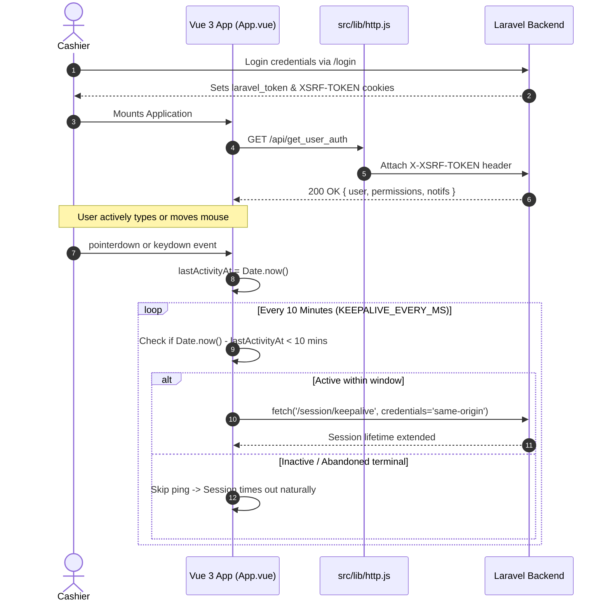
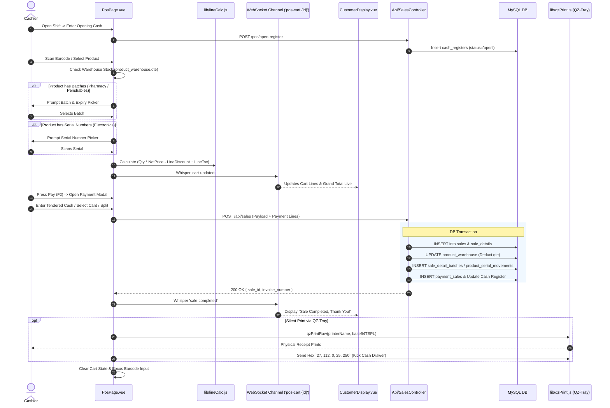
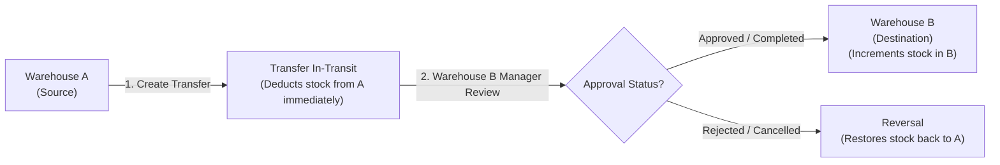

# Operational Business Flows & Lifecycle Reference

This manual details the step-by-step lifecycles and sequence architectures for all core business operations in Stocky.

---

## 1. Authentication & KeepAlive Inactivity Protection

Stocky uses Passport's cookie guard (`laravel_token`). To ensure cashiers are never kicked out in the middle of a transaction while inactive terminals still safely expire:

---

## 2. Point of Sale (POS) Complete Sale Lifecycle

The retail POS engine coordinates inventory checks, batch/serial picking, real-time customer display broadcasting, thermal receipt printing, and hardware drawer triggers:

---

## 3. Inventory Purchasing & Replenishment Flow

1.  **Draft / Ordering Phase**:
    *   Select **Supplier (Provider)** and **Destination Warehouse**.
    *   Add line items: Product, Purchase Unit (e.g. Case of 24), Purchase Cost, Discount, and Tax.
    *   Enter Supplier Invoice Reference and expected arrival date.
2.  **Goods Receipt Phase**:
    *   Set status to `Received`:
    *   System checks `units.operator` (multiplication vs division) and converts purchase quantity to base unit quantity.
    *   Increments `product_warehouse.qte`.
    *   If batch-enabled, records `product_batches` row with initial quantity, manufacturing date, and expiration date.
3.  **Financial Settlement**:
    *   Records payment in `payment_purchases` linked to the chosen financial Account.
    *   Updates supplier ledger balance (`providers.due_amount`).

---

## 4. Multi-Warehouse Stock Transfer Flow

---

## 5. Storefront eCommerce Customer Flow

1.  **Catalog Navigation**: Client browses products filtered by category, brand, and price range.
2.  **Cart Management**: Client adds products to cart (stored in session / localStorage).
3.  **Checkout**: Client provides shipping address, chooses shipping method (calculated via `shipping_zones`), applies promotional coupon.
4.  **Payment Gateway**: Direct integration with Stripe, PayPal, Paystack, Razorpay, or Flutterwave.
5.  **Order Ingestion**: System generates an `online_orders` record and creates an admin notification badge (`new_orders`) on the Admin sidebar.
