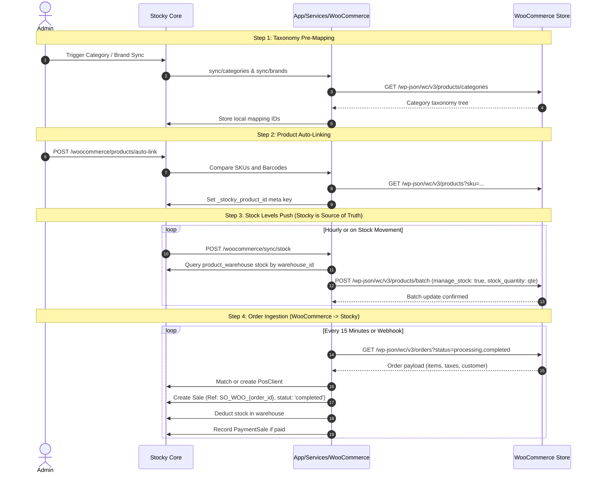

# Integrations & eCommerce Connectors Architecture Manual

This manual provides the technical specifications, bidirectional data pipelines, webhook lifecycles, and synchronization flows for Stocky's third-party integration connectors, with an exhaustive deep-dive into the **WooCommerce**, **Shopify**, **Salla**, **QuickBooks**, **Xero**, **Google Sheets**, and **Slack/Telegram** modules.

---

## 1. WooCommerce Integration Architecture

The WooCommerce integration (`app/Services/WooCommerce/` and `app/Http/Controllers/WooCommerceSyncController.php`) provides full bidirectional synchronization between Stocky and a WordPress / WooCommerce store.

```
+───────────────────────────────────────────────────────────────────────────────────+
|                           WOOCOMMERCE INTEGRATION HUB                             |
+───────────────────────────────────────────────────────────────────────────────────+
| 1. TAXONOMY MAPPING     | 2. CATALOG SYNC        | 3. STOCK LEVEL SYNC (Push)     |
| Categories & Brands     | Products & Variants    | Stocky is single source        |
| POST /sync/categories   | Match by SKU / Barcode | Pushes to /products/batch      |
| POST /sync/brands       | POST /sync/products    | POST /sync/stock (Hourly Cron) |
+-------------------------+------------------------+--------------------------------+
| 4. ORDER INGESTION (Pull)                        | 5. CUSTOMER SYNC & ISSUES      |
| WooCommerce Orders -> Stocky Sales Orders       | Match by email / phone         |
| Auto stock deduction & payment record           | POST /sync/customers           |
| POST /sync/orders (Every 15 mins Cron)          | Issue resolution endpoint      |
+──────────────────────────────────────────────────┴────────────────────────────────+
```

### 1.1 Authentication & Credential Handshake
Stocky requires two levels of credentials configured in `woocommerce_settings`:
1. **WooCommerce REST API v3**:
   - `consumer_key` (`ck_...`)
   - `consumer_secret` (`cs_...`)
   - Used for Products, Stock, Orders, and Customers REST API endpoints.
2. **WordPress Application Password**:
   - `wp_username` (Admin username)
   - `wp_app_password` (Generated in WP Admin $\rightarrow$ *Users* $\rightarrow$ *Profile* $\rightarrow$ *Application Passwords*)
   - Required for Taxonomy terms (Categories, Brands) and Media uploads via `/wp-json/wp/v2/`.

**Test Connection Endpoint (`POST /api/woocommerce/test-connection`)**:
Verifies REST API handshake against `/wp-json/wc/v3/system_status` and returns `{"status":"connected","store_name":"..."}`.

---

### 1.2 Step-by-Step Synchronization Pipeline



---

### 1.3 Order Ingestion Data Transformation Contract

When pulling orders via `POST /api/woocommerce/sync/orders`, WooCommerce payloads are transformed into Stocky models:

| WooCommerce Order Field | Stocky Target Model / Column | Transformation Logic |
| :--- | :--- | :--- |
| `order.number` or `order.id` | `sales.Ref` | Formatted as `SO_WOO_{order.number}` (e.g. `SO_WOO_1042`) |
| `order.date_created` | `sales.date` | Extracted as `YYYY-MM-DD` in instance timezone |
| `order.status` | `sales.statut` | `processing` or `completed` $\rightarrow$ `completed` (deducts stock); other statuses $\rightarrow$ `ordered` |
| `order.total` | `sales.GrandTotal` | Exact decimal `DECIMAL(16, 3)` |
| `order.total_tax` | `sales.TaxNet` | Order-level tax amount |
| `order.discount_total` | `sales.discount` | Order discount total |
| `order.shipping_total` | `sales.shipping` | Shipping freight fee |
| `order.billing` (email/phone) | `clients` | Looked up by email/phone; auto-creates new `PosClient` if not found |
| `order.line_items[]` | `sale_details[]` | Matched to Stocky `products` by SKU or `_stocky_product_id` |
| `line_item.price` | `sale_details.price` | Unit price at time of order |
| `line_item.quantity` | `sale_details.quantity` | Quantity sold |
| `order.payment_method` | `payment_sales` | If status is `processing` or `completed`, creates payment record attached to default account |

---

### 1.4 Background Queue & Cron Automation
Stocky includes dedicated Artisan CLI commands for headless scheduling:
```bash
# Pull new orders every 15 minutes
*/15 * * * * php /path/to/artisan woocommerce:sync >> /dev/null 2>&1

# Push warehouse stock quantities hourly
0 * * * * php /path/to/artisan woocommerce:sync-stock >> /dev/null 2>&1

# Push updated product catalog nightly
0 2 * * * php /path/to/artisan woocommerce:push-products >> /dev/null 2>&1
```
*Note for environments without cron*: Stocky incorporates `InlineQueueRunner.php`. When cron is inactive, pending sync jobs drain in tiny micro-batches during user requests in the admin panel.

---

### 1.5 Sync Issue Resolution & Error Recovery
- **Issue Logging (`woocommerce_logs`)**: Every API call, HTTP response, payload dump, and failure is recorded.
- **Customer Conflict Resolution (`POST /api/woocommerce/customers/sync-issues/{id}/resolve`)**:
  When a WooCommerce customer has duplicate email or conflicting phone, it is quarantined in `sync_issues`. Admins can manually merge with an existing Stocky client or create a new client profile.
- **Sync State Reset (`POST /api/woocommerce/reset-sync`)**:
  Flushes local entity hashes and mapping cache, allowing a clean initial re-sync without duplicating records.

---

## 2. Shopify Integration Architecture

Located at `app/Http/Controllers/ShopifyStoreController.php` and `app/Http/Controllers/ShopifySyncController.php`.

### 2.1 Multi-Store Connection
Stocky supports multiple Shopify stores connected to a single ERP installation:
- **Auth**: Authenticates via Shopify Custom App **Admin API Access Token** (`shpat_...`).
- **Store Record (`shopify_stores`)**: Stores `myshopify_domain`, `access_token`, `api_version` (e.g. `2024-07`), and `default_warehouse_id`.

### 2.2 Location Mapping
Shopify tracks inventory per "Location". Stocky pairs each Shopify location ID with a physical Stocky `warehouse_id`:
```json
{
  "mappings": [
    { "shopify_location_id": "89412356", "stocky_warehouse_id": 1 },
    { "shopify_location_id": "89412357", "stocky_warehouse_id": 2 }
  ]
}
```

### 2.3 Webhook-Driven Order Ingestion (`POST /api/shopify/webhook`)
Instead of polling, Shopify dispatches real-time webhooks on `orders/create`, `orders/updated`, and `orders/paid`:
1. **HMAC Signature Check**: Validates `X-Shopify-Hmac-Sha256` using the store's shared webhook secret.
2. **Order Conversion**: Maps line items by barcode/SKU, deducts inventory from the mapped warehouse location, and generates invoice `SO_SHOPIFY_{order_id}`.

---

## 3. Middle-Eastern Marketplaces (Salla Integration)

Located at `app/Http/Controllers/Integrations/Salla*Controller.php`.

- **OAuth 2.0 Flow**: Authorizes via Salla App Store using Authorization Code Grant (`SallaOAuthController.php`).
- **Arabic Localization**: Handles Arabic product names, descriptions, and VAT-compliant ZATCA fields.
- **Webhook Subscriptions**: Receives `order.created`, `order.status.updated`, and `product.updated`.

---

## 4. Accounting General Ledger Connectors (QuickBooks & Xero)

Automates transmitting daily sales and invoices to enterprise general ledgers.

### 4.1 QuickBooks Online Integration (`QuickBooksService.php`)
- **OAuth 2.0 with Auto-Refresh**: Tokens stored in `quickbooks_tokens` with automatic background refresh before expiration.
- **Chart of Accounts Mapping**:
  - Stocky Sales $\rightarrow$ QuickBooks Income Account
  - Stocky Tax $\rightarrow$ QuickBooks Sales Tax Liability Account
  - Stocky Accounts Receivable $\rightarrow$ QuickBooks A/R
  - Stocky Payment Accounts $\rightarrow$ QuickBooks Bank / Undeposited Funds
- **Asynchronous Queue (`SyncSaleToQuickBooks.php`)**: Dispatches on sale completion to generate an equivalent QuickBooks `Invoice` or `SalesReceipt`.

### 4.2 Xero Integration (`XeroSaleSyncJob.php`)
- **OAuth 2.0 PKCE Flow**: Managed via `XeroOAuthController.php`.
- **Sales Posting**: Transforms completed Stocky sales into Xero `ACCREC` (Accounts Receivable) invoices with line item tax codes.

---

## 5. Notification & Automation Connectors

### 5.1 Google Sheets Automated Streaming
- Integrates via Google Cloud Service Account (`credentials.json`).
- Automatically appends a new row to the configured Google Spreadsheet whenever a Sale is completed:
  `[Date, Invoice Ref, Customer Name, Warehouse, Grand Total, Paid Amount, Payment Method, Cashier]`

### 5.2 Slack & Telegram Realtime Alerts
- **Slack Incoming Webhook**: Dispatches rich Block Kit notifications on:
  - High-value sales ($\text{GrandTotal} \ge \text{threshold}$).
  - Stock alert threshold breaches ($\text{qte} \le \text{stock\_alert}$).
  - Cash register daily closing with cash variance report.
- **Telegram Bot API**: Sends direct messages via `https://api.telegram.org/bot<TOKEN>/sendMessage` to owner/manager chat IDs.
