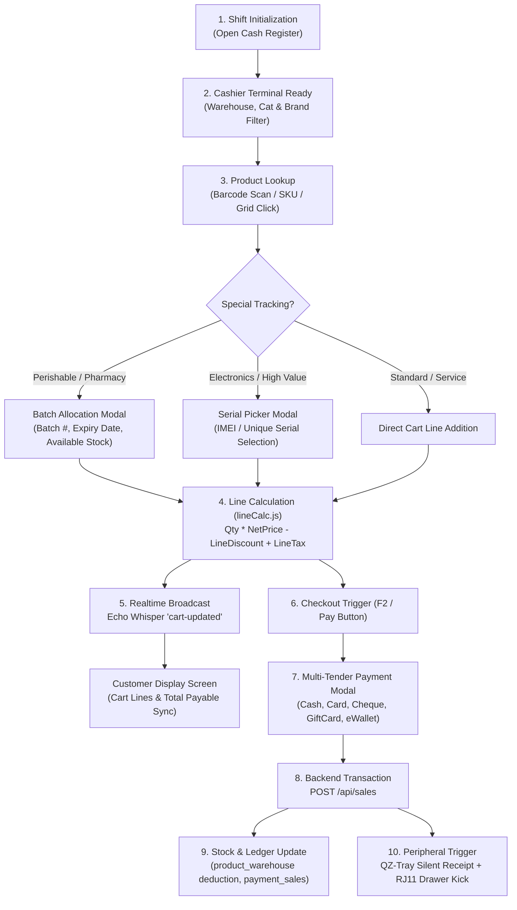

# Comprehensive Module Workflows Manual

This manual provides end-to-end operational workflows, technical data contracts, and controller-to-model lifecycles for all primary and extended modules across Stocky.

---

## 1. Point of Sale (POS) Module Workflow

### 1.1 Architectural Overview
The POS is a standalone 100vh cash-register interface located at `resources/src/pages/pos/PosPage.vue` (20,400+ lines), designed for lightning-fast barcode scanning, touch-screen interactions, and offline-tolerant receipt printing.



### 1.2 Data Contract: POST `/api/sales` (POS Submission)
```json
{
  "client_id": 1,
  "warehouse_id": 2,
  "date": "2026-09-16 10:30:00",
  "tax_rate": 10.00,
  "TaxNet": 3.50,
  "discount": 0.00,
  "discount_type": "fixed",
  "discount_percent_ceil": 0,
  "shipping": 0.00,
  "GrandTotal": 38.50,
  "notes": "Walk-in cashier sale",
  "payment": {
    "amount": 40.00,
    "received_amount": 40.00,
    "change": 1.50,
    "Reglement": "Cash",
    "payment_method_id": 1,
    "account_id": 1,
    "notes": "Paid with $50 bill"
  },
  "details": [
    {
      "product_id": 105,
      "product_variant_id": null,
      "quantity": 2,
      "Net_price": 17.50,
      "tax_percent": 10,
      "tax_method": "1",
      "discount": 0,
      "discount_method": "2",
      "batch_id": 12,
      "batch_number": "B-2026-08",
      "serial_numbers": ["SN-994812", "SN-994813"]
    }
  ]
}
```

---

## 2. Human Resource Management (HRM) Workflow

### 2.1 Subsystem Scope
Located in `app/Http/Controllers/hrm/` and `resources/src/pages/hrm/`, the HRM suite handles company organization, employee records, shifts, daily attendance, leave approval workflows, and monthly payroll.

### 2.2 Hierarchical Data Structure
```
Company (App\Models\Company)
└── Department (App\Models\Department)
    └── Designation / Job Title (App\Models\Designation)
        └── Employee Profile (App\Models\Employee)
            ├── Office Shift (App\Models\OfficeShift - Monday to Sunday hours)
            ├── Attendance (App\Models\Attendance - Clock in/out, IP, Status)
            ├── Leaves (App\Models\Leave - Vacation, Sick, Maternal)
            ├── Payroll (App\Models\Payroll - Basic salary, Allowances, Deductions)
            └── Contracts (App\Models\Contract - Duration, Renewals, Clauses)
```

### 2.3 Leave Request & Balance Verification Flow
1. Employee applies via portal or Admin logs leave: `POST /api/leave`
2. Backend inspects `leave_types.quota` against historical leaves taken within the calendar year.
3. If quota exceeded, controller returns `200 OK` with `{ isvalid: false, message: 'remaining_leaves_are_insufficient' }`.
4. If valid, manager approves: status changes from `pending` -> `approved`.

---

## 3. Sales & Invoicing Workflow

```
[Quotation Created]
       │
       ▼
[Converted to Sale] ──> [Invoice Generated] ──> [Delivery / Shipment Dispatched]
       │                        │                              │
       ▼                        ▼                              ▼
(Reserved Stock)     (Stock Deducted from       (Tracking Number & Carrier
                      product_warehouse)         Updated in shipments table)
                                │
                                ▼
                     [Payment Status Matrix]
                     • Paid (due = 0)
                     • Partial (payment_sales recorded)
                     • Unpaid (due = GrandTotal)
```

---

## 4. Purchases & Inventory Replenishment Workflow

1. **Purchase Order Submission**:
   - Controller: `PurchasesController.php` -> `store()`
   - Fields: `provider_id`, `warehouse_id`, `items`, `payment_status`, `GrandTotal`.
2. **Unit Conversion Pipeline**:
   - Each purchase item specifies a `purchase_unit_id`.
   - If unit operator is `*`, `base_quantity = item_quantity * operator_value`.
   - If unit operator is `/`, `base_quantity = item_quantity / operator_value`.
3. **Batch Registration**:
   - When `products.is_batch = 1`, incoming items are registered in `product_batches` with initial quantity, manufacturing date, and expiry date.
4. **Stock Increment**:
   - `product_warehouse` entry updated via atomic increment: `product_warehouse::where('product_id', $id)->where('warehouse_id', $wh)->increment('qte', $base_quantity)`.

---

## 5. Accounting V2 (Double-Entry General Ledger) Workflow

Located in `app/Http/Controllers/AccountingV2/`, this module replaces single-entry bookkeeping with a compliant double-entry general ledger.

### 5.1 Core Double-Entry Schema
*   **`acc_chart_of_accounts`**: Accounts structured by 5 root types (`Asset`, `Liability`, `Equity`, `Revenue`, `Expense`).
*   **`acc_journal_entries`**: Header table (`entry_date`, `reference`, `narration`, `status`).
*   **`acc_journal_entry_lines`**: Split rows ensuring `SUM(debit) == SUM(credit)`:
    *   `journal_entry_id` (FK)
    *   `account_id` (FK to chart of accounts)
    *   `debit` (DECIMAL 16,3)
    *   `credit` (DECIMAL 16,3)

### 5.2 Automated POS / Sale Journal Hook
When `settings.auto_journal_enabled = 1`:
*   Debit **Cash / Bank Account** (`Asset`)
*   Credit **Sales Revenue Account** (`Revenue`)
*   Debit **Cost of Goods Sold (COGS)** (`Expense`)
*   Credit **Inventory Account** (`Asset`)

---

## 6. Extended Enterprise Workflows

### 6.1 Manufacturing & MRP
*   **Bill of Materials (BOM)**: Master recipe linking raw materials (`product_id`) and overhead costs to a finished output product.
*   **Work Orders & Centers**: Execution stages on the factory floor deducting component stocks and yielding finished goods upon completion.

### 6.2 Asset Lifecycle Management
*   **Asset Master (`assets`)**: Tag, serial, purchase date, cost, depreciation method (Straight Line vs Reducing Balance).
*   **Depreciation Engine**: Monthly calculated depreciation expense logged into accounting journal entries.

### 6.3 Project Management & Kanban Board
*   **Workspace**: Projects -> Milestones -> Tasks -> Subtasks -> Timesheets.
*   **Task Board**: Drag-and-drop Kanban states (`Pending`, `In Progress`, `Testing`, `Completed`).
