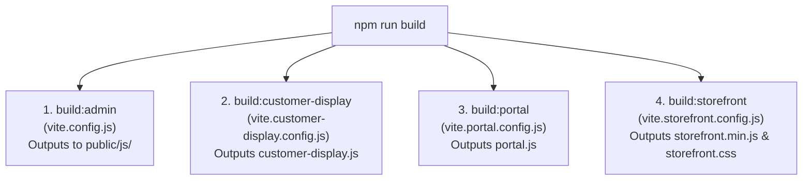

# Setup Files & Configuration Architecture

This manual provides the environment variables, server configurations, Vite multi-build setups, and security configs required to host and run Stocky.

---

## 1. Environment Configuration (`.env`)

```ini
APP_NAME=Stocky
APP_ENV=production
APP_KEY=base64:...
APP_DEBUG=false
APP_URL=https://your-domain.com

LOG_CHANNEL=stack
LOG_DEPRECATIONS_CHANNEL=null
LOG_LEVEL=debug

# Database Connection (MySQL 8.0+ / MariaDB 10.6+)
DB_CONNECTION=mysql
DB_HOST=127.0.0.1
DB_PORT=3306
DB_DATABASE=stocky_db
DB_USERNAME=stocky_user
DB_PASSWORD=your_secure_password

# Session & Cache Drivers
BROADCAST_DRIVER=pusher
CACHE_DRIVER=file
FILESYSTEM_DISK=local
QUEUE_CONNECTION=database
SESSION_DRIVER=file
SESSION_LIFETIME=120

# Realtime Pusher / WebSocket Config (Dual-Screen Customer Display Sync)
PUSHER_APP_ID=your_pusher_id
PUSHER_APP_KEY=your_pusher_key
PUSHER_APP_SECRET=your_pusher_secret
PUSHER_HOST=
PUSHER_PORT=443
PUSHER_SCHEME=https
PUSHER_APP_CLUSTER=mt1

# Mail Server (SMTP)
MAIL_MAILER=smtp
MAIL_HOST=smtp.mailgun.org
MAIL_PORT=587
MAIL_USERNAME=your_username
MAIL_PASSWORD=your_password
MAIL_ENCRYPTION=tls
MAIL_FROM_ADDRESS="no-reply@your-domain.com"
MAIL_FROM_NAME="${APP_NAME}"

# SMS Gateway (Twilio / Infobip / Custom)
TWILIO_SID=
TWILIO_TOKEN=
TWILIO_FROM=
INFOBIP_API_KEY=
INFOBIP_BASE_URL=

# Payment Gateways (Storefront & POS)
STRIPE_KEY=pk_live_...
STRIPE_SECRET=sk_live_...
PAYPAL_CLIENT_ID=
PAYPAL_SECRET=
PAYPAL_MODE=live
```

---

## 2. Multi-App Vite Configuration Architecture

Stocky uses 4 isolated Vite configurations to prevent bundle bloat and ensure fast execution:



### Main Vite Configuration (`vite.config.js`)
```javascript
import { defineConfig } from 'vite';
import vue from '@vitejs/plugin-vue';

export default defineConfig({
  plugins: [vue()],
  build: {
    outDir: 'public/js',
    emptyOutDir: false,
    manifest: true,
    cssCodeSplit: false, // Emits single bundle style.css
    rollupOptions: {
      input: 'resources/src/main.js',
      output: {
        entryFileNames: 'app-[hash].js',
        chunkFileNames: 'chunks/[name]-[hash].js',
        assetFileNames: 'assets/[name]-[hash][extname]',
      },
    },
  },
});
```

---

## 3. Web Server Configurations

### 3.1 Nginx Server Block (Production)
```nginx
server {
    listen 80;
    server_name pos.your-domain.com;
    return 301 https://$host$request_uri;
}

server {
    listen 443 ssl http2;
    server_name pos.your-domain.com;
    root /var/www/stocky/public;
    index index.php;

    ssl_certificate /etc/letsencrypt/live/pos.your-domain.com/fullchain.pem;
    ssl_certificate_key /etc/letsencrypt/live/pos.your-domain.com/privkey.pem;

    client_max_body_size 64M;

    # Gzip Compression
    gzip on;
    gzip_types text/plain text/css application/json application/javascript text/xml application/xml font/woff2;

    # Static Assets Caching
    location ~* \.(jpg|jpeg|png|gif|ico|css|js|woff2|woff|ttf|svg)$ {
        expires 30d;
        add_header Cache-Control "public, no-transform";
        access_log off;
    }

    location / {
        try_files $uri $uri/ /index.php?$query_string;
    }

    location ~ \.php$ {
        include snippets/fastcgi-php.conf;
        fastcgi_pass unix:/var/run/php/php8.2-fpm.sock;
        fastcgi_param SCRIPT_FILENAME $realpath_root$fastcgi_script_name;
        include fastcgi_params;
    }

    location ~ /\.(?!well-known).* {
        deny all;
    }
}
```

### 3.2 Apache Configuration (`.htaccess`)
```apache
<IfModule mod_rewrite.c>
    <IfModule mod_negotiation.c>
        Options -MultiViews -Indexes
    </IfModule>

    RewriteEngine On

    # Handle Authorization Header
    RewriteCond %{HTTP:Authorization} .
    RewriteRule .* - [E=HTTP_AUTHORIZATION:%{HTTP:Authorization}]

    # Redirect Trailing Slashes If Not A Folder...
    RewriteCond %{REQUEST_FILENAME} !-d
    RewriteCond %{REQUEST_URI} (.+)/$
    RewriteRule ^ %1 [L,R=301]

    # Send Requests To Front Controller...
    RewriteCond %{REQUEST_FILENAME} !-d
    RewriteCond %{REQUEST_FILENAME} !-f
    RewriteRule ^ index.php [L]
</IfModule>
```

---

## 4. Hardware QZ-Tray Silent Certificate Generation

To print silently without recurring browser security dialogs:

```bash
# Generate private key and self-signed certificate for QZ-Tray in storage/app/qz
mkdir -p storage/app/qz
openssl req -x509 -newkey rsa:2048 -keyout storage/app/qz/private-key.pem -out storage/app/qz/digital-certificate.txt -days 3650 -nodes -subj "/CN=StockyPOS"
```
1. Download `digital-certificate.txt` from **Settings -> System -> POS Receipt**.
2. Rename to `override.crt` and install into QZ-Tray client machine directory.
3. Silent thermal receipt printing and cash drawer triggers will execute instantly.
