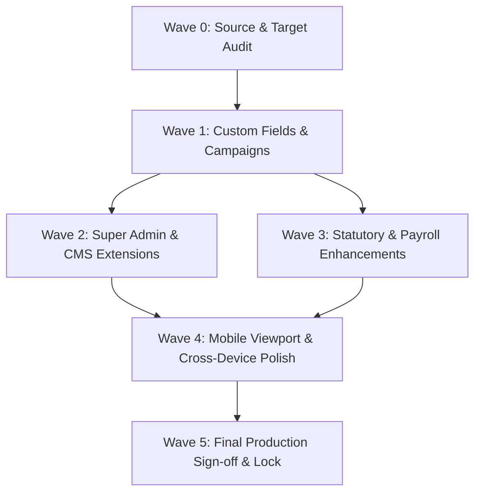

# Laravel to React Migration Wave Plan

**Strategy:** Dependency-ordered, modular execution waves ensuring zero regressions, continuous test verification, and strict multi-tenant isolation.

---

## 1. Wave Architecture & Dependencies

---

## 2. Wave Breakdown & Deliverables

### Wave 0 — Source & Target System Audit (COMPLETED)
- **Scope**: Exhaustive inspection of Laravel source (`routes/web.php`, 123 migrations, 100 seeders, 98 modules) and Target React/Prisma implementation.
- **Deliverables**: Production of all 12 architectural parity and inventory matrices.
- **Status**: **100% COMPLETE & VERIFIED**.

---

### Wave 1 — Custom Fields Engine (M08) + Marketing Campaigns (M10) (COMPLETED)
- **Scope**:
  1. **Custom Fields Engine**: Full dynamic field schema across Employees, Projects, Tasks, Invoices, Clients, Leads, Recruitment, Candidates.
  2. **Marketing Campaigns**: Multi-channel promotional campaigns with Active/Completed/Archived tabs, budget/spent KPIs, offcanvas drawer, CSV/Excel & PDF export.
- **Verification**: 21/21 automated integration tests passing (`server/src/tests/wave1-custom-fields-and-campaigns.test.ts`), `npx tsc --noEmit` clean on client and server, production build passing.
- **Status**: **100% COMPLETE & VERIFIED**.

---

### Wave 2 — Super Admin & CMS Extensions (Ready for Execution)
- **Scope**:
  - `P01`: Super Admin User Password Reset modal and Login History direct inspection drawer.
  - `P02`: Live database backup snapshot download utility.
  - `P03`: Multilingual phrase editor table with inline editing.
  - `P10` & `P11`: Dedicated FAQ and Testimonial management tabs in `/super/cms`.
- **Dependencies**: Wave 0, Wave 1.
- **Target Routes**: `src/routes/_authenticated/_app/super/*`.

---

### Wave 3 — Statutory & Advanced Payroll Enhancements
- **Scope**:
  - Statutory compliance rules expansion (EPF, ESI, Professional Tax, TDS brackets).
  - Form 16 / Tax declaration proofs review.
  - Gratuity calculation and final settlement ledger.
- **Dependencies**: Wave 1.
- **Target Routes**: `src/routes/_authenticated/_app/payroll.tsx`, `provident-fund.tsx`.

---

### Wave 4 — Mobile Viewport & Cross-Device UI Polish
- **Scope**:
  - Comprehensive responsiveness audit on mobile (375px), tablet (768px), and desktop (1440px).
  - Touch interaction testing for tables, offcanvas drawers, and Kanban board columns.
- **Dependencies**: Waves 1–3.

---

### Wave 5 — Final Production Sign-Off & Lock
- **Scope**:
  - Full end-to-end regression test suite execution across all modules.
  - Production build verification (`npm run build`).
  - Architectural lock and migration closure report.
