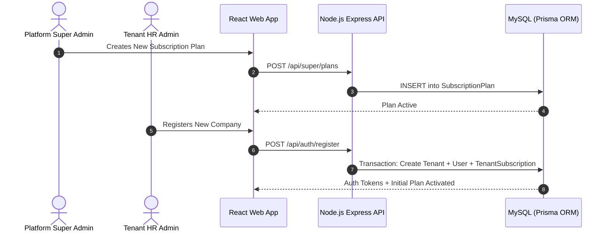
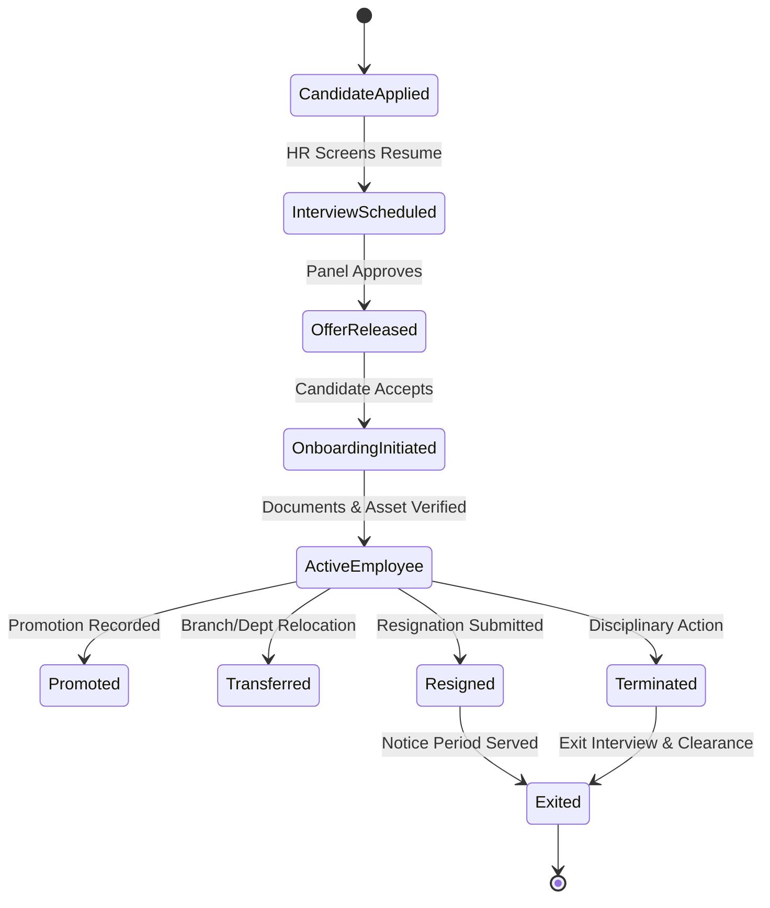
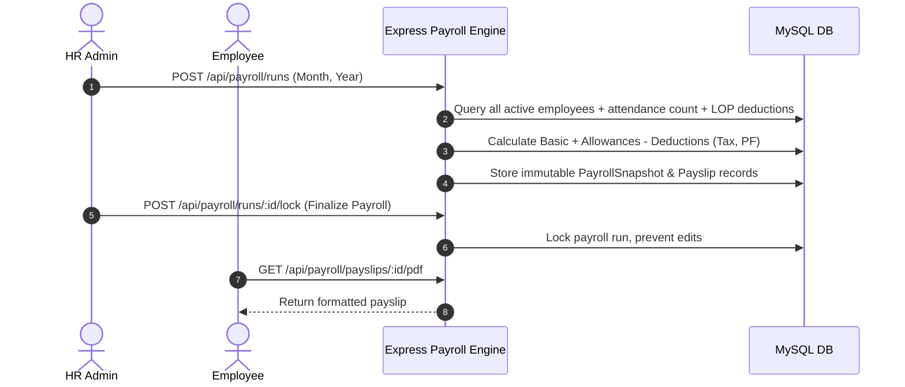
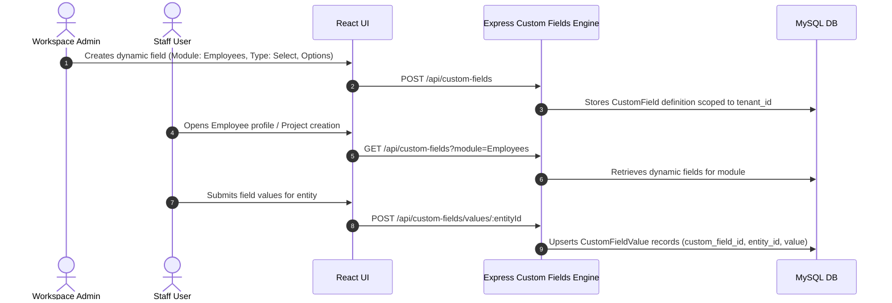
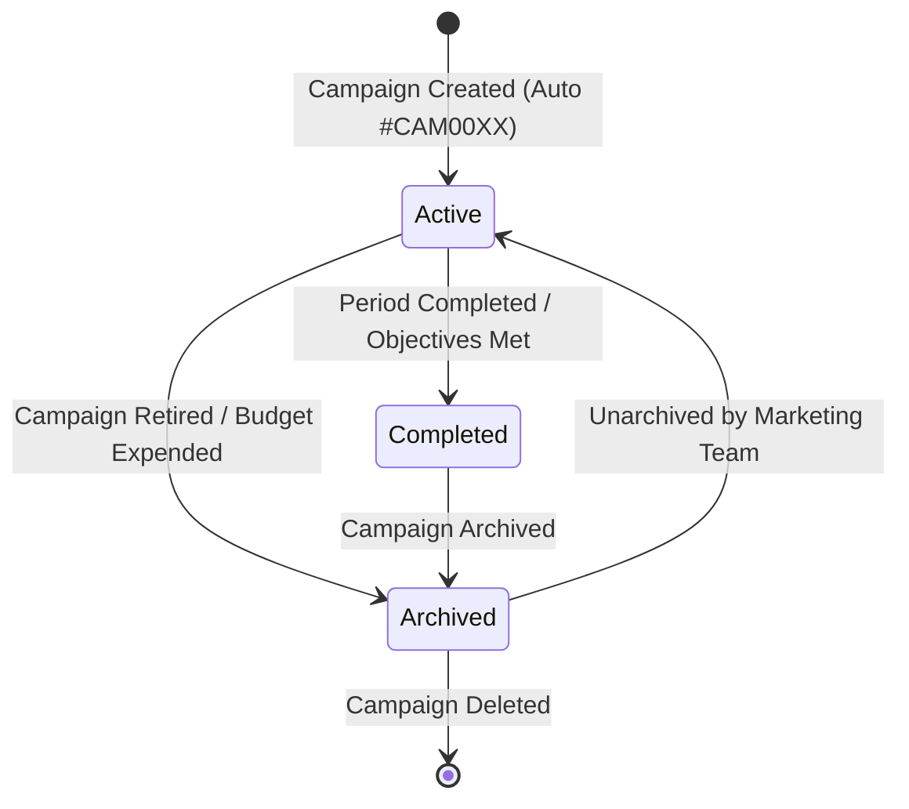
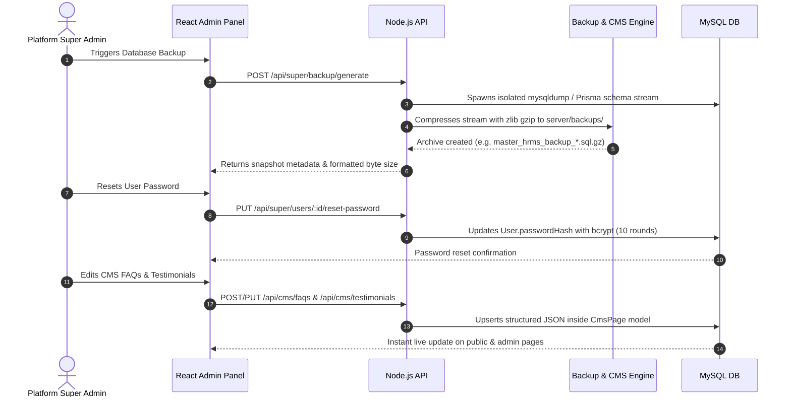

# Laravel to React & Node.js Workflow Parity Matrix

**Document Scope:** Complete user journeys, lifecycle state machines, approvals, notifications, and scheduled background tasks across Super Admin, HR Admin, and Employee Portals.

---

## 1. Multi-Tenant SaaS Lifecycle Workflow



- **State Transitions:**
  - `Company`: `pending` $\rightarrow$ `active` $\rightarrow$ `suspended` (via Super Admin toggle).
  - `Plan Order`: `pending` $\rightarrow$ `approved` (activates plan) or `rejected`.
  - `Coupon`: `active` $\rightarrow$ `expired` (tracked by redemptions & date).

---

## 2. Employee Onboarding & Movement Lifecycle Workflow



- **Data Integrity Safeguards:**
  - Promotion automatically logs historical designation and updates `Employee.designationId`.
  - Resignation enforces minimum notice days and tracks manager exit clearance.
  - Termination immediately deactivates the user login credentials in `User` table.

---

## 3. Daily Attendance & Leave Approval Workflow

```mermaid
sequenceDiagram
    autonumber
    actor Employee as Staff Member
    actor Manager as HR Admin / Manager
    participant App as React App
    participant API as Express API
    participant DB as MySQL DB

    Employee->>App: Clock In (Web / Biometric)
    App->>API: POST /api/attendance/clock-in
    API->>DB: Record attendance (timestamp, IP, GPS)

    Employee->>App: Submits Leave Application (Annual/Casual)
    App->>API: POST /api/leave/requests
    API->>DB: Check balance quota; Insert LeaveRequest (status=pending)
    API-->>Manager: Notification Triggered

    Manager->>App: Review & Approve Leave
    App->>API: PATCH /api/leave/requests/:id/status (status=approved)
    API->>DB: Deduct days from EmployeeLeaveBalance; Mark Attendance as Leave
    DB-->>Employee: Status Updated to Approved
```

- **Regularization Workflow:**
  - If punch is missed, employee submits `POST /api/attendance/regularizations`.
  - HR Admin approves $\rightarrow$ attendance record clock times updated seamlessly.

---

## 4. Payroll Generation & Payslip Distribution Workflow



- **Recurring Invoices Workflow:**
  - Daily cron scans active recurring invoices.
  - Automatic invoice generation with idempotency checks to prevent duplicate runs.

---

## 5. Custom Fields Engine & Entity Extensibility Workflow (Wave 1)



---

## 6. Marketing Campaigns Lifecycle & Budget Workflow (Wave 1)



---

## 7. Super Admin & Platform Extensions Workflow (Wave 2)



---

## 8. Workflow Verification Status
All core workflows, including Wave 1 Custom Fields Engine and Marketing Campaigns, as well as Wave 2 Super Admin Password Reset, Login History, Database Backup, Multilingual Phrase Editor, and CMS FAQs/Testimonials Studios, have been mapped, verified against real database operations, and equipped with automated regression test suites.
