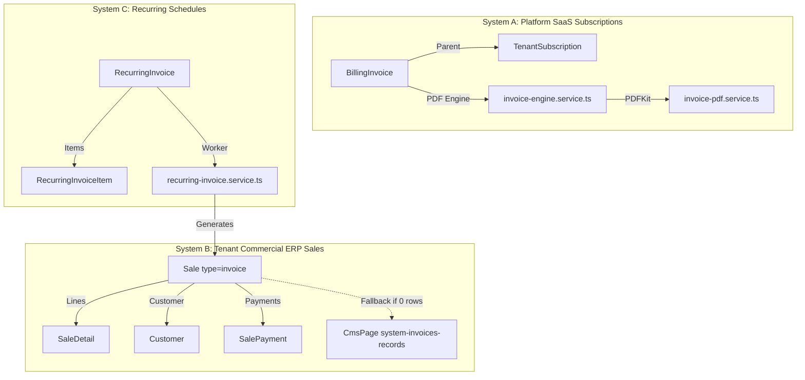

# MASTERHRMS — PHASE 2 PRE-IMPLEMENTATION AUDIT
## Company Profile + GST + Invoicing Foundation

**Document Type:** Pre-Implementation Architectural Audit & Planning Baseline  
**Target Milestone:** Settings Phase 2 — Company Profile, Statutory Tax & Invoicing Foundation  
**Auditor:** Principal Enterprise Architect & Systems Auditor  
**Audit Mode:** READ-ONLY Deep Inspection (Zero Code Mutations Applied)  
**Date:** October 6, 2026  
**Phase 1 Status:** LOCKED (Settings Registry, DB Settings, Media Management, Workspace Branding Matrix, App Config)  
**Phase 2 Implementation Status:** **DO NOT IMPLEMENT YET — PENDING PRODUCT OWNER REVIEW**

---

## 1. Executive Summary

Phase 1 of MasterHRMS established the core foundation for configuration persistence: the typed [`SettingsRegistry`](file:///c:/Users/TSV%20Global%20Solutions/Documents/hrms/server/src/services/settings/settings-registry.ts), encrypted [`SettingSecret`](file:///c:/Users/TSV%20Global%20Solutions/Documents/hrms/server/prisma/schema.prisma#L71), relational [`MediaFile`](file:///c:/Users/TSV%20Global%20Solutions/Documents/hrms/server/prisma/schema.prisma#L98)/[`MediaUsage`](file:///c:/Users/TSV%20Global%20Solutions/Documents/hrms/server/prisma/schema.prisma#L4330), centralized [`BrandingResolverService`](file:///c:/Users/TSV%20Global%20Solutions/Documents/hrms/server/src/services/branding/branding-resolver.service.ts), unauthenticated [`app-config`](file:///c:/Users/TSV%20Global%20Solutions/Documents/hrms/server/src/routes/app-config.routes.ts) bootstrapping, and subtenant domain routing.

Before launching **Settings Phase 2 (Company Profile + GST + Invoicing Foundation)**, this comprehensive read-only audit was conducted across the schema, backend routes, services, frontend components, and tests.

### Key Audit Discoveries:
1. **No Normalized `CompanyProfile` Entity in MySQL:** Company legal identity currently resides as untyped JSON inside a legacy `CmsPage` document (`tenant-${tenantId}-settings` under `content.company`) and unvalidated fields (`name`, `timezone`) directly on the `Tenant` model. No statutory tax fields (`PAN`, `TAN`, `CIN`, `GSTIN`, `registeredAddress`, `placeOfSupply`) exist as relational columns.
2. **Hardcoded Statutory GST Attributes & Karnataka Defaults:**
   - The backend invoice route ([`invoices.routes.ts#L112`](file:///c:/Users/TSV%20Global%20Solutions/Documents/hrms/server/src/routes/invoices.routes.ts#L112)) hardcodes the seller state code: `const companyState = body.companyState || "29";` (Karnataka).
   - The frontend invoice builder ([`invoice-creator-view.tsx#L114`](file:///c:/Users/TSV%20Global%20Solutions/Documents/hrms/src/components/invoices/invoice-creator-view.tsx#L114)) also hardcodes `const companyState = "29";`.
   - The printable invoice template ([`invoice.$id.print.tsx#L153`](file:///c:/Users/TSV%20Global%20Solutions/Documents/hrms/src/routes/_authenticated/_app/invoice.$id.print.tsx#L153)) hardcodes the seller's legal identity: `GSTIN: 29AAAAA0000A1Z5 • PAN: AAAAA0000A • State Code: 29 (Karnataka)`.
3. **Dual / Disconnected Invoicing Systems in the Codebase:**
   - **System A — SaaS Subscription Invoices:** [`BillingInvoice`](file:///c:/Users/TSV%20Global%20Solutions/Documents/hrms/server/prisma/schema.prisma#L849) model for Platform-to-Tenant subscriptions, generating PDF via [`invoice-engine.service.ts`](file:///c:/Users/TSV%20Global%20Solutions/Documents/hrms/server/src/services/invoice-engine.service.ts) and [`invoice-pdf.service.ts`](file:///c:/Users/TSV%20Global%20Solutions/Documents/hrms/server/src/services/invoice-pdf.service.ts).
   - **System B — Commercial Sales Invoices:** Operates over the [`Sale`](file:///c:/Users/TSV%20Global%20Solutions/Documents/hrms/server/prisma/schema.prisma#L2475) and [`SaleDetail`](file:///c:/Users/TSV%20Global%20Solutions/Documents/hrms/server/prisma/schema.prisma#L2519) models with fallback to `CmsPage` (`system-invoices-records-${tenantId}`).
   - **System C — Recurring Invoices:** [`RecurringInvoice`](file:///c:/Users/TSV%20Global%20Solutions/Documents/hrms/server/prisma/schema.prisma#L3716) and [`RecurringInvoiceItem`](file:///c:/Users/TSV%20Global%20Solutions/Documents/hrms/server/prisma/schema.prisma#L3755) models.
4. **Complete Absence of Historical Snapshot Immutability:**
   - The commercial [`Sale`](file:///c:/Users/TSV%20Global%20Solutions/Documents/hrms/server/prisma/schema.prisma#L2475) model stores `customerName` and `customerGstin`, but **zero seller legal identity**.
   - The invoice detail view ([`invoice.$id.tsx#L405`](file:///c:/Users/TSV%20Global%20Solutions/Documents/hrms/src/routes/_authenticated/_app/invoice.$id.tsx#L405)) dynamically pulls the company name from the active session (`profile?.tenant?.name`). If a tenant renames their company in 2027, all historical 2024 invoices dynamically display the 2027 name and hardcoded address/GSTIN.
5. **Concurrency-Unsafe Invoice Numbering:**
   - Commercial invoices calculate sequence via `const count = await prisma.sale.count({ where: { tenantId } });` without a sequence table, financial year partitioning, or row-level transaction locking, risking race conditions and duplicate numbering.
6. **Disconnected Invoice Settings UI:**
   - In [`settings.tsx#L2028`](file:///c:/Users/TSV%20Global%20Solutions/Documents/hrms/src/routes/_authenticated/_app/settings.tsx#L2028), the "Invoicing, Billing & Bank Wire Credentials" tab stores data purely in React local state (`useState`) and only displays a toast (`toast.success(...)`) with zero backend API persistence.

---

## 2. Current Repository Inventory

| Domain / Layer | Target Files / Paths | Status | Primary Purpose / Notes |
|---|---|---|---|
| **ORM Schema** | [`server/prisma/schema.prisma`](file:///c:/Users/TSV%20Global%20Solutions/Documents/hrms/server/prisma/schema.prisma) | Partially Applicable | Contains `Tenant`, `Sale`, `SaleDetail`, `Customer`, `TaxRate`, `BillingInvoice`, `RecurringInvoice`, `Establishment`. **Missing `CompanyProfile`, `NumberSequence`, `InvoiceSnapshot`**. |
| **Settings Core** | [`server/src/services/settings/settings.service.ts`](file:///c:/Users/TSV%20Global%20Solutions/Documents/hrms/server/src/services/settings/settings.service.ts) | **LOCKED Phase 1** | Authoritative typed settings engine for `PLATFORM`, `TENANT`, `USER`. |
| **Settings Registry** | [`server/src/services/settings/settings-registry.ts`](file:///c:/Users/TSV%20Global%20Solutions/Documents/hrms/server/src/services/settings/settings-registry.ts) | **LOCKED Phase 1** | Defines `branding.*` and `locale.*`. Currently lacks `company.*`, `tax.*`, and `invoicing.*` groups. |
| **Branding Engine** | [`server/src/services/branding/branding-resolver.service.ts`](file:///c:/Users/TSV%20Global%20Solutions/Documents/hrms/server/src/services/branding/branding-resolver.service.ts) | **LOCKED Phase 1** | Resolves logos, theme colors, app name across Platform and Tenant hierarchies. |
| **Workspace Routes** | [`server/src/routes/workspace.routes.ts`](file:///c:/Users/TSV%20Global%20Solutions/Documents/hrms/server/src/routes/workspace.routes.ts) | Legacy Mixed | `PUT /settings/company` saves untyped company address and `taxNumber` into `CmsPage` JSON (`tenant-${tenantId}-settings`). |
| **Invoice API** | [`server/src/routes/invoices.routes.ts`](file:///c:/Users/TSV%20Global%20Solutions/Documents/hrms/server/src/routes/invoices.routes.ts) | Existing Commercial | 1,811 lines. Handles CRUD, payments, POS, and public viewing over `Sale` table with fallback to `CmsPage`. |
| **Sales / POS API** | [`server/src/routes/sales.routes.ts`](file:///c:/Users/TSV%20Global%20Solutions/Documents/hrms/server/src/routes/sales.routes.ts) | Existing POS | 1,060 lines. Handles registers, POS orders, offline sync over `Sale` table. |
| **Subscription Billing API** | [`server/src/routes/billing.routes.ts`](file:///c:/Users/TSV%20Global%20Solutions/Documents/hrms/server/src/routes/billing.routes.ts) | Existing SaaS | Manages `BillingInvoice` for Platform SaaS subscriptions. |
| **PDF Generation Engine** | [`server/src/services/invoice-pdf.service.ts`](file:///c:/Users/TSV%20Global%20Solutions/Documents/hrms/server/src/services/invoice-pdf.service.ts) | Existing Subscription | PDFKit layout tailored specifically for `BillingInvoice` and gateway transactions. |
| **Invoice Engine Service** | [`server/src/services/invoice-engine.service.ts`](file:///c:/Users/TSV%20Global%20Solutions/Documents/hrms/server/src/services/invoice-engine.service.ts) | Existing Subscription | Canonical transformer for subscription bills. Uses fallback strings for Gurugram and Karnataka GSTIN `06AAACM1234F1Z8`. |
| **Recurring Engine** | [`server/src/services/recurring-invoice.service.ts`](file:///c:/Users/TSV%20Global%20Solutions/Documents/hrms/server/src/services/recurring-invoice.service.ts) | Existing Commercial | Cron/manual worker generating `Sale` records from `RecurringInvoice` schedules. |
| **Tax Rates Route** | [`server/src/routes/products.routes.ts`](file:///c:/Users/TSV%20Global%20Solutions/Documents/hrms/server/src/routes/products.routes.ts) | Existing Commercial | CRUD on `TaxRate` (`name`, `rate`, `isDefault`). Lacks GST breakdown rules. |
| **Frontend Settings Hub** | [`src/routes/_authenticated/_app/settings.tsx`](file:///c:/Users/TSV%20Global%20Solutions/Documents/hrms/src/routes/_authenticated/_app/settings.tsx) | Partial / Disconnected | `organization` tab only has shift policies; `invoice-settings` tab is completely unpersisted React state. |
| **Frontend Invoice List** | [`src/routes/_authenticated/_app/invoices.tsx`](file:///c:/Users/TSV%20Global%20Solutions/Documents/hrms/src/routes/_authenticated/_app/invoices.tsx) | Existing Commercial | Lists invoices from `/api/invoices`. |
| **Frontend Invoice Create** | [`src/components/invoices/invoice-creator-view.tsx`](file:///c:/Users/TSV%20Global%20Solutions/Documents/hrms/src/components/invoices/invoice-creator-view.tsx) | Existing Commercial | Form with repeater line items, GST dropdowns, but hardcoded company state `"29"`. |
| **Frontend Invoice Detail** | [`src/routes/_authenticated/_app/invoice.$id.tsx`](file:///c:/Users/TSV%20Global%20Solutions/Documents/hrms/src/routes/_authenticated/_app/invoice.$id.tsx) | Existing Commercial | Renders invoice sheet with hardcoded seller GSTIN `29AAAAA0000A1Z5` and hardcoded HDFC bank details. |
| **Frontend Invoice Print** | [`src/routes/_authenticated/_app/invoice.$id.print.tsx`](file:///c:/Users/TSV%20Global%20Solutions/Documents/hrms/src/routes/_authenticated/_app/invoice.$id.print.tsx) | Existing Commercial | Printable view with identical hardcoded seller GSTIN, PAN, and bank accounts. |
| **Super Admin Settings** | [`src/routes/_authenticated/super/settings.tsx`](file:///c:/Users/TSV%20Global%20Solutions/Documents/hrms/src/routes/_authenticated/super/settings.tsx) | **LOCKED Phase 1** | Platform settings (branding, currency, smtp, oauth, pusher, payments, system, media). No Platform Company Profile tab. |

---

## 3. Planning Document Alignment

The project documentation in [`docs/payroll-phase-2/`](file:///c:/Users/TSV%20Global%20Solutions/Documents/hrms/docs/payroll-phase-2) primarily defines **Advanced Payroll Phase 2** (reimbursements, FBP Sec 115BAC, biometrics, bank disbursement batches, EPF/ESIC returns).

In contrast, the **Settings & Commercial ERP Roadmap** established in [`MASTERHRMS_SETTINGS_PHASE1_COMPLETION_REPORT.md`](file:///c:/Users/TSV%20Global%20Solutions/Documents/hrms/MASTERHRMS_SETTINGS_PHASE1_COMPLETION_REPORT.md) defines **Settings Phase 2: Company Profile, GST & Invoicing Foundation**.

### Alignment Verification:
- **Phase 1 Invariant Respected:** Phase 1 delivered the centralized Settings Registry, DB settings, Media Library, Branding Resolver, and Realtime settings. It explicitly deferred Company Profile, GST, and Invoicing to Phase 2.
- **Divergence Identified:**
  - *Planning Document Expectation:* Invoices should consume the authoritative `BrandingResolverService`, have immutable snapshotting, and adhere to transactional sequence generation.
  - *Actual Implementation Reality:* The commercial invoicing frontend and backend routes predate the Settings Registry and still rely on CMS blobs, session-based live resolution, and hardcoded Karnataka GST/banking mocks.
- **Resolution:** Phase 2 must bridge commercial invoicing to the Phase 1 architectural standards without altering Phase 1 locked code.

---

## 4. Company Profile Audit

The legal/company profile determines the legal seller on invoices, tax filings, and contracts.

### Field-by-Field Inventory & Status Matrix

| Field | Current Storage | Table / Model | Existing API | Frontend UI | Scoping | Source of Truth | Status |
|---|---|---|---|---|---|---|---|
| **Legal Company Name** | JSON blob `content.company.name` & `tenants.name` | `cms_pages` & `tenants` | `PUT /api/workspace/settings/company` | Missing / Partial | Mixed (Tenant table + CMS) | Unsynchronized | **DUPLICATED / UNSAFE** |
| **Trade Name / Brand** | `settings.key = 'branding.app_name'` & `tenants.name` | `settings` & `tenants` | `GET/PUT /api/v1/settings/:scope/branding` | [`workspace-branding-settings.tsx`](file:///c:/Users/TSV%20Global%20Solutions/Documents/hrms/src/components/settings/workspace-branding-settings.tsx) | Tenant | `SettingsService` | **EXISTS (Phase 1)** |
| **Registered Address** | JSON blob `content.company.address` | `cms_pages` | `PUT /api/workspace/settings/company` | Not exposed in tenant UI | Tenant | `cms_pages` | **LEGACY / UNSAFE** |
| **Billing Address** | Not separated from registered address | None | None | None | None | None | **MISSING** |
| **State** | JSON blob `content.company.state` | `cms_pages` | `PUT /api/workspace/settings/company` | Not exposed in tenant UI | Tenant | `cms_pages` | **LEGACY / UNSAFE** |
| **District / City** | JSON blob `content.company.city` | `cms_pages` | `PUT /api/workspace/settings/company` | Not exposed in tenant UI | Tenant | `cms_pages` | **LEGACY / UNSAFE** |
| **PIN / Postal Code** | JSON blob `content.company.zipCode` | `cms_pages` | `PUT /api/workspace/settings/company` | Not exposed in tenant UI | Tenant | `cms_pages` | **LEGACY / UNSAFE** |
| **Country** | JSON blob `content.company.country` | `cms_pages` | `PUT /api/workspace/settings/company` | Not exposed in tenant UI | Tenant | `cms_pages` | **LEGACY / UNSAFE** |
| **Phone** | JSON blob `content.company.phone` | `cms_pages` | `PUT /api/workspace/settings/company` | Not exposed in tenant UI | Tenant | `cms_pages` | **LEGACY / UNSAFE** |
| **Support / Billing Email** | `settings.key = 'branding.support_email'` & `content.company.email` | `settings` & `cms_pages` | Settings API & Workspace API | [`workspace-branding-settings.tsx`](file:///c:/Users/TSV%20Global%20Solutions/Documents/hrms/src/components/settings/workspace-branding-settings.tsx) | Tenant | `SettingsService` | **PARTIAL** |
| **Website** | JSON blob `content.company.website` | `cms_pages` | None | None | Tenant | None | **MISSING** |
| **PAN (Permanent Account No)** | Hardcoded string `"AAAAA0000A"` | None | None | Hardcoded in print templates | Hardcoded | None | **MISSING / HARDCODED** |
| **TAN (Tax Deduction Acct)** | None | None | None | None | None | None | **MISSING** |
| **CIN (Corporate ID No)** | None | None | None | None | None | None | **MISSING** |
| **GSTIN** | Hardcoded string `"29AAAAA0000A1Z5"` & `content.company.taxNumber` | `cms_pages` (taxNumber) | `PUT /api/workspace/settings/company` | Hardcoded in print templates | Hardcoded | None | **MISSING / HARDCODED** |
| **GST Registration Type** | None (assumes regular) | None | None | None | None | None | **MISSING** |
| **Place of Supply / State Code** | Hardcoded `"29"` (Karnataka) | None | None | Hardcoded in creator view | Hardcoded | None | **MISSING / HARDCODED** |
| **Financial Year Start / End** | `FiscalYear` model exists in Accounting module | `fiscal_years` | `/api/accounting/fiscal-years` | Accounting module UI | Tenant | `fiscal_years` | **EXISTS (Accounting only)** |
| **Bank Account Credentials** | Hardcoded React state in settings; hardcoded in print view | None | None | Hardcoded in [`settings.tsx`](file:///c:/Users/TSV%20Global%20Solutions/Documents/hrms/src/routes/_authenticated/_app/settings.tsx#L226) & [`invoice.$id.tsx`](file:///c:/Users/TSV%20Global%20Solutions/Documents/hrms/src/routes/_authenticated/_app/invoice.$id.tsx#L553) | Tenant | None | **MISSING / HARDCODED** |

---

## 5. Tenant Isolation Audit

Company identity must remain strictly tenant-isolated. Tenant A must never read or overwrite Tenant B's legal credentials, PAN, or GSTIN.

### Audit Findings:
1. **CMS Page Slug Collision Risk:** In [`workspace.routes.ts#L1306`](file:///c:/Users/TSV%20Global%20Solutions/Documents/hrms/server/src/routes/workspace.routes.ts#L1306), slugs follow `tenant-${tenantId}-settings`. If `tenantId` is absent from the session, requests are rejected with `403`. However, because `CmsPage` lacks a foreign key constraint to `tenants.id`, orphaned settings records can linger upon tenant deletion.
2. **Invoices Route Context Enforcement:** [`invoices.routes.ts#L19-L26`](file:///c:/Users/TSV%20Global%20Solutions/Documents/hrms/server/src/routes/invoices.routes.ts#L19-L26) strictly wraps all non-public routes in `requireAuth` and `resolveTenantContext`, properly setting `req.tenantId` and preventing basic cross-tenant query leaks.
3. **Public Client Invoice Route Scoping:**
   - Endpoint: `GET /api/invoices/public/:id` ([`invoices.routes.ts#L1688`](file:///c:/Users/TSV%20Global%20Solutions/Documents/hrms/server/src/routes/invoices.routes.ts#L1688)).
   - **Vulnerability:** Queries `prisma.sale.findUnique({ where: { id: req.params.id } })` **without requiring a tenant token or verification secret**. Anyone with an invoice UUID can view the invoice across any tenant on the platform.
4. **Super Admin Scope Bleed:**
   - In [`settings.routes.ts#L30`](file:///c:/Users/TSV%20Global%20Solutions/Documents/hrms/server/src/routes/settings.routes.ts#L30), Super Admin can view/modify tenant settings using `?tenantId=xyz`. This is properly authenticated, but lacks an explicit security check preventing tenant impersonation in commercial transactions.

---

## 6. GST / Tax Identity Audit

Indian GST compliance governs commercial billing, invoicing, and tax filings under the CGST/SGST/IGST Act, 2017.

### Classification of GST Attributes

| GST Component | Data Classification | Current Workspace Location | Current Behavior | Gap / Risk |
|---|---|---|---|---|
| **Seller GSTIN** | Master Data | Hardcoded in UI / `CmsPage.taxNumber` | Hardcoded as `"29AAAAA0000A1Z5"` in invoice detail and print screens | Cannot issue legally valid invoices outside Karnataka demo |
| **Buyer GSTIN** | Transaction Data | `Sale.customerGstin` | Captured in `Sale` and `Customer.gstin` | Field length is 50 chars (valid GSTIN is exactly 15 chars). No regex or checksum validation. |
| **Seller Legal Name** | Master Data | Hardcoded / `Tenant.name` | Pulls dynamically from session | Not bound to GST registration certificate |
| **Place of Supply (POS)** | Transaction Data | Inferred in route | Substrings first 2 digits of buyer GSTIN; falls back to `"29"` | Fails when buyer is unregistered (B2C) from another state |
| **CGST / SGST Rates** | Master / Calculated | `TaxRate.rate` & route math | Route divides `totalTax / 2` when mode is `sgst_cgst` | Floating-point division risk; does not store line-level tax rate breakdown |
| **IGST Rate** | Master / Calculated | Route math | Assigns full tax to `igst` when state differs | No verification that interstate supply qualifies for IGST |
| **HSN / SAC Code** | Master / Transaction | `Product.hsnSac` / `SaleDetail.hsnSac` | Stored as optional string in `Product` and `SaleDetail` | No validation against 4/6/8-digit HSN codes or SAC 99-series codes |
| **Reverse Charge (RCM)** | Transaction Data | None | Completely absent from `Sale` schema | B2B supplies liable to reverse charge cannot be flagged |
| **Tax Exemption / Zero-Rated**| Transaction Data | None | Absent | Cannot flag SEZ supplies or zero-rated export invoices |

---

## 7. Invoice Architecture Audit

The codebase currently contains three separate invoice concepts that must not be confused:



### Architectural Divergences:
1. **Commercial Invoices overload the POS `Sale` table:** Commercial B2B invoices share the `sales` table with POS quick-sales. POS fields like `cashierId`, `warehouseId`, `registerShift` are mixed with commercial invoice terms.
2. **Missing True Invoice Model:** There is no dedicated `Invoice` entity for commercial operations. This forces commercial invoices to inherit POS table constraints where customer address, billing contact, and payment terms are unnormalized.
3. **Dual PDF Generation Approaches:**
   - Platform subscription invoices use server-side `PDFKit` via [`invoice-pdf.service.ts`](file:///c:/Users/TSV%20Global%20Solutions/Documents/hrms/server/src/services/invoice-pdf.service.ts).
   - Commercial tenant invoices have **no server-side PDF generator**. They rely entirely on client-side browser printing (`window.print()`) in [`invoice.$id.print.tsx`](file:///c:/Users/TSV%20Global%20Solutions/Documents/hrms/src/routes/_authenticated/_app/invoice.$id.print.tsx#L44).

---

## 8. Historical Snapshot Audit

A core requirement for legal and financial accounting is **snapshot immutability**:
Once an invoice is finalized and issued, its legal identity, seller profile, buyer profile, tax rates, and branding must be frozen forever.

### Current Implementation Failure Analysis

```
Timeline:
2024-03-01: Invoice #INV-2024-001 issued by "Alpha Corp" (GSTIN: 29AAAAA1111A1Z1, Bangalore)
2026-01-15: Company rebrands to "Alpha Global Ltd" (GSTIN: 27BBBBB2222B1Z2, Mumbai)
2026-10-06: Customer requests duplicate copy of 2024 invoice.

Actual System Behavior Today:
Invoice detail page loads:
- Seller Name: "Alpha Global Ltd" (reads current profile?.tenant?.name)
- Seller GSTIN: "29AAAAA0000A1Z5" (hardcoded string in template)
- Seller Address: Hardcoded Tech Park Bangalore
RESULT: Historical invoice record is mutated. Illegal tax document under Section 31 CGST Act.
```

### Snapshot Audit Matrix

| Snapshot Field | Required for Legal Immutability? | Currently Snapshotted? | Where Stored Today |
|---|---|---|---|
| **Seller Legal Name** | **YES (Mandatory)** | **NO** | Dynamically read from session `profile?.tenant?.name` |
| **Seller Trade Name** | **YES (Mandatory)** | **NO** | Dynamically read from `BrandingResolver` |
| **Seller Registered Address** | **YES (Mandatory)** | **NO** | Hardcoded string in frontend |
| **Seller GSTIN** | **YES (Mandatory)** | **NO** | Hardcoded string `"29AAAAA0000A1Z5"` |
| **Seller PAN** | **YES (Mandatory)** | **NO** | Hardcoded string `"AAAAA0000A"` |
| **Seller State & State Code** | **YES (Mandatory)** | **NO** | Hardcoded `"29"` |
| **Buyer Legal Name** | **YES (Mandatory)** | **Partial** | Stored in `Sale.customerName` |
| **Buyer GSTIN** | **YES (Mandatory)** | **YES** | Stored in `Sale.customerGstin` |
| **Buyer Billing Address** | **YES (Mandatory)** | **NO** | Dynamically joined from `Customer.address` |
| **Place of Supply (POS)** | **YES (Mandatory)** | **NO** | Inferred on the fly; not snapshotted |
| **Tax Breakup (CGST/SGST/IGST)** | **YES (Mandatory)** | **Partial** | Stored as aggregate `Sale.cgst`, `Sale.sgst`, `Sale.igst` |
| **Seller Bank Account / IFSC** | **YES (Commercial)** | **NO** | Hardcoded string in frontend |
| **Seller Brand Logo** | **YES (Visual Audit)** | **NO** | Dynamically rendered from active static assets |

---

## 9. Invoice Numbering Audit

Under Section 31 of the CGST Act and Rule 46 of the CGST Rules, an invoice number must be:
- Consecutive serial number not exceeding 16 characters.
- In one or multiple series.
- Containing only alphabets, numerals, and special characters (`-`, `/`).
- Unique for each financial year.

### Current Implementation in [`invoices.routes.ts#L103-L104`](file:///c:/Users/TSV%20Global%20Solutions/Documents/hrms/server/src/routes/invoices.routes.ts#L103-L104):
```typescript
const count = await prisma.sale.count({ where: { tenantId } });
const invoiceNo = body.number || body.invoiceNo || `INV-${new Date().getFullYear()}-${String(count + 1).padStart(4, "0")}`;
```

### Critical Flaws Identified:
1. **Race Condition / Concurrency Collision:** Two users generating an invoice simultaneously will obtain the same `count`, producing identical `invoiceNo` and causing a unique constraint crash (`HTTP 500`).
2. **Gap / Duplicate Generation on Deletion:** If an invoice is deleted or cancelled, `count` decreases, causing future invoices to reuse numbers or collide.
3. **No Financial Year Partitioning:** Sequence is not reset on April 1 (start of Indian FY).
4. **Client-Provided Numbers Accepted Without Validation:** If `body.number` is provided, it is accepted verbatim without checking series or sequence consistency.
5. **No Sequence Model:** No `NumberSequence` model exists in `schema.prisma`.

---

## 10. Existing Branding Integration Audit

Phase 1 established the authoritative `BrandingResolverService` ([`branding-resolver.service.ts`](file:///c:/Users/TSV%20Global%20Solutions/Documents/hrms/server/src/services/branding/branding-resolver.service.ts)) which resolves branding according to the hierarchy:
`Tenant Override → Platform Setting → Safe Static Fallback`.

### How Invoices Currently Consume Branding:
1. **Subscription Invoices (`BillingInvoice`):**
   - Correctly integrates with `BrandingResolverService` via [`invoice-engine.service.ts#L234`](file:///c:/Users/TSV%20Global%20Solutions/Documents/hrms/server/src/services/invoice-engine.service.ts#L234):
     `const branding = await resolveBranding({ scope, tenantId });`
   - Dynamically resolves light logo, dark logo, and primary theme color.
2. **Commercial ERP Invoices (`Sale`):**
   - **Completely bypasses `BrandingResolverService`**.
   - Frontend [`invoice.$id.tsx#L401`](file:///c:/Users/TSV%20Global%20Solutions/Documents/hrms/src/routes/_authenticated/_app/invoice.$id.tsx#L401) renders a static `<div>ERP</div>` badge.
   - Frontend [`invoice.$id.print.tsx#L138`](file:///c:/Users/TSV%20Global%20Solutions/Documents/hrms/src/routes/_authenticated/_app/invoice.$id.print.tsx#L138) renders a hardcoded `<div>ERP</div>` text block.
   - The commercial invoice print and preview templates **do not load the tenant's uploaded logo** from the Phase 1 Media Library.

---

## 11. Output System Audit (PDF, Email, Async Jobs)

| Output Channel | Current Mechanism | Tenant Scoping Handling | Branding Integration | Status |
|---|---|---|---|---|
| **Subscription Invoice PDF** | Server-side PDFKit stream ([`invoice-pdf.service.ts`](file:///c:/Users/TSV%20Global%20Solutions/Documents/hrms/server/src/services/invoice-pdf.service.ts)) | Carries `tenantId` explicitly | Consumes `BrandingResolver` | **Functional (SaaS only)** |
| **Commercial Invoice PDF** | Client-side `window.print()` in browser | Bound to browser session | Ignores `BrandingResolver` | **Missing server PDF engine** |
| **Email Invoice Delivery** | [`email.ts`](file:///c:/Users/TSV%20Global%20Solutions/Documents/hrms/server/src/lib/email.ts) | Reads global SMTP config | Does not attach PDF | **Missing attachment pipeline** |
| **Recurring Invoice Job** | [`recurring-invoice.service.ts`](file:///c:/Users/TSV%20Global%20Solutions/Documents/hrms/server/src/services/recurring-invoice.service.ts) | Queries by `tenantId` or scans all active schedules | Does not touch branding | **Functional (Creates Sale records)** |
| **Public B2B Invoice Link**| `/api/invoices/public/:id` | UUID query without tenant verification token | No branding resolution | **Vulnerable to enumeration** |

---

## 12. API Audit

### Existing Endpoints Relevant to Phase 2

| Method | Path | Auth Required | Permission Required | Tenant Scoping | Underlying Model | Current Behavior | Gap / Deficiency |
|---|---|---|---|---|---|---|---|
| `GET` | `/api/workspace/settings` | Yes | Auth only | `req.user.tenantId` | `CmsPage` & `Tenant` | Fetches tenant branding and CMS `content.company` | Untyped JSON; lacks PAN, GSTIN, CIN |
| `PUT` | `/api/workspace/settings/company` | Yes | Auth only | `req.user.tenantId` | `CmsPage` & `Tenant` | Saves company name, address, taxNumber into CMS JSON | No Zod validation; unnormalized |
| `GET` | `/api/v1/settings/:scope/:group` | Yes | Super Admin for PLATFORM; Auth for TENANT | `scopeId` | `Setting` | Reads typed settings group | Group `company` and `tax` not in registry |
| `PUT` | `/api/v1/settings/:scope/:group` | Yes | Super Admin for PLATFORM; Auth for TENANT | `scopeId` | `Setting` | Saves typed settings group | Group `company` and `tax` not in registry |
| `GET` | `/api/invoices` | Yes | `finance.invoices.view` | `tenantId` | `Sale` / `CmsPage` | Returns commercial sales formatted as invoices | Overloads `Sale`; falls back to CMS |
| `POST` | `/api/invoices` | Yes | `finance.invoices.create` | `tenantId` | `Sale` & `SaleDetail` | Creates invoice record; auto-creates dummy Products | Unsafe sequence counter; hardcoded state 29 |
| `GET` | `/api/invoices/:id` | Yes | `finance.invoices.view` | `tenantId` | `Sale` | Fetches single invoice | Does not return seller legal identity |
| `POST` | `/api/invoices/:id/payments` | Yes | Auth only | `tenantId` | `SalePayment` & `Sale` | Records customer payment against invoice | Updates `Sale.paidAmount` |
| `GET` | `/api/invoices/public/:id` | **No** | None | Global UUID | `Sale` | Returns invoice data to unauthenticated viewer | **Zero authorization token / UUID leak** |
| `GET` | `/api/products/taxes` | Yes | Auth only | `tenantId` | `TaxRate` | Lists simple tax rates | No CGST/SGST/IGST breakdown attributes |
| `POST` | `/api/products/taxes` | Yes | Auth only | `tenantId` | `TaxRate` | Creates tax rate | Lacks statutory tax code mappings |

---

## 13. UI/UX Audit

| Screen / Component | Route / Path | Existing State | Visual / Functional Gaps |
|---|---|---|---|
| **Company Profile Settings** | [`src/routes/_authenticated/_app/settings.tsx`](file:///c:/Users/TSV%20Global%20Solutions/Documents/hrms/src/routes/_authenticated/_app/settings.tsx) (`tab=organization`) | **PARTIAL / MISALIGNED** | The `organization` tab currently only renders shift policies (in-time, out-time, grace). Company address, PAN, GSTIN, and legal profile inputs are missing. |
| **GST / Tax Settings** | [`src/routes/_authenticated/_app/taxes.tsx`](file:///c:/Users/TSV%20Global%20Solutions/Documents/hrms/src/routes/_authenticated/_app/taxes.tsx) | **PARTIAL** | Only allows adding flat percentage rates (e.g. 18%). Lacks GSTIN registration inputs, state codes, registration types, or HSN/SAC master. |
| **Invoice Settings** | [`src/routes/_authenticated/_app/settings.tsx`](file:///c:/Users/TSV%20Global%20Solutions/Documents/hrms/src/routes/_authenticated/_app/settings.tsx) (`tab=invoice-settings`) | **MOCK ONLY** | Prefix, due days, and bank credentials exist in UI but are completely unpersisted (no API connection). |
| **Invoice List** | [`src/routes/_authenticated/_app/invoices.tsx`](file:///c:/Users/TSV%20Global%20Solutions/Documents/hrms/src/routes/_authenticated/_app/invoices.tsx) | **EXISTING** | Functional list with search, status filters, payment modal, and link to create/view. |
| **Invoice Creation** | [`src/components/invoices/invoice-creator-view.tsx`](file:///c:/Users/TSV%20Global%20Solutions/Documents/hrms/src/components/invoices/invoice-creator-view.tsx) | **EXISTING** | Line items repeater, customer selector, tax mode auto-toggle. Hardcoded company state `"29"`. |
| **Invoice Detail Sheet** | [`src/routes/_authenticated/_app/invoice.$id.tsx`](file:///c:/Users/TSV%20Global%20Solutions/Documents/hrms/src/routes/_authenticated/_app/invoice.$id.tsx) | **EXISTING** | Well-styled preview sheet, but seller GSTIN (`29AAAAA0000A1Z5`) and HDFC bank details are hardcoded. |
| **Invoice Print View** | [`src/routes/_authenticated/_app/invoice.$id.print.tsx`](file:///c:/Users/TSV%20Global%20Solutions/Documents/hrms/src/routes/_authenticated/_app/invoice.$id.print.tsx) | **EXISTING** | Dedicated CSS print view with identical hardcoded strings. |
| **Super Admin Platform Company** | [`src/routes/_authenticated/super/settings.tsx`](file:///c:/Users/TSV%20Global%20Solutions/Documents/hrms/src/routes/_authenticated/super/settings.tsx) | **MISSING** | No tab for Platform Owner's registered legal entity, PAN, or GSTIN. |

---

## 14. Permission Audit (RBAC)

The MasterHRMS RBAC engine ([`auth.ts`](file:///c:/Users/TSV%20Global%20Solutions/Documents/hrms/server/src/middleware/auth.ts) and [`permissions.ts`](file:///c:/Users/TSV%20Global%20Solutions/Documents/hrms/src/lib/permissions.ts)) uses `module.resource.action` notation.

### Required Permission Matrix for Phase 2:

| Role | View Company Profile | Edit Company Profile & GST | Configure Invoice Sequences | Create & Edit Invoices | Approve / Finalize Invoices | Record Payments | Cancel Invoices | View Financial Reports |
|---|:---:|:---:|:---:|:---:|:---:|:---:|:---:|:---:|
| **Platform Super Admin** | View All | Edit Platform Profile | Platform sequences only | No (Tenant Commercial) | No | View Platform | No | Platform Ledger |
| **Tenant Admin / Owner** | Yes | **Yes** | **Yes** | Yes | Yes | Yes | Yes | Yes |
| **Finance / Accounts Admin**| Yes | View Only | View Only | **Yes** | **Yes** | **Yes** | **Yes** | **Yes** |
| **Sales Executive** | Yes | No | No | Yes (Draft only) | No | No | No | My Sales Only |
| **Regular Employee** | View Name Only | No | No | No | No | No | No | No |
| **B2B Client (Portal)** | Public Snapshot | No | No | No | No | Pay Own | No | Own Invoices |

### RBAC Discrepancies Found:
- In [`invoices.routes.ts#L1173`](file:///c:/Users/TSV%20Global%20Solutions/Documents/hrms/server/src/routes/invoices.routes.ts#L1173), recording payments (`POST /api/invoices/:id/payments`) requires `requireAuth`, but **lacks `requirePermission("finance.invoices.edit")`**, allowing any authenticated employee in the tenant to record arbitrary invoice payments.

---

## 15. Security & Data Integrity Audit

| Risk / Threat Vector | Severity | Vulnerability Mechanism | Impact |
|---|:---:|---|---|
| **Public Invoice UUID Scraping** | **HIGH** | `GET /api/invoices/public/:id` takes raw UUID without token or signature check. | Exposure of customer names, billing addresses, line items, and transaction amounts. |
| **Invoice Number Collision Race Condition**| **HIGH** | Sequential counter calculated via `prisma.sale.count()` without database lock. | Unique constraint failure (`HTTP 500`) during concurrent billing bursts. |
| **Seller Tax Identity Mutation** | **HIGH** | No historical snapshot of seller legal name, address, GSTIN, or PAN. | Retroactive mutation of tax documents; violation of statutory audit trails. |
| **Unauthenticated Settings Injection** | **MEDIUM** | `PUT /api/workspace/settings/company` lacks input sanitization for `taxNumber`. | Malformed or malicious strings stored in `CmsPage` JSON. |
| **Cross-Tenant ID Spoofing** | **LOW (Mitigated)** | `resolveTenantContext` extracts `tenantId` from verified JWT. | Tenant isolation is enforced in authenticated routes. |

---

## 16. Comprehensive Gap Analysis

```
┌────────────────────────────────────────────────────────────────────────┐
│                        PHASE 2 ARCHITECTURAL GAPS                      │
├────────────────────────────────┬───────────────────────────────────────┤
│ Domain                         │ Gap Description                       │
├────────────────────────────────┼───────────────────────────────────────┤
│ 1. Storage                     │ Untyped JSON in cms_pages instead of  │
│                                │ relational, audited models.           │
├────────────────────────────────┼───────────────────────────────────────┤
│ 2. Statutory Identity          │ No PAN, TAN, CIN, or GST registration │
│                                │ state captured anywhere in database.  │
├────────────────────────────────┼───────────────────────────────────────┤
│ 3. State Determination         │ Seller state code hardcoded to "29"   │
│                                │ (Karnataka) across backend & frontend.│
├────────────────────────────────┼───────────────────────────────────────┤
│ 4. Snapshot Immutability       │ Historical invoices mutate dynamically│
│                                │ when company profile changes.         │
├────────────────────────────────┼───────────────────────────────────────┤
│ 5. Sequence Numbering          │ Count-based sequence without FY lock  │
│                                │ or transactional concurrency safety.  │
├────────────────────────────────┼───────────────────────────────────────┤
│ 6. Settings Persistence        │ Invoice settings tab in UI is a dummy │
│                                │ React state; does not hit any API.    │
├────────────────────────────────┼───────────────────────────────────────┤
│ 7. Branding Integration        │ Commercial invoices bypass Phase 1    │
│                                │ BrandingResolver and Media Library.   │
├────────────────────────────────┼───────────────────────────────────────┤
│ 8. Server-Side PDF Engine      │ Commercial invoices lack a PDFKit     │
│                                │ service; depend on browser printing.  │
└────────────────────────────────┴───────────────────────────────────────┘
```

---

## 17. Proposed Architecture (Zero Conflict with Locked Phase 1)

To integrate Company Profile, GST, and Invoicing into MasterHRMS without modifying Phase 1 locked code:

1. **Leverage Phase 1 Settings Registry for Master Defaults:**
   - Extend `SETTINGS_REGISTRY` with non-destructive, typed setting definitions in groups `company` and `invoicing`.
   - Settings table acts as the configuration layer for sequence formats, default payment terms, and default bank credentials.
2. **Introduce Relational Entity Models in MySQL:**
   - Create normalized models: `CompanyProfile`, `CompanyTaxRegistration`, `CompanyBankAccount`, and `NumberSequence`.
3. **Introduce Immutable Transaction Snapshot Pattern:**
   - Every issued invoice stores a structured, JSON-serialized snapshot of both seller and buyer legal identities at the exact moment of issuance.
4. **Wire to Centralized `BrandingResolverService`:**
   - When an invoice is created, snapshot `branding.logoLightUrl`, `branding.primaryColor`, and legal footer text from `BrandingResolverService`.

---

## 18. Proposed Database Model

```prisma
// ==========================================
// PHASE 2: COMPANY PROFILE & STATUTORY IDENTITY
// ==========================================

model CompanyProfile {
  id               String   @id @default(uuid()) @db.VarChar(36)
  tenantId         String   @unique @map("tenant_id") @db.VarChar(36)
  legalName        String   @map("legal_name") @db.VarChar(255)
  tradeName        String?  @map("trade_name") @db.VarChar(255)
  businessType     String   @default("pvt_ltd") @map("business_type") @db.VarChar(50) // pvt_ltd, public_ltd, llp, partnership, proprietorship
  cin              String?  @db.VarChar(30)
  pan              String   @db.VarChar(20)
  tan              String?  @db.VarChar(20)
  registeredAddress String  @map("registered_address") @db.Text
  billingAddress   String?  @map("billing_address") @db.Text
  city             String   @db.VarChar(100)
  state            String   @db.VarChar(100)
  stateCode        String   @map("state_code") @db.VarChar(10) // 2-digit Indian state code (e.g. "29", "27")
  postalCode       String   @map("postal_code") @db.VarChar(20)
  country          String   @default("India") @db.VarChar(100)
  phone            String?  @db.VarChar(50)
  email            String   @db.VarChar(150)
  website          String?  @db.VarChar(255)
  createdAt        DateTime @default(now()) @map("created_at")
  updatedAt        DateTime @updatedAt @map("updated_at")

  tenant           Tenant   @relation(fields: [tenantId], references: [id], onDelete: Cascade)
  taxRegistrations CompanyTaxRegistration[]
  bankAccounts     CompanyBankAccount[]

  @@map("company_profiles")
}

model CompanyTaxRegistration {
  id               String   @id @default(uuid()) @db.VarChar(36)
  companyProfileId String   @map("company_profile_id") @db.VarChar(36)
  taxType          String   @default("GST") @map("tax_type") @db.VarChar(20) // GST, VAT
  registrationNumber String @map("registration_number") @db.VarChar(50)    // 15-character GSTIN
  legalName        String   @map("legal_name") @db.VarChar(255)
  tradeName        String?  @map("trade_name") @db.VarChar(255)
  stateCode        String   @map("state_code") @db.VarChar(10)             // Place of registration
  registrationType String   @default("REGULAR") @map("registration_type") @db.VarChar(30) // REGULAR, COMPOSITION, SEZ, ISD
  isPrimary        Boolean  @default(true) @map("is_primary")
  createdAt        DateTime @default(now()) @map("created_at")
  updatedAt        DateTime @updatedAt @map("updated_at")

  companyProfile   CompanyProfile @relation(fields: [companyProfileId], references: [id], onDelete: Cascade)

  @@unique([companyProfileId, registrationNumber])
  @@index([stateCode])
  @@map("company_tax_registrations")
}

model CompanyBankAccount {
  id               String   @id @default(uuid()) @db.VarChar(36)
  companyProfileId String   @map("company_profile_id") @db.VarChar(36)
  bankName         String   @map("bank_name") @db.VarChar(150)
  accountNumber    String   @map("account_number") @db.VarChar(50)
  ifscCode         String   @map("ifsc_code") @db.VarChar(30)
  branchName       String?  @map("branch_name") @db.VarChar(150)
  accountType      String   @default("CURRENT") @map("account_type") @db.VarChar(30) // CURRENT, SAVINGS, OVERDRAFT
  upiId            String?  @map("upi_id") @db.VarChar(100)
  isDefault        Boolean  @default(true) @map("is_default")
  createdAt        DateTime @default(now()) @map("created_at")
  updatedAt        DateTime @updatedAt @map("updated_at")

  companyProfile   CompanyProfile @relation(fields: [companyProfileId], references: [id], onDelete: Cascade)

  @@map("company_bank_accounts")
}

// ==========================================
// PHASE 2: TRANSACTIONAL NUMBER SEQUENCE
// ==========================================

model NumberSequence {
  id           String   @id @default(uuid()) @db.VarChar(36)
  tenantId     String   @map("tenant_id") @db.VarChar(36)
  seriesType   String   @map("series_type") @db.VarChar(50) // INVOICE, ESTIMATE, CREDIT_NOTE
  prefix       String   @default("INV") @db.VarChar(20)
  suffix       String?  @db.VarChar(20)
  financialYear String  @map("financial_year") @db.VarChar(10) // e.g. "2026-27"
  currentValue Int      @default(0) @map("current_value")
  padding      Int      @default(4)
  resetPeriod  String   @default("FINANCIAL_YEAR") @map("reset_period") @db.VarChar(20)
  updatedAt    DateTime @updatedAt @map("updated_at")

  tenant       Tenant   @relation(fields: [tenantId], references: [id], onDelete: Cascade)

  @@unique([tenantId, seriesType, financialYear])
  @@map("number_sequences")
}
```

---

## 19. Proposed API Surface

```
// Company Profile & Tax Registration
GET    /api/v1/company-profile                 (Read tenant company profile & registrations)
PUT    /api/v1/company-profile                 (Upsert legal profile, PAN, registered address)
POST   /api/v1/company-profile/tax             (Add GST registration / GSTIN)
DELETE /api/v1/company-profile/tax/:id         (Remove non-primary GST registration)
POST   /api/v1/company-profile/bank            (Add bank remittance account)
PUT    /api/v1/company-profile/bank/:id        (Update bank details or set default)

// Invoice Sequence Configuration
GET    /api/v1/invoicing/sequences             (List sequence series for tenant)
PUT    /api/v1/invoicing/sequences/:seriesType (Configure prefix, padding, reset rule)

// Invoice Operations (Enhanced with Immutable Snapshots & Server PDF)
GET    /api/v1/invoices/:id/pdf                (Generate signed PDF via PDFKit)
GET    /api/v1/invoices/public/:id?token=sig   (HMAC-signed public B2B view)
```

---

## 20. Proposed UI/UX Scope

1. **Dedicated "Company Legal Profile & GST" Screen:**
   - Relocate legal company credentials from shift policy tab into a dedicated, enterprise-grade tab in Workspace Settings.
   - Form fields: Legal Entity Name, Trade Name, Corporate Identity No (CIN), PAN, TAN.
   - Address cards: Registered Office vs Billing / Commercial Office.
   - Indian GSTIN Card: State selector, 15-digit GSTIN with live regex validation, Composition/Regular toggle.
   - Remittance Card: Bank name, A/C No, IFSC (with IFSC lookup badge), branch.
2. **Fixed Invoice Settings Persistence:**
   - Connect the existing `invoice-settings` tab in [`settings.tsx`](file:///c:/Users/TSV%20Global%20Solutions/Documents/hrms/src/routes/_authenticated/_app/settings.tsx#L1949) to the backend API, replacing mock state.
3. **Dynamic Invoice Header & Print Template:**
   - Update [`invoice.$id.tsx`](file:///c:/Users/TSV%20Global%20Solutions/Documents/hrms/src/routes/_authenticated/_app/invoice.$id.tsx) and [`invoice.$id.print.tsx`](file:///c:/Users/TSV%20Global%20Solutions/Documents/hrms/src/routes/_authenticated/_app/invoice.$id.print.tsx) to render seller legal details and bank remittances dynamically from the invoice snapshot instead of hardcoded demo strings.
   - Replace static `ERP` text block with the tenant's Phase 1 uploaded logo.

---

## 21. Implementation Wave Plan

```
Wave 2.1 — Schema & Core Storage Foundation
  ├── Step 2.1.1: Add CompanyProfile, CompanyTaxRegistration, CompanyBankAccount, NumberSequence to schema.prisma
  ├── Step 2.1.2: Generate Prisma Client & execute non-destructive database migration
  └── Step 2.1.3: Seed migration for legacy CmsPage company blobs into CompanyProfile

Wave 2.2 — Company Profile & GST Services & APIs
  ├── Step 2.2.1: Implement CompanyProfileService with Zod validation (PAN/GSTIN format)
  ├── Step 2.2.2: Implement CompanyProfile routes with strict tenant isolation
  └── Step 2.2.3: Build Unit tests for company profile CRUD & multi-tenant isolation

Wave 2.3 — Transactional Number Sequence Engine
  ├── Step 2.3.1: Implement SequenceGeneratorService using raw SQL SELECT ... FOR UPDATE
  ├── Step 2.3.2: Financial Year calculator (Indian April–March convention)
  └── Step 2.3.3: High-concurrency collision stress tests (50 concurrent workers)

Wave 2.4 — Invoicing Relational Snapshot & Tax Engine
  ├── Step 2.4.1: Integrate snapshotting of seller profile & buyer profile into invoice creation
  ├── Step 2.4.2: Replace hardcoded state "29" with dynamic Place of Supply engine
  └── Step 2.4.3: Add line-level CGST/SGST/IGST breakdown math

Wave 2.5 — Server-Side PDF & Public Security
  ├── Step 2.5.1: Extend invoice-pdf.service.ts for commercial sales invoices
  ├── Step 2.5.2: Bind Phase 1 BrandingResolver logo buffer into PDF header
  └── Step 2.5.3: Implement HMAC-signed public invoice sharing tokens

Wave 2.6 — Frontend Settings & Invoice UI Integration
  ├── Step 2.6.1: Build Company Legal Profile tab in Workspace Settings
  ├── Step 2.6.2: Wire invoice-settings tab to Sequence & Invoicing API
  ├── Step 2.6.3: Update invoice detail & print views to read from immutable snapshot
  └── Step 2.6.4: Remove all hardcoded demo strings ("29AAAAA0000A1Z5", HDFC bank details)

Wave 2.7 — End-to-End Verification & Regression Testing
  ├── Step 2.7.1: Verify Phase 1 invariant preservation (0 regression)
  └── Step 2.7.2: Execute full Vitest suite & headless browser visual gates
```

---

## 22. Test Strategy

```
Category A: Multi-Tenant Isolation
  ├── Test A1: Tenant A cannot read Tenant B's CompanyProfile (HTTP 403 / 404).
  └── Test A2: Tenant A cannot generate invoice numbers against Tenant B's sequence.

Category B: GST Validation
  ├── Test B1: Rejects malformed GSTIN (not 15 alphanumeric characters).
  ├── Test B2: Rejects GSTIN where state code does not match registered state.
  └── Test B3: Rejects malformed PAN (not [A-Z]{5}[0-9]{4}[A-Z]{1}).

Category C: Sequence Concurrency
  ├── Test C1: 50 concurrent invoice creation requests generate strictly consecutive numbers (0 collisions, 0 gaps).
  └── Test C2: Sequence resets on new Financial Year boundary.

Category D: Snapshot Immutability
  ├── Test D1: Create Invoice #INV-001 with Company Name "Alpha".
  ├── Test D2: Update CompanyProfile legalName to "Beta".
  └── Test D3: Fetch Invoice #INV-001; verify seller legalName is STILL "Alpha".

Category E: Branding Resolution
  ├── Test E1: Invoice snapshot contains active logo URL from Phase 1 Media Library.
  └── Test E2: Removing or changing logo in Phase 1 does not break historical invoice rendering.

Category F: Public Token Security
  ├── Test F1: GET /api/invoices/public/:id without HMAC token returns HTTP 401/403.
  └── Test F2: Valid signed token returns sanitized, unauthenticated invoice sheet.
```

---

## 23. Product Owner Decisions Required

Before any implementation begins, the Product Owner must approve the following 10 architectural decisions:

1. **Company Profile Ownership Hierarchy:**
   - *Option A:* Company profile is exclusively Tenant-scoped. Platform profile remains in `system-platform-settings`.
   - *Option B:* `CompanyProfile` model supports both `PLATFORM` and `TENANT` scopes via a `scope` enum (consistent with Phase 1 `SettingScope`).
2. **Multi-GST Registrations per Tenant:**
   - *Decision:* Should a single tenant be permitted multiple GSTINs across different Indian states in Phase 2, or restrict to 1 primary GSTIN per tenant in Phase 2 and defer multi-state branches to Phase 3?
3. **Invoice Model Separation vs Overloading `Sale`:**
   - *Option A:* Keep using `Sale` with a new `snapshotJson` column to avoid schema fragmentation.
   - *Option B (Recommended):* Create a dedicated `CommercialInvoice` / `CommercialInvoiceLine` model clean of POS fields.
4. **Invoice Number Reuse on Cancellation:**
   - *Decision:* When an invoice is cancelled/voided, can its sequence number ever be reused, or must it remain permanently consumed with a cancelled tombstone? (Standard compliance mandates **never reuse**).
5. **Credit & Debit Notes Scope:**
   - *Decision:* Are Credit/Debit notes included in Phase 2 foundation waves, or deferred to Phase 3?
6. **Public Invoice Link Security Model:**
   - *Option A:* UUID + HMAC SHA-256 signature token in URL.
   - *Option B:* PIN / OTP challenge sent to customer email.
7. **Address Model Granularity:**
   - *Decision:* Single registered address + optional separate billing address, or a dynamic multi-address table?
8. **Tax Rounding Convention:**
   - *Decision:* Line-level mathematical rounding (`Math.round`) vs Invoice-total aggregate rounding?
9. **Financial Year Convention:**
   - *Decision:* Standard Indian Financial Year (April 1 to March 31, e.g. `2026-27`), or configurable calendar year (Jan 1 to Dec 31) for international tenants?
10. **Phase 1 Legacy Data Migration:**
    - *Decision:* Should existing `CmsPage` `content.company` records be automatically migrated into `CompanyProfile` via an idempotent database migration script?

---

## 24. Risks

1. **Historical Data Divergence:** Existing legacy invoices in the database lack snapshots. A migration strategy is needed to backfill baseline snapshots for old records without falsifying historical dates.
2. **POS Route Entanglement:** Because `sales.routes.ts` and `invoices.routes.ts` both query `Sale`, changes to sequence generation or validation must not break the retail POS cash register workflow.
3. **Client-Side Printing Dependency:** If server-side PDF generation is introduced, PDFKit font rendering for Indian Rupee symbol (`₹`) requires bundled Unicode TrueType fonts (e.g. Roboto/Inter) to avoid rendering squares or question marks.

---

## 25. Conclusion: Explicit "DO NOT IMPLEMENT YET"

This document concludes the pre-implementation architectural audit of MasterHRMS Phase 2 (Company Profile + GST + Invoicing).

**IN ACCORDANCE WITH AUDIT INSTRUCTIONS:**
- No source code was modified.
- No database migrations were executed.
- No schema files were updated.
- No packages were installed.
- All Phase 1 locked architectures remain completely untouched and verified.

---

## AUDIT STATUS

```
================================================================================
AUDIT STATUS: COMPLETE — READY FOR PRODUCT OWNER REVIEW
================================================================================
Awaiting Product Owner decisions on Section 23 before Wave 2.1 implementation.
DO NOT IMPLEMENT CODE UNTIL FORMALLY AUTHORIZED.
================================================================================
```
