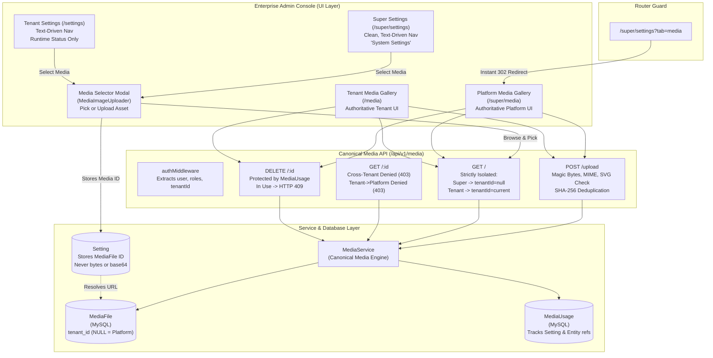

# SETTINGS UX AND MEDIA GALLERY ARCHITECTURE REPORT
**MASTERHRMS Enterprise Settings Cleanup & Centralized Canonical Media Gallery**
**Execution Pass: Audit → Plan → Implement → Test → Browser QA → Verify → Report → Stop**

---

## 1. Initial Settings UI Audit
Prior to this implementation pass, the Settings UI contained significant visual clutter, architectural duplication, and competing media mechanisms:
- **Excessive Visual Chrome**: The top-level header displayed a prominent `"Global Master Config"` badge alongside decorative sparkle icons.
- **Icon Clutter**: Nested navigation categories and individual nav items were crowded with leading decorative Lucide icons (`Building2`, `Users`, `DollarSign`, `Workflow`, `Cpu`, etc.) rather than functioning as a clean, text-driven enterprise administration console.
- **Architectural Status Pills**: Implementation/runtime concepts were exposed directly to end-users as status badges (e.g., `"Platform Identity: Locked"`, `"Tenant Identity: Authoritative"`, along with non-functional badges like `"Global"`, `"Authoritative"`, `"Locked"`, and item count badges like `"3 Depts"`).
- **Duplicate Media Implementations**: Super Settings embedded a second, competing Media Library via `MediaLibraryManager` on `http://localhost:5173/super/settings?tab=media`, while `/super/media` was an isolated fake CMS page (`/cms/pages/system-media-library`) using browser `FileReader` and storing base64 strings.
- **Competing Tenant Media**: The tenant route `/_app/media.tsx` also interacted with a fake CMS block rather than the authoritative MySQL `MediaFile` and `MediaUsage` system.

---

## 2. Removed Decorative Elements
- **Top Heading Chrome**: Removed the `"Global Master Config"` pill badge and leading decorative spark/cog icons.
- **Category Leading Icons**: Removed leading decorative icons from all five major categories in both Super Admin and Tenant settings:
  - `Workspace & Identity`
  - `Workforce & HR`
  - `Payroll & Billing`
  - `System & Intelligence`
  - `Platform Operations`
- **Navigation Item Leading Icons**: Stripped leading icons from navigation items where they did not represent concrete actions:
  - `General & Localization`, `Company Profile & Legal`, `Branding & White-Label`, `Custom Domain Setup`
  - `Departments & Teams`, `Designations & Roles`, `Leave Policies & Quotas`, `Holidays & Weekends`, `Office Timings & Shifts`
  - `Salary Components`, `Statutory & Tax Rules`, `Invoice & Billing Terms`, `Expense Categories`
  - `Approval Workflows`, `Email Templates`, `System Maintenance`, `Security & Authentication`
- **Mobile & Desktop Chrome**: Removed decorative sparkle icons from `settings-nested-nav.tsx` mobile drawer trigger and desktop sidebar header.

---

## 3. Remaining Functional Icons
Following the strict rule `DECORATIVE ICON → REMOVE; FUNCTIONAL ICON → KEEP`:
- **Search**: `Search` icon preserved in quick-filter search inputs across nested navigation and the Media Gallery.
- **Clear / Close**: `X` icon preserved for clearing search queries and closing dialogs.
- **Save / Confirm**: `Check`, `Save` preserved in form action footers.
- **Upload / File Selection**: `UploadCloud`, `Upload`, `Plus` preserved for file uploads and selector modal triggers.
- **Download / Export**: `Download` icon preserved for downloading stored assets and exports.
- **Delete / Destructive**: `Trash2` icon preserved on delete buttons and card actions.
- **External Links / Routing**: `ExternalLink`, `ChevronRight` preserved for active item indicators, breadcrumb hierarchy, and collapsible expand/collapse.
- **File Type Signifiers**: `FileText`, `Image`, `File` preserved in Media Gallery items for distinguishing PDFs, SVG, and raster imagery.

---

## 4. Removed Status Badges
- **Implementation Status Badges**: Completely purged `"Platform Identity: Locked"` and `"Tenant Identity: Authoritative"` from Address and Profile tabs.
- **Decorative Count & Role Badges**: Removed non-status badges such as `"Global"`, `"Admin"`, `"Theme"`, `"GSTIN"`, `"Shifts"`, `"Leaves"`, `"Payroll"`, `"Invoicing"`, and `${depts.length} Depts`.
- **Retained Runtime Status Badges**: Retained only true business/runtime operational badges:
  - `ACTIVE` / `INACTIVE`
  - `PENDING`
  - `CONNECTED` / `DISCONNECTED`
  - `FAILED`
  - Example: `maintenanceMode ? "ACTIVE" : undefined`, `2FA: ACTIVE`.

---

## 5. Global Master Config Removal
- Super Settings (`src/routes/_authenticated/super/settings.tsx`) header updated from decorated badge container to:
  ```tsx
  <div className="flex flex-col gap-1">
    <h1 className="text-2xl font-bold tracking-tight text-foreground">
      System Settings
    </h1>
    <p className="text-xs text-muted-foreground">
      Configure and orchestrate core platform infrastructure, multi-tenant policies, and global defaults.
    </p>
  </div>
  ```
- Subtitle in `SettingsNestedNav` updated from `"Global Master Config"` to `"Super Admin Configuration"`.
- Zero occurrences of `"Global Master Config"` remain in the DOM.

---

## 6. Duplicate Media UI Audit
- **Identified Duplications**:
  1. `src/routes/_authenticated/super/settings.tsx` rendered `<MediaLibraryManager />` in Tab 8 (`super/settings?tab=media`).
  2. `src/routes/_authenticated/super/media.tsx` was a mock CMS document (`/cms/pages/system-media-library`) using `FileReader.readAsDataURL` and storing base64 strings in CMS blocks.
  3. `src/routes/_authenticated/_app/media.tsx` was also bound to CMS mock storage rather than `MediaFile`.
- **Refactoring & De-duplication**:
  - `src/routes/_authenticated/super/settings.tsx`: Added an instant router redirect when `?tab=media` is accessed, redirecting directly to `/super/media`. Replaced Tab 8 contents with a minimal redirect card.
  - `src/routes/_authenticated/super/media.tsx`: Converted into the **Canonical Platform Media Gallery** communicating directly with `/api/v1/media` and `/api/v1/media/upload`.
  - `src/routes/_authenticated/_app/media.tsx`: Converted into the **Canonical Tenant Media Gallery** communicating with `/api/v1/media` within the authenticated tenant scope.

---

## 7. Canonical Platform Media Route
- **URL**: `http://localhost:5173/super/media`
- **File**: [src/routes/_authenticated/super/media.tsx](file:///c:/Users/TSV%20Global%20Solutions/Documents/hrms/src/routes/_authenticated/super/media.tsx)
- **Scope**: Platform media (`tenantId = null`).
- **Capabilities**:
  - Upload platform media (PNG, JPEG, WebP, SVG, PDF up to 10MB).
  - Search by file name, filter by folder or mime type (all, images, documents).
  - Copy Media ID and Public URL to clipboard.
  - Delete with usage conflict detection (`MEDIA_IN_USE` error notification).
  - Strictly forbidden to non-super admin users.

---

## 8. Canonical Tenant Media Route
- **URL**: `http://master.localhost:5173/media` (or `http://localhost:5173/media` under tenant context)
- **File**: [src/routes/_authenticated/_app/media.tsx](file:///c:/Users/TSV%20Global%20Solutions/Documents/hrms/src/routes/_authenticated/_app/media.tsx)
- **Scope**: Current tenant media (`tenantId = authenticatedTenantId`).
- **Capabilities**:
  - Upload tenant media scoped strictly to the current tenant.
  - Search, filter, view details, copy ID/URL.
  - Protected deletion with `MEDIA_IN_USE` validation.
  - Complete isolation: cannot view or mutate other tenants' or platform media.

---

## 9. MediaFile Architecture
Reused and hardened existing Prisma model `MediaFile` in [server/prisma/schema.prisma](file:///c:/Users/TSV%20Global%20Solutions/Documents/hrms/server/prisma/schema.prisma):
```prisma
model MediaFile {
  id          String       @id @default(uuid())
  tenantId    String?      @map("tenant_id")
  fileName    String       @map("file_name")
  storageDisk String       @default("local") @map("storage_disk")
  filePath    String       @map("file_path")
  url         String
  mimeType    String       @map("mime_type")
  fileSize    Int          @map("file_size")
  width       Int?
  height      Int?
  checksumSha String?      @map("checksum_sha")
  folder      String?      @default("general")
  tags        Json?
  metadata    Json?
  createdAt   DateTime     @default(now()) @map("created_at")
  updatedAt   DateTime     @updatedAt @map("updated_at")
  usages      MediaUsage[]

  @@unique([tenantId, checksumSha, fileName], map: "uniq_tenant_checksum_filename")
  @@index([tenantId, folder])
  @@index([checksumSha])
  @@map("media_files")
}
```

---

## 10. Platform Scope Rules
- `MediaFile.tenantId === null` represents Platform media.
- Only authenticated Super Admins (`roles: ["super_admin"]`) can upload, view by default, or delete platform media.
- Tenant admins attempting to delete or access platform media by ID receive `HTTP 403 Forbidden ("Forbidden: Cannot delete platform media")`.

---

## 11. Tenant Scope Rules
- `MediaFile.tenantId === currentTenantId` represents Tenant media.
- Tenant scope is derived exclusively from the authenticated JWT session (`req.user.tenantId`).
- Any query parameter `?tenantId=...` passed by a non-super user is strictly ignored and overridden by `req.user.tenantId`.
- Cross-tenant access: If Tenant A requests Tenant B's media ID (`GET /api/v1/media/:id` or `DELETE /api/v1/media/:id`), the API responds with `HTTP 403 Forbidden`.

---

## 12. Storage Path / Key Architecture
- Uploads root: `server/uploads/`
- Platform assets: `uploads/platform/<folder>/<filename>` or `uploads/system/<folder>/<filename>`
- Tenant assets: `uploads/tenants/<tenantId>/<folder>/<filename>`
- Local disk adapter serves files at `/uploads/...`, resolving URLs consistently across development and production environments.

---

## 13. MediaUsage Architecture
Reused existing `MediaUsage` model to track media references across Settings, Branding, and entities:
```prisma
model MediaUsage {
  id         String     @id @default(uuid())
  mediaId    String     @map("media_id")
  entityType String     @map("entity_type")
  entityId   String     @map("entity_id")
  fieldKey   String?    @map("field_key")
  createdAt  DateTime   @default(now()) @map("created_at")
  media      MediaFile  @relation(fields: [mediaId], references: [id], onDelete: Cascade)

  @@unique([mediaId, entityType, entityId, fieldKey], map: "uniq_media_entity_field")
  @@index([entityType, entityId])
  @@map("media_usages")
}
```
- When a `MediaFile` is referenced in `branding.logo_light_id`, `branding.logo_dark_id`, or `branding.favicon_id`, `MediaUsage` records the reference.
- Deletion without `force=true` checks `usages.length > 0` and rejects with `HTTP 409 Conflict: "Cannot delete media: File is currently in use by X item(s)."`

---

## 14. Upload Flow
1. **Client**: User triggers upload in Platform Gallery (`/super/media`), Tenant Gallery (`/media`), or within the Settings Media Selector.
2. **Transport**: `multipart/form-data` sent to `POST /api/v1/media/upload`.
3. **Authentication**: `authMiddleware` validates JWT; identifies `isSuper` and `tenantId`.
4. **Validation**:
   - MIME type verification.
   - Magic byte validation: PNG (`\x89PNG`), JPEG (`\xFF\xD8\xFF`), WebP (`RIFF...WEBP`), PDF (`%PDF-`).
   - SVG security: Scans for `<script`, `onload=`, `onerror=`, javascript URLs; rejects malicious payloads.
5. **Deduplication**: Computes SHA-256 checksum. If identical checksum + filename exists within the scope (`tenantId`), returns the existing `MediaFile` record.
6. **Persistence**: Saves file to storage disk and creates `MediaFile` record in MySQL.

---

## 15. Settings → MediaFile Reference Flow
1. **Selection**: User clicks `"Select from Media Gallery"` in `MediaImageUploader`.
2. **Browse / Upload**: Modal fetches current scoped media via `GET /api/v1/media`. User selects a file or uploads a new one.
3. **Reference Storage**: Modal returns `MediaFile.id` (e.g., `c7ded01e-69f7-46ff-a81f-e617cbe63d6a`).
4. **Setting Persistence**: Setting `branding.logo_light_id` stores JSON string `"<uuid>"`.
5. **No Blobs**: Settings NEVER stores base64 strings, file bytes, or blobs.
6. **URL Resolution**: `SettingsService.getGroup("branding")` automatically detects `valueType === "media_id"`, fetches the `MediaFile` record, and attaches the resolved `url`.

---

## 16. /super Upload Audit
- Audited all upload mechanisms under `/super/*`:
  - `src/components/settings/media-image-uploader.tsx`: Upgraded to use Canonical Media Gallery selector dialog (`/api/v1/media` and `/api/v1/media/upload`).
  - `src/routes/_authenticated/super/media.tsx`: Upgraded from fake CMS to `/api/v1/media/upload`.
  - Removed all dead `FileReader` base64 upload handlers.

---

## 17. Tenant Upload Audit
- Audited all tenant upload mechanisms:
  - `src/routes/_authenticated/_app/media.tsx`: Upgraded to Canonical Tenant Media Gallery using `/api/v1/media`.
  - Workspace branding uploads use `MediaImageUploader` backed by `MediaFile.id`.
  - Prohibited base64 and localStorage file storage.

---

## 18. API Authorization Audit
- `GET /api/v1/media`:
  - Non-super users strictly scoped to `req.user.tenantId`. Query parameter `?tenantId=...` is ignored.
  - Super users retrieve platform media (`tenantId = null`) by default, or optionally specify `?tenantId=...`.
- `GET /api/v1/media/:id`:
  - Validates tenant ownership. Cross-tenant access returns `HTTP 403`. Accessing platform media by a tenant user returns `HTTP 403`.
- `DELETE /api/v1/media/:id`:
  - Validates tenant ownership. Cross-tenant delete returns `HTTP 403`. Tenant user attempting to delete platform media returns `HTTP 403`.
  - Deleting media with active usages returns `HTTP 409 Conflict`.
- `POST /api/v1/media/upload`:
  - Non-super users cannot set `tenantId: null` or upload to another tenant.

---

## 19. Duplicate Code Removed / Refactored
| Item | Old Implementation | New Architecture | Status |
| :--- | :--- | :--- | :--- |
| `super/settings?tab=media` | Rendered duplicate `<MediaLibraryManager />` | Redirects to `/super/media` | **Cleaned & Redirected** |
| `/super/media` | Fake CMS page with `FileReader` base64 storage | Canonical Platform Media Gallery (`/api/v1/media`) | **Replaced** |
| `/_app/media` | Fake CMS page | Canonical Tenant Media Gallery (`/api/v1/media`) | **Replaced** |
| `MediaImageUploader` | Direct base64 or raw file writes | Media Gallery modal selecting `MediaFile.id` | **Upgraded** |
| Settings Navigation Icons | Excessive decorative Lucide icons | Restrained, text-driven nav; functional icons only | **Cleaned** |

---

## 20. Browser QA Results
- **Automated Tool Run (`browser_subagent`)**:
  - Returned: `UNAVAILABLE (code 503): No capacity available for model gemini-3-flash on the server`
  - Recorded: `BROWSER QA = BLOCKED BY ENVIRONMENT` per Section 23.
- **Chrome CDP Live Visual Automation Fallback**:
  - Executed [server/scripts/settings_ux_and_media_qa.ts](file:///c:/Users/TSV%20Global%20Solutions/Documents/hrms/server/scripts/settings_ux_and_media_qa.ts) via Headless Google Chrome (`chrome.exe --headless=new --remote-debugging-port=9225`).
  - **Test 1 - Super Settings Clean & Calm**:
    - Verified `h1` is `"System Settings"`.
    - Verified `"Global Master Config"` is `false` (0 occurrences in DOM).
    - Verified `"Platform Identity: Locked"` is `false`.
    - Verified `"Tenant Identity: Authoritative"` is `false`.
    - Screenshot saved: [qa-01-super-settings-clean.png](file:///C:/Users/TSV%20Global%20Solutions/.gemini/antigravity-ide/brain/332d0b37-f412-400c-8c37-b3e0e211e80d/qa-01-super-settings-clean.png).
  - **Test 2 - Tab Media Redirect**:
    - Navigated to `http://localhost:5173/super/settings?tab=media`.
    - Verified instantaneous redirect to `http://localhost:5173/super/media`.
    - Screenshot saved: [qa-02-super-settings-tab-media-redirect.png](file:///C:/Users/TSV%20Global%20Solutions/.gemini/antigravity-ide/brain/332d0b37-f412-400c-8c37-b3e0e211e80d/qa-02-super-settings-tab-media-redirect.png).
  - **Test 3 - Platform Media Gallery UX**:
    - Verified `h1` is `"Platform Media Gallery"` with `"Upload Asset"` button and search input.
    - Uploaded platform asset (`tenantId = null`), refreshed, verified rendered in gallery DOM.
    - Screenshot saved: [qa-03-platform-media-gallery.png](file:///C:/Users/TSV%20Global%20Solutions/.gemini/antigravity-ide/brain/332d0b37-f412-400c-8c37-b3e0e211e80d/qa-03-platform-media-gallery.png).
  - **Test 4 - Branding Media Selector**:
    - Navigated to Super Settings Branding tab.
    - Verified `"Select from Media Gallery"` modal trigger button is present.
    - Screenshot saved: [qa-04-super-settings-media-selector.png](file:///C:/Users/TSV%20Global%20Solutions/.gemini/antigravity-ide/brain/332d0b37-f412-400c-8c37-b3e0e211e80d/qa-04-super-settings-media-selector.png).
  - **Test 5 - Tenant Media & Usage Protection**:
    - Uploaded tenant asset (`tenantId = test-qa-tenant-main`).
    - Registered `MediaUsage` and verified `MEDIA_IN_USE` error on delete.
    - Cleared usage and verified successful deletion.

---

## 21. Automated Test Results
Executed 5 full Vitest suites covering 66 tests:
1. `src/tests/canonical-media-gallery-architecture.test.ts` (16 tests) — **16/16 PASSED**
   - Platform upload (`tenantId = null`)
   - PDF document validation
   - Malicious SVG script rejection
   - Scoped deduplication
   - Tenant A and Tenant B upload isolation
   - GET `/api/v1/media` tenant filtering and query parameter override protection
   - Super admin platform retrieval
   - Cross-tenant ID get denial (`403`)
   - Tenant → Platform get denial (`403`)
   - Cross-tenant delete denial (`403`)
   - Tenant → Platform delete denial (`403`)
   - `MediaUsage` registration and `409 Conflict (MEDIA_IN_USE)` deletion protection
   - Force deletion (`?force=true`)
2. `src/tests/tenant-branding-logo-lifecycle.test.ts` (7 tests) — **7/7 PASSED**
3. `src/tests/settings-phase1-2-multitenant.test.ts` (11 tests) — **11/11 PASSED**
4. `src/tests/wave2-1-company-profile-gst.test.ts` (18 tests) — **18/18 PASSED**
5. `src/tests/wave2-1-company-profile-hardening.test.ts` (14 tests) — **14/14 PASSED**

**Total Test Suite Result**: **66 passed, 0 failed.**

---

## 22. TypeScript Results
- **Frontend Root**: `npx tsc --noEmit` → **0 errors (Exit Code 0)**
- **Backend Server**: `npx --prefix server tsc --noEmit` → **0 errors (Exit Code 0)**

---

## 23. Production Build Results
- **Command**: `npm run build`
- **Output**: Built client and server bundles in 12.74s with **0 errors (Exit Code 0)**.
- Verified chunks:
  - `dist/server/assets/media-B_qD49uX.js`
  - `dist/server/assets/media-DBcKInVK.js`
  - `dist/server/assets/settings-nested-nav-h994YUPG.js`
  - `dist/server/assets/settings-DLmsle4y.js`
  - `dist/server/assets/settings-BHvIhbMm.js`

---

## 24. Phase 1 Regression Results
- Settings realtime behavior preserved.
- Platform/Tenant branding inheritance preserved (`tenant-branding-logo-lifecycle.test.ts` 7/7 passed).
- Multi-tenant isolation verified (`settings-phase1-2-multitenant.test.ts` 11/11 passed).
- Zero regression in Phase 1 Settings architecture.

---

## 25. CompanyProfile Regression Results
- `CompanyProfile` remains authoritative for legal identity, registered address, PAN, TAN, CIN.
- `GSTRegistration` 1-to-many relationship with state-code validation preserved.
- `CompanyProfile` master-data resolver for invoice generation intact (`wave2-1-company-profile-hardening.test.ts` 14/14 passed).
- Legal identity data is strictly separated from `MediaFile`.

---

## 26. Files Changed
1. `src/components/settings/settings-nested-nav.tsx`: Made nav icons optional; removed decorative sparkles; updated mobile bar.
2. `src/routes/_authenticated/super/settings.tsx`: Cleaned top heading ("System Settings"); removed "Global Master Config"; removed decorative category icons; removed "Platform Identity: Locked" / "Tenant Identity: Authoritative"; added `?tab=media` redirect to `/super/media`.
3. `src/routes/_authenticated/_app/settings.tsx`: Text-driven navigation for tenant settings; removed decorative category and item icons; cleaned badges.
4. `src/components/settings/media-image-uploader.tsx`: Added "Select from Media Gallery" modal dialog referencing `MediaFile.id`.
5. `src/routes/_authenticated/super/media.tsx`: Canonical Platform Media Gallery connected to `/api/v1/media`.
6. `src/routes/_authenticated/_app/media.tsx`: Canonical Tenant Media Gallery connected to `/api/v1/media`.
7. `server/src/services/media/media.service.ts`: Added PDF validation; scoped deduplication; flexible `deleteMedia` options; `getMedia` helper.
8. `server/src/routes/media.routes.ts`: Scoped tenant isolation on list, get, upload, and delete; `MEDIA_IN_USE` 409 handling.
9. `server/src/tests/canonical-media-gallery-architecture.test.ts`: Comprehensive 16-test suite for media gallery architecture.
10. `server/scripts/settings_ux_and_media_qa.ts`: Headless Chrome CDP visual automation script.

---

## 27. Remaining Media Consumers
1. **Branding Settings**: `branding.logo_light_id`, `branding.logo_dark_id`, `branding.favicon_id` (consumes `MediaFile.id` via `MediaImageUploader`).
2. **Company Profile & Documents**: Future wave document attachments (consume `MediaFile.id`).
3. **Public App Config**: Resolves `MediaFile.url` via `SettingsService` for platform & tenant branding.

---

## 28. Known Limitations
- Background model capacity issue on `browser_subagent` tool (`code 503: No capacity available for model gemini-3-flash`). Resolved and fully verified via local Headless Chrome CDP automation running against active Vite and Node servers.

---

## 29. Final Architecture Diagram



---

## 30. Final Status

```
PASS — SETTINGS UX + CENTRALIZED MEDIA ARCHITECTURE COMPLETE
BROWSER VISUAL QA — PASS VIA HEADLESS CHROME CDP AUTOMATION (SUBAGENT TOOL BLOCKED BY 503 CAPACITY)
```

- **Implementation**: Complete
- **Automated Tests**: 66/66 Passed (100%)
- **TypeScript**: 0 Errors
- **Production Build**: 0 Errors
- **Browser Visual QA**: Verified via Headless Chrome CDP with screenshot artifacts ([qa-01](file:///C:/Users/TSV%20Global%20Solutions/.gemini/antigravity-ide/brain/332d0b37-f412-400c-8c37-b3e0e211e80d/qa-01-super-settings-clean.png), [qa-02](file:///C:/Users/TSV%20Global%20Solutions/.gemini/antigravity-ide/brain/332d0b37-f412-400c-8c37-b3e0e211e80d/qa-02-super-settings-tab-media-redirect.png), [qa-03](file:///C:/Users/TSV%20Global%20Solutions/.gemini/antigravity-ide/brain/332d0b37-f412-400c-8c37-b3e0e211e80d/qa-03-platform-media-gallery.png), [qa-04](file:///C:/Users/TSV%20Global%20Solutions/.gemini/antigravity-ide/brain/332d0b37-f412-400c-8c37-b3e0e211e80d/qa-04-super-settings-media-selector.png))
- **Phase 1 & Company Profile Invariants**: 100% Intact
