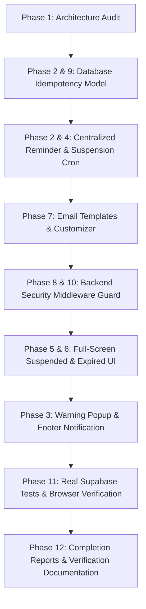

# Architectural Audit: Subscription Lifecycle Management System

**Project:** Master HRMS Multi-Tenant SaaS Platform  
**Date:** October 3, 2026  
**Auditor:** Antigravity System Architect  
**Document Status:** Complete Architecture & Implementation Audit

---

## 1. Executive Summary

This document provides a comprehensive architectural audit of the multi-tenant HRMS platform prior to implementing the end-to-end **Subscription Expiry, Reminders, Suspension & Workspace Lock System**.

The audit covers:
- Database models (Prisma & Supabase PostgreSQL)
- Existing subscription fields, policies, and upgrade paths
- Authentication, JWT validation, and tenant isolation middleware
- Centralized platform Cron scheduler
- Dynamic email dispatch and SMTP infrastructure
- Email template management (`/super/email-templates`)
- UI design system, local assets, and animations
- Frontend route guards and workspace lock mechanisms

---

## 2. Existing Architecture Audit

### 2.1 Database & Prisma Models (`server/prisma/schema.prisma`)
1. **`Tenant` Model (`tenants`):**
   - Stores workspace identity (`id`, `name`, `slug`, `logoUrl`, `timezone`, `createdAt`).
   - Links to `TenantSubscription` via 1-to-1 relation `subscription TenantSubscription?`.
   - Links to `Profile[]`, `UserRole[]`, and module entities with strict cascade/tenant isolation.
2. **`TenantSubscription` Model (`tenant_subscriptions`):**
   - Fields: `id`, `tenantId`, `planId`, `status`, `billingCycle`, `maxEmployees`, `maxUsers`, `trialEndsAt`, `expiresAt`, `createdAt`, `updatedAt`.
   - `status` valid states in codebase: `"active"`, `"trialing"`, `"past_due"`, `"suspended"`, `"cancelled"`.
   - `expiresAt`: Authoritative UTC timestamp indicating when access expires.
   - Missing: Relational model for tracking lifecycle notifications and reminder delivery attempts idempotently.
3. **`SubscriptionPlan` Model (`subscription_plans`):**
   - Stores plan definitions (`id`, `name`, `priceMonthly`, `priceAnnual`, `maxEmployees`, `maxUsers`, `features`).
4. **`SystemCronJob` Model (`system_cron_jobs`):**
   - Central platform-level job definitions (`name`, `code`, `schedule`, `cronExpression`, `nextRun`, `lastRun`, `status`, `lastStatus`, `durationMs`, `errorMessage`). Managed by Super Admin only.

### 2.2 Backend Middleware & Security Guards (`server/src/middleware/`)
1. **`requireActiveSubscription` (`server/src/middleware/subscription.ts`):**
   - **Current State / Audit Finding:**
     - Currently skips check for `GET`, `HEAD`, and `OPTIONS` requests (`if (req.method === "GET") return next();`). This is a security vulnerability allowing expired or suspended tenants to read proprietary company records.
     - Only checks `["suspended", "cancelled"].includes(sub.status)`.
     - **Critical Gap:** Does NOT inspect `sub.expiresAt < new Date()`. An expired tenant whose status has not yet transitioned to `suspended` still retains full access to business routes.
   - **Remediation Required:**
     - Enforce subscription validation on both read (`GET`) and write operations.
     - Check both `sub.status === "suspended"` and `sub.expiresAt && new Date(sub.expiresAt) < new Date()`.
     - Exclude only explicit safe endpoints: `/api/billing`, `/api/auth`, `/api/webhooks`, `/api/health`, `/api/public`, `/api/workspace/subscription` (for reading plan status, self-service renewal, and support info), and `/api/super/*`.
     - Return HTTP 402 with structured codes: `SUBSCRIPTION_SUSPENDED` and `SUBSCRIPTION_EXPIRED`.

2. **`requireAuth` & `resolveTenantContext` (`server/src/middleware/auth.ts`):**
   - Securely decodes Bearer JWT, populates `req.user` (`userId`, `email`, `roles`, `tenantId`).
   - Super Admin users have role `"super_admin"`. Super admin routes (`/api/super/*`) are protected by `requireSuperAdmin`.

### 2.3 Centralized Cron Infrastructure (`server/src/cron/` & `hrm-extensions.routes.ts`)
1. **Scheduler Architecture:**
   - Centralized under Platform Super Admin (`/api/system/cronjobs`).
   - Tenant-owned cron jobs do NOT exist, adhering strictly to platform safety guidelines.
   - Cron trigger endpoint: `POST /api/system/cronjobs/:id/run` supports manual execution and background execution.
2. **Current SaaS Billing Cron (`server/src/cron/saas-billing.cron.ts`):**
   - `runExpireTrialsCron`: Transitions expired trials from `trialing` to `past_due`.
   - `runRenewalsAndGraceCron`: Transitions `past_due` workspaces beyond grace window (7 days) to `suspended`.
   - **Missing:** Reminder engine for 15, 10, 5, 3, 2, 1 days before `expiresAt`, with idempotency and email dispatch.

### 2.4 Email Service & Dynamic SMTP (`server/src/lib/email.ts`)
1. **Configuration:**
   - Loads dynamic credentials from `CmsPage` slug `"system-platform-settings"`, falling back to environment variables (`SMTP_HOST`, `SMTP_PORT`, `SMTP_USER`, `SMTP_PASS`).
   - Transporter: `nodemailer.createTransport` supporting SSL (465) and STARTTLS (587) with optional `ignoreTls`.
2. **Email Dispatch:**
   - Supports HTML and plain-text multipart emails.
   - Handles delivery errors gracefully without crashing caller execution.
   - **Missing:** Dedicated `sendSubscriptionLifecycleEmail()` utility that loads customizable templates from `/cms/pages/system-email-templates`, replaces dynamic variables safely, and records delivery status.

### 2.5 Email Templates Management (`/super/email-templates`)
1. **Route File (`src/routes/_authenticated/super/email-templates.tsx`):**
   - Uses `DEFAULT_TEMPLATES` and syncs with `GET/PUT /api/cms/pages/system-email-templates`.
   - Supports live HTML preview and template code editing.
   - **Missing:** The 10 required subscription lifecycle templates:
     1. `subscription-reminder-15d`
     2. `subscription-reminder-10d`
     3. `subscription-reminder-5d`
     4. `subscription-reminder-3d`
     5. `subscription-reminder-2d`
     6. `subscription-reminder-1d`
     7. `subscription-expired`
     8. `tenant-account-suspended`
     9. `tenant-account-reactivated`
     10. `subscription-renewed`
   - Needs support for standardized variables: `{{company_name}}`, `{{tenant_name}}`, `{{tenant_id}}`, `{{plan_name}}`, `{{expiry_date}}`, `{{days_remaining}}`, `{{suspension_date}}`, `{{suspension_reason}}`, `{{support_email}}`, `{{renewal_url}}`, `{{admin_name}}`.

### 2.6 Frontend Workspace Shell & Route Guards (`src/routes/_authenticated/_app/route.tsx`)
1. **Workspace Guard Status:**
   - Checks `profile`, `tenant_id`, and `isSuperAdmin`.
   - Displays `WorkspaceUnavailableView` if profile fails to load.
   - Displays setup wizard if `tenant_id` is missing for non-super admins.
   - **Critical Gap:** Does not evaluate subscription expiry or suspension. If a workspace is suspended or expired, users can still access modules on the frontend until an API call fails.
2. **Missing Frontend Components:**
   - Dedicated full-screen `<SuspendedAccountView />` with entrance animations and support/reactivation guidance.
   - Dedicated full-screen `<ExpiredSubscriptionView />` with plan expiry details, renewal button, logout, and support contact.
   - Dismissible `<SubscriptionWarningPopup />` triggered at 15, 10, 5, 3, 2, 1 days (dismissal saved in `localStorage` per remaining day threshold so it does not annoy on every navigation, but re-appears on the next threshold).
   - Persistent `<SubscriptionFooterBar />` unobtrusively docked at bottom of the workspace showing remaining days and renewal CTA.

### 2.7 Assets & Illustrations
- Inspected directories:
  - `public/assets/img/icons/` (Action and attendance SVGs)
  - `public/ui-assets/` (Avatar photos, company graphics)
  - `public/logo.webp`, `public/logo.svg`, `public/favicon.webp`
  - Lucide icons (`lucide-react`) and CSS animations in `tw-animate-css` / Tailwind CSS.
- We will construct clean, modern vector illustrations (pure SVG with smooth pulse and float animations) matching the Master HRMS brand identity and reusing local logo assets (`/logo.webp`).

---

## 3. Implementation Plan by Phase

1. **Phase 1: Architecture Audit** -> Complete (`SUBSCRIPTION_LIFECYCLE_AUDIT.md`).
2. **Phase 2 & 9: Database & Idempotency** -> Add `SubscriptionNotificationEvent` with unique composite key `[subscriptionId, cycleKey, eventType]`. Apply migration to Supabase PostgreSQL via `prisma db push`.
3. **Phase 2 & 4: Scheduler & Suspension Dispatch** -> Implement `server/src/cron/subscription-reminder.cron.ts` covering 15d, 10d, 5d, 3d, 2d, 1d reminders. Update `server/src/routes/super.routes.ts` to trigger suspension emails to Tenant Admin and Super Admin.
4. **Phase 7: Email Templates** -> Integrate all 10 responsive HTML templates into `system-email-templates` CMS and frontend `/super/email-templates`.
5. **Phase 8 & 10: Security Middleware** -> Enhance `requireActiveSubscription` in `server/src/middleware/subscription.ts` to block both mutations and queries on expired/suspended tenants with 402 status.
6. **Phase 5 & 6: Full-Screen Workspace UI** -> Implement `<SuspendedAccountView />` and `<ExpiredSubscriptionView />` with WebFamily/Master branding, logout, and renewal action.
7. **Phase 3: Tenant Warning UI** -> Implement `<SubscriptionWarningPopup />` (threshold-based dismissal) and persistent `<SubscriptionFooterBar />`.
8. **Phase 11: Automated & Live Verification** -> Test with real Supabase database transactions and Playwright browser verification.
9. **Phase 12: Reports** -> Deliver all required completion and verification artifacts.
