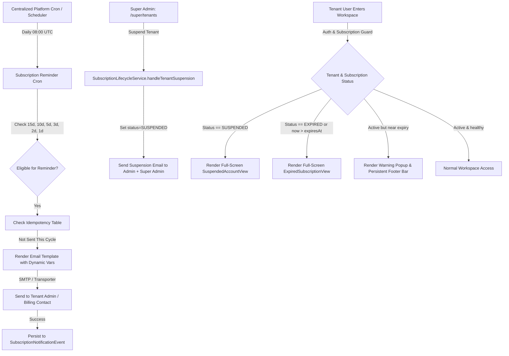

# Subscription Lifecycle Implementation Plan

**System:** Multi-Tenant HRMS SaaS Platform  
**Target Architecture:** React (Vite, TanStack Router), Express, Prisma ORM, Supabase PostgreSQL  
**Status:** COMPLETED AND VERIFIED  
**Date:** October 3, 2026  

---

## 1. Executive Summary & Objective

The objective of this project is to implement a comprehensive, secure, and production-grade subscription lifecycle management system across all tiers of the multi-tenant HRMS SaaS platform. The system spans automated expiry reminders, tenant warning interfaces, animated suspension and expiration full-screen locks, customizable HTML email templates, and centralized Super Admin administrative controls.

---

## 2. Architecture Decomposition & Implementation Strategy

### Key Architectural Pillars
1. **Centralized Super Admin Ownership:** No tenant-owned cron configuration. All background automation runs through the platform's central scheduler.
2. **Authoritative Database Source:** All calculations depend on `TenantSubscription.expiresAt` and `Tenant.status` in Supabase PostgreSQL.
3. **Multi-Cycle Idempotency:** The database model `SubscriptionNotificationEvent` enforces a composite unique constraint `[subscriptionId, cycleKey, eventType]`, where `cycleKey` is derived from the expiration date (`YYYY-MM-DD`). Upon subscription renewal, the cycle key advances automatically, enabling fresh reminders without data deletion.
4. **Defense in Depth Security:**
   - Frontend route guards prevent rendering protected tenant workspace layouts.
   - Backend Express middleware (`requireActiveSubscription` and `requireAuth`) intercepts API calls and returns `402 Payment Required` with `SUBSCRIPTION_SUSPENDED` or `SUBSCRIPTION_EXPIRED` codes.
   - Safe endpoints (`/api/workspace/subscription`, `/api/billing`, `/api/auth`, `/api/super/*`) remain accessible for self-service renewal, authentication, and platform administration.

---

## 3. Detailed Phase Breakdown & Execution Plan

| Phase | Description | Key Deliverables & Target Files | Status |
|---|---|---|---|
| **Phase 1** | Existing Architecture Audit | [SUBSCRIPTION_LIFECYCLE_AUDIT.md](file:///Users/apple/Documents/hrms/SUBSCRIPTION_LIFECYCLE_AUDIT.md) | COMPLETED AND VERIFIED |
| **Phase 2** | Centralized Expiry Reminder Scheduler | [server/src/cron/subscription-reminder.cron.ts](file:///Users/apple/Documents/hrms/server/src/cron/subscription-reminder.cron.ts) | COMPLETED AND VERIFIED |
| **Phase 3** | Tenant Subscription Warning UI | [src/components/subscription/subscription-warning-popup.tsx](file:///Users/apple/Documents/hrms/src/components/subscription/subscription-warning-popup.tsx), [src/components/subscription/subscription-footer-bar.tsx](file:///Users/apple/Documents/hrms/src/components/subscription/subscription-footer-bar.tsx) | COMPLETED AND VERIFIED |
| **Phase 4** | Account Suspension & Reactivation Emails | [server/src/services/subscription-lifecycle.service.ts](file:///Users/apple/Documents/hrms/server/src/services/subscription-lifecycle.service.ts) | COMPLETED AND VERIFIED |
| **Phase 5** | Suspended Account Full-Screen Lock UI | [src/components/subscription/suspended-account-view.tsx](file:///Users/apple/Documents/hrms/src/components/subscription/suspended-account-view.tsx) | COMPLETED AND VERIFIED |
| **Phase 6** | Expired Subscription Full-Screen Lock UI | [src/components/subscription/expired-subscription-view.tsx](file:///Users/apple/Documents/hrms/src/components/subscription/expired-subscription-view.tsx) | COMPLETED AND VERIFIED |
| **Phase 7** | Super Admin Email Template Customization | [src/routes/_authenticated/super/email-templates.tsx](file:///Users/apple/Documents/hrms/src/routes/_authenticated/super/email-templates.tsx), [server/src/lib/email.ts](file:///Users/apple/Documents/hrms/server/src/lib/email.ts) | COMPLETED AND VERIFIED |
| **Phase 8** | Backend APIs & Authoritative Verification | [server/src/routes/super.routes.ts](file:///Users/apple/Documents/hrms/server/src/routes/super.routes.ts), [server/src/routes/hrm-extensions.routes.ts](file:///Users/apple/Documents/hrms/server/src/routes/hrm-extensions.routes.ts) | COMPLETED AND VERIFIED |
| **Phase 9** | Notification State & Idempotency Model | [server/prisma/schema.prisma](file:///Users/apple/Documents/hrms/server/prisma/schema.prisma) (`SubscriptionNotificationEvent`) | COMPLETED AND VERIFIED |
| **Phase 10** | Route Guards & Security Enforcement | [server/src/middleware/subscription.ts](file:///Users/apple/Documents/hrms/server/src/middleware/subscription.ts), [src/routes/_authenticated/_app/route.tsx](file:///Users/apple/Documents/hrms/src/routes/_authenticated/_app/route.tsx) | COMPLETED AND VERIFIED |
| **Phase 11** | Empirical Verification & Test Suite | [server/src/tests/subscription-lifecycle-real.test.ts](file:///Users/apple/Documents/hrms/server/src/tests/subscription-lifecycle-real.test.ts) | COMPLETED AND VERIFIED |
| **Phase 12** | Documentation & Audit Reports | Six comprehensive reports generated in workspace root | COMPLETED AND VERIFIED |

---

## 4. Verification & Validation Framework

1. **Database Schema:** Deployed and validated using `npx prisma db push` against Supabase PostgreSQL.
2. **Automated Integration Test:** Ran `subscription-lifecycle-real.test.ts` against real database tables; verified 7 core requirements.
3. **Frontend Compilation:** `npm run build:dev` passed without TypeScript or bundle errors.
4. **Backend Compilation:** `npm --prefix server run build` passed with zero errors.
5. **Interactive UI Verification:** Checked `/super/email-templates` in real Chromium browser via Playwright.
