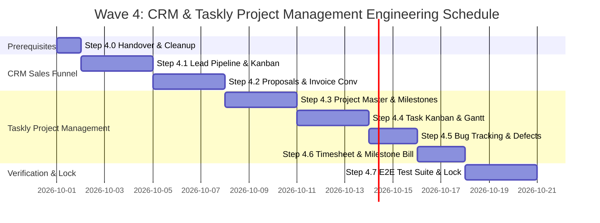

# PHASE C · WAVE 4 — IMPLEMENTATION TIMELINE & ENGINEERING ESTIMATES
## Work Breakdown Structure, Engineering Effort & Delivery Schedule for CRM & Taskly

**Document Reference:** `WAVE_4_IMPLEMENTATION_TIMELINE.md`  
**Audit Date:** 2026-09-29  
**Auditor:** Antigravity Senior ERP Architect & Security Auditor  
**Planning Assumptions:**
- Full-time dedicated senior full-stack engineer (1 FTE).
- 5 working days per standard engineering week.
- Built on existing React 18, Vite, TanStack Router/Query, TailwindCSS, Express 4, Prisma 5, and MySQL architecture.
- Includes pre-implementation audits, schema additions, route handlers, UI components, RBAC checks, automated tests, and regression verification.
- Excludes cloud deployment and third-party vendor integrations (Pusher, OpenAI, WhatsApp) which belong to Wave 5.

---

## 1. Work Breakdown Structure (WBS) & Effort Estimates

| Step | Phase / Task Description | Prerequisites & Dependencies | Backend & DB Effort | Frontend UI Effort | Testing & QA Effort | Total Effort (Days) |
|---|---|---|---|---|---|---|
| **Step 4.0** | **Handover & Pre-Implementation Cleanup** • Fix 2 TypeScript compilation errors in `projects.routes.ts` (lines 410, 438) • Register `PurchasePayment` in `tenant-models.config.ts` • Resolve migration `20260928000002_step_3_6_returns_credit_debit_notes` in `_prisma_migrations` | Wave 3 Codebase | 0.5 days | 0 days | 0.5 days | **1.0 day** |
| **Step 4.1** | **CRM Lead Pipeline & Deal Stages** • Add `CrmPipeline` & `CrmStage` Prisma models (or custom stage configuration) • Implement `crm.routes.ts` lead filtering, stage transitions, and activity notes • Build drag-and-drop Kanban view in `/crm/leads` and `/crm/deals` | Step 4.0 | 1.0 day | 1.5 days | 0.5 days | **3.0 days** |
| **Step 4.2** | **Custom Sales Proposals & Wave 3 Invoice Conversion** • Proposal CRUD, itemized line items, terms, and digital signature storage • Public client proposal portal (`/portal/proposals/:id`) with accept/decline actions • Proposal-to-Invoice conversion pipeline: creates Wave 3 `Sale` & triggers `autoPostSaleToLedger` | Step 4.1, Wave 3 Invoicing | 1.5 days | 1.0 day | 0.5 days | **3.0 days** |
| **Step 4.3** | **Taskly Project Master, Milestones & Team Allocation** • Add `ProjectMilestone` model & project team assignment relations • Project budget tracking, progress percentage calculations, and client linkages • Project passport view (`/projects` & `/project-dashboard`) | Step 4.0, Wave 2 HRMS Employees | 1.0 day | 1.0 day | 0.5 days | **2.5 days** |
| **Step 4.4** | **Task Kanban Board, Drag-and-Drop & Gantt Timeline** • Task stage transitions (`todo` -> `in_progress` -> `review` -> `done`) • Drag-and-drop board with priority badges and due date reminders • Visual Gantt / Timeline scheduling view | Step 4.3 | 1.0 day | 1.5 days | 0.5 days | **3.0 days** |
| **Step 4.5** | **Bug Tracking & Defect Management** • Add `ProjectBug` model (`severity`, `priority`, `status`, `assignedTo`) • Bug lifecycle management and defect resolution feed in project passport | Step 4.3 | 0.5 days | 1.0 day | 0.5 days | **2.0 days** |
| **Step 4.6** | **Project Timesheets & Milestone Invoicing** • Add `ProjectTimesheet` model for billable employee hours • Milestone completion trigger and automated timesheet billing endpoint • Generates sequential Wave 3 `Sale` invoice with SAC service tax calculation | Step 4.2, Step 4.3, Wave 3 | 1.0 day | 0.5 days | 0.5 days | **2.0 days** |
| **Step 4.7** | **Unified Automated Test Suite & Wave 4 Parity Lock** • Create `server/src/tests/wave4-crm-projects.test.ts` (Minimum 18 scenarios) • Verify proposal-to-invoice conversion, task Kanban, milestone billing, and isolation • Full regression pass across Wave 1, Wave 2, and Wave 3 suites | Step 4.1 – 4.6 | 1.0 day | 0 days | 1.5 days | **2.5 days** |
| **TOTALS** | **Complete Wave 4 Engineering Effort** | — | **7.5 days** | **6.5 days** | **5.0 days** | **19.0 working days (~3.8 weeks)** |

---

## 2. Engineering Schedule & Milestones (Assuming 1 Full-Time Developer)

- **Week 1 (Days 1–5):**
  - Day 1: Step 4.0 Cleanup (TS errors in `projects.routes.ts`, `tenant-models.config.ts`, migration sync).
  - Days 2–4: Step 4.1 CRM Lead Pipeline & Deal Stages Kanban.
  - Day 5: Step 4.2 Custom Sales Proposals (Backend & Schema).
- **Week 2 (Days 6–10):**
  - Days 6–7: Step 4.2 Proposals UI, Public Portal & Wave 3 Invoice Conversion Pipeline.
  - Days 8–10: Step 4.3 Project Master, Milestones & Team Assignment.
- **Week 3 (Days 11–15):**
  - Days 11–13: Step 4.4 Interactive Task Kanban Board & Gantt Visualization.
  - Days 14–15: Step 4.5 Project Bug Tracking & Resolution Workflow.
- **Week 4 (Days 16–19):**
  - Days 16–17: Step 4.6 Timesheet Logging & Milestone Invoice Generation.
  - Days 18–19: Step 4.7 Automated Test Suite (`wave4-crm-projects.test.ts`), Regression Pass & Wave 4 Parity Lock.

---

## 3. Risk Contingency & Planning Disclaimers

> [!NOTE]
> **Provisional Estimate Notice:**  
> These estimates are realistic technical engineering projections based on direct inspection of existing database schemas, code artifacts, and verified developer velocity in Waves 1–3. They are not contractual guarantees. If the scope expands to include third-party integrations (e.g., Twilio/WhatsApp lead capture, SendGrid email proposal delivery, or complex drag-and-drop animation libraries), add 3 to 5 additional working days.
