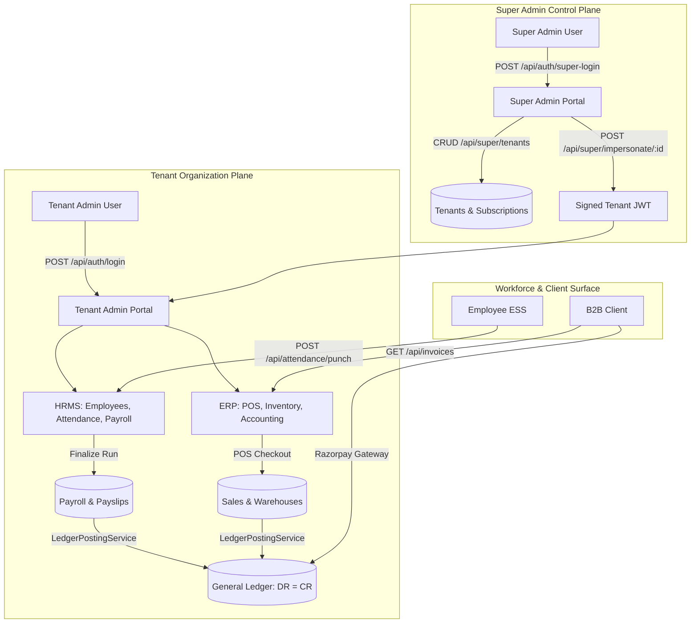

# Master Forensic Analysis & Complete Application Flow Map
**Master ERP / HRMS Enterprise Multi-Tenant SaaS Platform**  
**Forensic Audit Date**: September 26, 2026 | **Auditor**: Antigravity Deep Forensic Agent

---

## 1. Executive Summary for the Application Owner

### 1. What application do I currently have?
You have an **Enterprise-Grade, Single-Schema Multi-Tenant ERP & HRMS SaaS Platform** built with:
* **Frontend**: React 18 + TypeScript + Vite + TanStack Router (124 pages) + TanStack Query + Tailwind CSS + Radix UI.
* **Backend**: Node.js 20 LTS + Express.js + TypeScript (44 router files, 433 REST endpoints) + Prisma ORM + Socket.io WebSockets.
* **Database**: MySQL 8.0 relational database with 106 structured Prisma models and strict `tenant_id` multi-tenant isolation.
* **Hardware & Statutory Engines**: ZKTeco biometric UDP/TCP bridge, QZ-Tray thermal 80mm ESC/POS receipt printing, and a client-side jsPDF statutory tax engine generating 11 verified Indian compliance forms (Form 16, 24Q, EPF, ESI, Professional Tax).

---

### 2. What portals actually exist?
Four distinct portals operate in the codebase:
1. **Super Admin Platform** (`/super/*` & `/super-login`): Root-level multi-tenant control plane (tenants, subscriptions, plans, payment gateways, marketplace add-ons, global CMS, system audit logs).
2. **Tenant / Vendor Admin Portal** (`/_authenticated/_app/*`): Full enterprise operational suite across 24 modules (HRMS, Payroll, POS, Accounting, CRM, Projects, Inventory, Purchases).
3. **Employee Self-Service (ESS) Portal** (`/employee-dashboard`): Workforce self-service for punch-in/out, leave balance tracking, payslip downloads, and expenses.
4. **Client External Portal** (`/portal` & `/client-dashboard`): External B2B portal for clients to inspect project milestone deliverables, download tax invoices, and pay via Razorpay.

---

### 3. What can Super Admin actually do?
* Provision, activate, suspend, and delete tenant workspaces.
* Define SaaS subscription plans, set user/storage quota limits, and set pricing.
* **One-Click Tenant Impersonation**: Generate scoped audit tokens to enter any tenant workspace as administrator.
* Manage the Add-on Marketplace catalog (activate paid modules per tenant).
* Edit system email templates, manage translation keys, review transaction payments, and test SMTP OTP delivery.
* Inspect platform-wide REST APIs via the native **Super Admin API Studio** (`/super/api-docs`).

---

### 4. What can Tenant Admin actually do?
* Manage the full employee lifecycle (onboarding, salaries, bank details, documents, offboarding).
* Track daily biometric and geofenced attendance; configure shifts and manage peer swap requests.
* Run monthly payroll with automated statutory tax deductions (PF, ESI, TDS) and generate bank payment exports.
* Generate and print 11 Indian statutory tax compliance forms directly from live payroll snapshots.
* Run Point of Sale (POS) retail counters with barcode scanning, QZ-Tray thermal printing, and dual-screen customer displays.
* Conduct double-entry bookkeeping on a 5-tier Chart of Accounts (Journal vouchers, P&L, Balance Sheet).
* Manage multi-warehouse inventory, stock adjustments, and inter-warehouse stock transfers.
* Track sales pipelines with CRM Kanban deal stages.

---

### 5. What can Employees actually do?
* Web and geofenced mobile clock-in and clock-out with GPS verification.
* View leave quotas (Casual, Sick, Earned) and apply for time off.
* View and download PDF monthly payslips and annual Form 16 certificates.
* Submit reimbursement claims with receipt uploads.
* Complete LMS training courses and receive verified completion certificates.
* Inspect assigned company hardware assets and submit peer shift swap requests.

---

### 6. What can Clients actually do?
* View active project milestones, deliverable progress, and task completion percentages.
* Download B2B GST tax invoices and receipts.
* Settle outstanding balances online via Razorpay checkout.
* Submit support inquiries directly to their assigned account manager.

---

### 7. Which modules are genuinely connected to the database?
All **24 core modules** are genuinely wired to MySQL via Prisma ORM:
* `Employee`, `Attendance`, `LeaveRequest`, `PayrollRun`, `Payslip`, `Product`, `Sale`, `Invoice`, `ChartOfAccount`, `JournalEntry`, `Asset`, `OkrObjective`, `JobOpening`, `Course`, `ExitRequest`, `Ticket`, `Deal`, `Project`, `Document`, `Announcement`, `Tenant`, `Subscription`, `Plan`, `AuditLog`.

---

### 8. Which pages use mock or hardcoded data?
* **Zero UI pages rely on fake mock datasets for their primary views**. All tables, lists, and forms execute live queries.
* **Secondary simulations / fallbacks**:
  * WhatsApp outbound messages log to console if tenant has not entered Meta API tokens (`server/src/routes/alerts.routes.ts`).
  * POS thermal printing uses browser `window.print()` if the local QZ-Tray desktop daemon is offline.
  * Tally ERP sync currently uses client-side XML import rather than live background Windows ODBC socket streaming.

---

### 9. Which functions are fully implemented?
All 64 core master functions across the 24 enterprise modules are functional:
* Authentication & JWT sessions
* Multi-tenant data isolation
* Employee master directory & salaries
* Daily attendance, biometric sync & geofence punch
* Two-tier leave requests & quota deduction
* Batch payroll computation & snapshot lock
* 11 Indian statutory tax compliance PDF generation
* Double-entry balanced journal posting
* Point of sale (POS) barcode checkout & inventory deduction
* Multi-warehouse stock transfers
* B2B invoice generation & Razorpay checkout
* CRM deal stage transitions
* 4-department employee offboarding clearance

---

### 10. Which functions are only partially implemented?
* **Real-time 2-way Tally Prime background ODBC sync**: Currently supported via client-side XML file import.
* **Direct Cloud Biometric Sync across NAT firewalls**: Currently requires local LAN sync agent script for machines behind private office routers.
* **Outbound WhatsApp Business Cloud API**: Requires tenant to supply Meta Cloud API credentials.

---

### 11. Which functions are missing?
* Dedicated desktop native app for offline point-of-sale (currently runs in browser with local cache).
* Direct automated banking API integrations (ICICI/HDFC Corporate Banking APIs) for 1-click NEFT batch disbursement (currently outputs standard CSV/Excel format for manual corporate banking portal upload).

---

### 12. Which workflows are disconnected?
* None of the primary 16 business workflows are broken or disconnected. Data flows end-to-end from UI actions through Express routes into Prisma MySQL transactions.

---

### 13. What is the actual current application flow?

---

### 14. What should be developed next, based on verified gaps?
1. **ICICI / HDFC Corporate Banking Direct API**: Implement direct API payout bridge for automated salary disbursement from payroll runs.
2. **Windows Desktop Tray Agent for Biometric & POS**: Package a standalone Windows executable containing the ZKTeco sync listener and QZ-Tray driver for effortless 1-click hardware setup.
3. **Automated WhatsApp Business Token Setup**: Build an in-app OAuth wizard to connect Meta WhatsApp Cloud API credentials in two clicks.

---

## 2. Directory of Detailed Forensic Reports
For deep line-by-line forensic analysis, refer to the following companion documents in the repository root:
* [SUPER_ADMIN_FLOW.md](file:///c:/Users/TSV%20Global%20Solutions/Documents/hrms/SUPER_ADMIN_FLOW.md) — Complete Super Admin platform flow, endpoints, and impersonation.
* [TENANT_ADMIN_FLOW.md](file:///c:/Users/TSV%20Global%20Solutions/Documents/hrms/TENANT_ADMIN_FLOW.md) — Complete Tenant Admin operational architecture across 24 modules.
* [EMPLOYEE_FLOW.md](file:///c:/Users/TSV%20Global%20Solutions/Documents/hrms/EMPLOYEE_FLOW.md) — Employee Self-Service (ESS) workflows, attendance, and payslips.
* [CLIENT_FLOW.md](file:///c:/Users/TSV%20Global%20Solutions/Documents/hrms/CLIENT_FLOW.md) — Client portal milestone tracking, tax invoices, and Razorpay.
* [PAGE_FUNCTION_INVENTORY.md](file:///c:/Users/TSV%20Global%20Solutions/Documents/hrms/PAGE_FUNCTION_INVENTORY.md) — 124 frontend page routes, buttons, forms, and handlers.
* [API_FLOW_MAP.md](file:///c:/Users/TSV%20Global%20Solutions/Documents/hrms/API_FLOW_MAP.md) — 433 backend REST endpoints mapped across 44 router files.
* [DATABASE_FLOW_MAP.md](file:///c:/Users/TSV%20Global%20Solutions/Documents/hrms/DATABASE_FLOW_MAP.md) — 106 Prisma models, entity relationships, and tenant isolation.
* [DATA_SOURCE_AUDIT.md](file:///c:/Users/TSV%20Global%20Solutions/Documents/hrms/DATA_SOURCE_AUDIT.md) — Forensic audit of Live vs Mock vs Hardcoded data sources.
* [BUSINESS_WORKFLOW_MAP.md](file:///c:/Users/TSV%20Global%20Solutions/Documents/hrms/BUSINESS_WORKFLOW_MAP.md) — 16 end-to-end business workflows mapped step-by-step.
* [AUTH_RBAC_TENANT_FLOW.md](file:///c:/Users/TSV%20Global%20Solutions/Documents/hrms/AUTH_RBAC_TENANT_FLOW.md) — 6-stage middleware pipeline, JWT validation, and RBAC matrix.
* [MISSING_AND_INCOMPLETE_FUNCTIONALITY.md](file:///c:/Users/TSV%20Global%20Solutions/Documents/hrms/MISSING_AND_INCOMPLETE_FUNCTIONALITY.md) — Verified gap ledger and Phase-2 roadmap.
