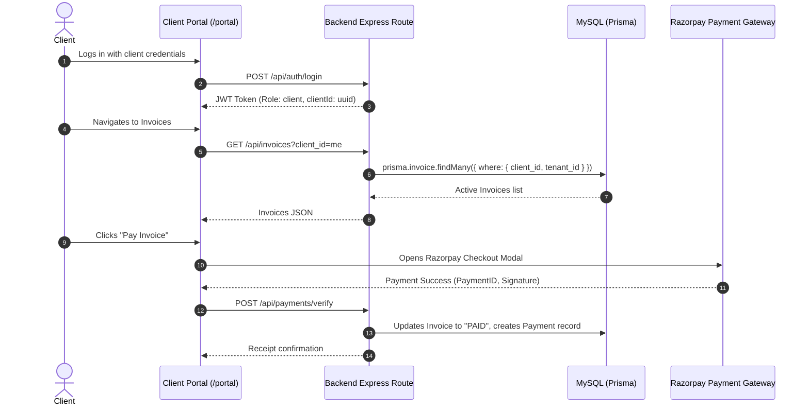

# Client External Portal Flow & Forensic Architecture

## 1. Executive Summary & Security Isolation
The Client External Portal is designed for B2B customers, clients, and project stakeholders. It allows external clients to monitor their active deliverables, download tax invoices, pay securely via Razorpay, and submit support tickets to their dedicated account manager.

* **Routes**: `/portal` (`src/routes/portal.tsx`) & `/client-dashboard`
* **Role Guard**: `role: "client"`
* **Data Boundary**: Strictly isolated by `client_id` and `tenant_id`. Clients have zero access to internal HRMS tables, employee PII, internal payroll, cost of goods, or vendor purchase orders.

---

## 2. Client Portal Functions & Workflows

### 2.1. Client Functional Inventory
* **Project Milestone Tracker**: Reads from `Project` and `Task` tables where `clientId == user.clientId`. Renders Gantt progress bars and deliverable sign-offs.
* **B2B Invoices & Receipts**: Reads from `Invoice` table. Renders client-side PDF tax invoices with GSTIN, HSN codes, and itemized billings.
* **Online Payment Gateway**: Integrates Razorpay modal. Upon signature verification, triggers automatic double-entry journal posting marking accounts receivable as settled.
* **Account Support Tickets**: Creates records in `Ticket` table scoped to the client's account, routing inquiries directly to the project manager.
