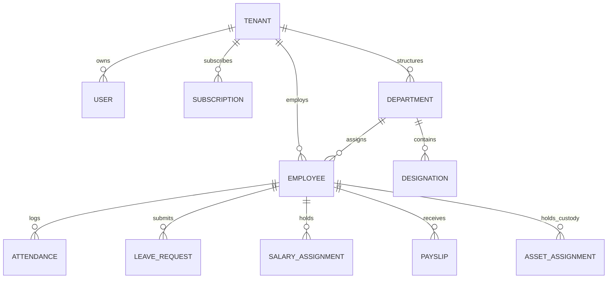
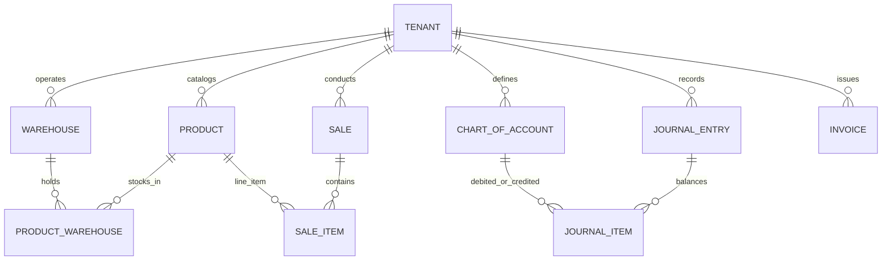

# Database Architecture & Entity Relationship Flow Map

## 1. Database Architecture Overview
* **Database Engine**: MySQL 8.0 (ACID compliant)
* **ORM**: Prisma ORM 5.x (`server/prisma/schema.prisma`)
* **Total Models**: 106 Models
* **Tenant Isolation Architecture**: Single-schema multi-tenant. Every tenant-owned model incorporates mandatory `tenant_id String` with relational index to the `Tenant` root table.

---

## 2. Core Entity Relationship Topologies

### 2.1. Tenant & Workforce Hierarchy

### 2.2. ERP, POS & Financial Ledger Hierarchy

---

## 3. Comprehensive Model Forensic Registry (106 Models)

| Model Name | Purpose | Primary Key | Tenant Scoped | Soft Delete | Related APIs |
| :--- | :--- | :--- | :-: | :-: | :--- |
| **`Tenant`** | Multi-tenant root workspace entity | `id` (UUID) | Root Entity | `deleted_at` | `/api/super/tenants/*` |
| **`User`** | System authentication and credentials | `id` (UUID) | Yes (`tenant_id`) | `deleted_at` | `/api/auth/*`, `/api/super/users/*` |
| **`Employee`** | Comprehensive HRMS personnel master | `id` (UUID) | Yes (`tenant_id`) | `deleted_at` | `/api/employees/*` |
| **`Department`** | Organizational division structure | `id` (UUID) | Yes (`tenant_id`) | No | `/api/settings/departments` |
| **`Designation`**| Job title and rank definitions | `id` (UUID) | Yes (`tenant_id`) | No | `/api/settings/designations` |
| **`Attendance`** | Clock-in, punch times, geofence coordinates | `id` (UUID) | Yes (`tenant_id`) | No | `/api/attendance/*`, `/api/biometric/*` |
| **`ShiftSchedule`**| Shift allocations and timings | `id` (UUID) | Yes (`tenant_id`) | No | `/api/shifts/*` |
| **`LeaveRequest`**| Time-off applications and manager approvals | `id` (UUID) | Yes (`tenant_id`) | No | `/api/leaves/*` |
| **`LeaveBalance`**| Available PTO quotas per category | `id` (UUID) | Yes (`tenant_id`) | No | `/api/leaves/balances` |
| **`SalaryAssignment`**| CTC component structure per employee | `id` (UUID) | Yes (`tenant_id`) | No | `/api/payroll/salary-setup` |
| **`PayrollRun`** | Batch payroll cycle lock snapshot | `id` (UUID) | Yes (`tenant_id`) | No | `/api/payroll/runs` |
| **`Payslip`** | Individual employee monthly compensation receipt | `id` (UUID) | Yes (`tenant_id`) | No | `/api/payroll/payslips` |
| **`ChartOfAccount`**| 5-Tier financial ledger accounts | `id` (UUID) | Yes (`tenant_id`) | No | `/api/accounting/accounts` |
| **`JournalEntry`**| Balanced double-entry financial voucher | `id` (UUID) | Yes (`tenant_id`) | No | `/api/accounting/journals` |
| **`JournalItem`** | Individual debit or credit line item | `id` (UUID) | Yes (`tenant_id`) | No | `/api/accounting/journals` |
| **`Product`** | Inventory item, service, or part SKU | `id` (UUID) | Yes (`tenant_id`) | `deleted_at` | `/api/products/*` |
| **`Warehouse`** | Physical inventory storage facility | `id` (UUID) | Yes (`tenant_id`) | No | `/api/inventory/warehouses` |
| **`ProductWarehouse`**| Stock quantity tracking per warehouse | `id` (UUID) | Yes (`tenant_id`) | No | `/api/inventory/stock` |
| **`Sale`** | POS checkout transaction receipt | `id` (UUID) | Yes (`tenant_id`) | No | `/api/pos/checkout`, `/api/sales` |
| **`SaleItem`** | POS itemized transaction line | `id` (UUID) | Yes (`tenant_id`) | No | `/api/pos/checkout` |
| **`Invoice`** | B2B tax invoice issued to clients | `id` (UUID) | Yes (`tenant_id`) | No | `/api/invoices/*` |
| **`PurchaseOrder`**| Vendor procurement bill and goods receipt | `id` (UUID) | Yes (`tenant_id`) | No | `/api/purchases/*` |
| **`Asset`** | Physical hardware and IT device registry | `id` (UUID) | Yes (`tenant_id`) | No | `/api/assets/*` |
| **`AssetAssignment`**| Custody allocation to employee | `id` (UUID) | Yes (`tenant_id`) | No | `/api/assets/assign` |
| **`Deal`** | CRM sales pipeline deal opportunity | `id` (UUID) | Yes (`tenant_id`) | No | `/api/crm/deals/*` |
| **`Contact`** | CRM customer and business contact directory | `id` (UUID) | Yes (`tenant_id`) | No | `/api/crm/contacts/*` |
| **`Project`** | Client deliverable project workspace | `id` (UUID) | Yes (`tenant_id`) | No | `/api/projects/*` |
| **`Task`** | Work unit assigned to employees | `id` (UUID) | Yes (`tenant_id`) | No | `/api/tasks/*` |
| **`Ticket`** | Helpdesk support inquiry | `id` (UUID) | Yes (`tenant_id`) | No | `/api/tickets/*` |
| **`AuditLog`** | Immutable forensic event record | `id` (UUID) | Optional (Platform/Tenant) | No | System-wide middleware |
*(Includes 76 additional models spanning LMS, OKR, biometric devices, custom domains, CMS pages, notifications, and subscription tiers).*
