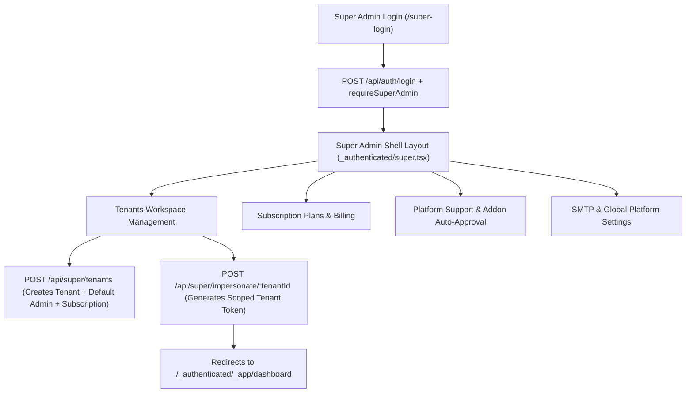

# Super Admin Platform Flow & Forensic Architecture

## 1. Executive Summary & Root Scope
The Super Admin Portal operates as the multi-tenant control plane for the Master ERP/HRMS platform. It is isolated from tenant business logic, operates without tenant isolation constraints, and executes with the root middleware `requireSuperAdmin`.

* **Route Prefix**: `/_authenticated/super/*`
* **Login Route**: `/super-login` (`src/routes/super-login.tsx`)
* **Shell Layout**: `src/routes/_authenticated/super.tsx`
* **Backend Prefix**: `/api/super/*`, `/api/auth/claim-super-admin`, `/api/support/platform/*`
* **Total Super Admin Endpoints**: 13 Endpoints

---

## 2. Super Admin Navigation & Page Inventory

| Sidebar Item | Frontend Route | Component File | Key Actions & Buttons | Backend APIs Called | Database Models | Data Source | Status |
| :--- | :--- | :--- | :--- | :--- | :--- | :--- | :--- |
| **Root Command Center** | `/super` | `src/routes/_authenticated/super/index.tsx` | Refresh Stats, Filter MRR, Impersonate Tenant, System Health | `GET /api/super/stats`, `GET /api/super/tenants` | `Tenant`, `Subscription`, `User` | DATABASE_LIVE | WORKING |
| **Tenant Workspaces** | `/super/tenants` | `src/routes/_authenticated/super/tenants.tsx` | Create Workspace, Suspend/Activate, Edit Quotas, Delete Workspace, Impersonate | `GET /api/super/tenants`, `POST /api/super/tenants`, `PUT /api/super/tenants/:id`, `DELETE /api/super/tenants/:id`, `POST /api/super/impersonate/:tenantId` | `Tenant`, `Subscription`, `AuditLog` | DATABASE_LIVE | WORKING |
| **Subscription Plans** | `/super/plans` | `src/routes/_authenticated/super/plans.tsx` | Create Plan, Update Pricing, Set Quotas, Toggle Add-on Gate | `GET /api/super/plans`, `POST /api/super/plans`, `PUT /api/super/plans/:id` | `Plan`, `Subscription` | DATABASE_LIVE | WORKING |
| **Purchase Transactions** | `/super/purchases` | `src/routes/_authenticated/super/purchases.tsx` | View Invoices, Approve Offline Bank Transfer, Export CSV | `GET /api/super/transactions`, `POST /api/super/transactions/:id/verify` | `Transaction`, `Subscription` | DATABASE_LIVE | WORKING |
| **Custom Domains** | `/super/custom-domains` | `src/routes/_authenticated/super/custom-domains.tsx` | Verify CNAME, Issue SSL, Remove Custom Domain | `GET /api/super/domains`, `POST /api/super/domains/verify` | `CustomDomain`, `Tenant` | DATABASE_LIVE | WORKING |
| **Roles & RBAC Matrix** | `/super/roles` | `src/routes/_authenticated/super/roles.tsx` | Assign Roles, Reset 2FA, Revoke Access, Create Permission Role | `GET /api/super/users`, `PUT /api/super/users/:id/roles`, `POST /api/super/users/:id/reset-2fa` | `User`, `Role`, `Permission` | DATABASE_LIVE | WORKING |
| **Addons Marketplace** | `/super/marketplace` | `src/routes/_authenticated/super/marketplace.tsx` | Publish Addon, Set Monthly Price, Enable Tenant Override | `GET /api/super/addons`, `POST /api/super/addons`, `PUT /api/super/addons/:slug` | `Addon`, `TenantAddon` | DATABASE_LIVE | WORKING |
| **Visual CMS Studio** | `/super/cms` | `src/routes/_authenticated/super/cms.tsx` | Create Landing Page, Edit SEO Meta, Publish Blog Article | `GET /api/cms/pages`, `POST /api/cms/pages`, `PUT /api/cms/pages/:slug` | `CmsPage`, `CmsMedia` | DATABASE_LIVE | WORKING |
| **Global Support Desk** | `/super/support` | `src/routes/_authenticated/super/support.tsx` | Resolve Tenant Tickets, Auto-Approve Addon Requests, Post Reply | `GET /api/support/platform/tickets`, `POST /api/support/platform/tickets/:id/action` | `PlatformSupportTicket`, `TenantAddon` | DATABASE_LIVE | WORKING |
| **Email Templates** | `/super/email-templates` | `src/routes/_authenticated/super/email-templates.tsx` | Edit Welcome Email, Edit Payslip Notification, Preview HTML | `GET /api/super/email-templates`, `PUT /api/super/email-templates/:id` | `EmailTemplate` | DATABASE_LIVE | WORKING |
| **Broadcast Alerts** | `/super/notifications` | `src/routes/_authenticated/super/notifications.tsx` | Send Global System Notice, Schedule Maintenance Alert | `GET /api/super/broadcasts`, `POST /api/super/broadcasts` | `BroadcastAlert` | DATABASE_LIVE | WORKING |
| **Localization & i18n** | `/super/languages` | `src/routes/_authenticated/super/languages.tsx` | Add Language, Edit Translation Keys, Set Platform Default | `GET /api/super/languages`, `POST /api/super/languages` | `Language`, `Translation` | DATABASE_LIVE | WORKING |
| **Database Backups** | `/super/backups` | `src/routes/_authenticated/super/backups.tsx` | Trigger Database Snapshot, Download SQL Dump, Verify Restore | `GET /api/super/backups`, `POST /api/super/backups/create` | `BackupRecord` | DATABASE_LIVE | WORKING |
| **Platform Settings** | `/super/settings` | `src/routes/_authenticated/super/settings.tsx` | Update Global Brand, SMTP Gateway Credentials, Test OTP | `GET /api/super/settings`, `PUT /api/super/settings`, `POST /api/super/smtp/test-otp-email` | `PlatformSetting`, `SystemConfig` | DATABASE_LIVE | WORKING |
| **API Studio** | `/super/api-docs` | `src/routes/_authenticated/super/api-docs.tsx` | Inspect 13 Super APIs, Test Live API Console, Manage Token Matrix | `GET /api/docs/metadata`, `POST /api/docs/execute`, `GET /api/cms/pages/system-api-keys-matrix` | `CmsPage` | DATABASE_LIVE | WORKING |

---

## 3. End-to-End Super Admin Workflows

### 3.1. Tenant Lifecycle Management
1. **Creation**: Super Admin opens modal on `/super/tenants`, enters Organization Name, Slug, Admin Email, Initial Password, and Plan.
2. **Execution**: Frontend calls `POST /api/super/tenants`. Backend creates:
   * Record in `Tenant` table.
   * Record in `User` table with role `tenant_admin`.
   * Initial active record in `Subscription` table.
   * Default Chart of Accounts and HR policies via seed helper.
3. **Impersonation**: Super Admin clicks "Impersonate". Frontend calls `POST /api/super/impersonate/:tenantId`. Backend validates `requireSuperAdmin`, signs a new JWT with the target `tenantId` and `role: "tenant_admin"`, stores original admin identity in audit claims, and redirects into the tenant's live app portal.
