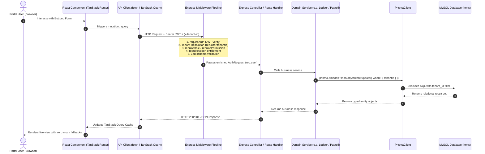
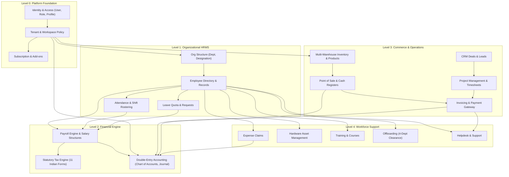
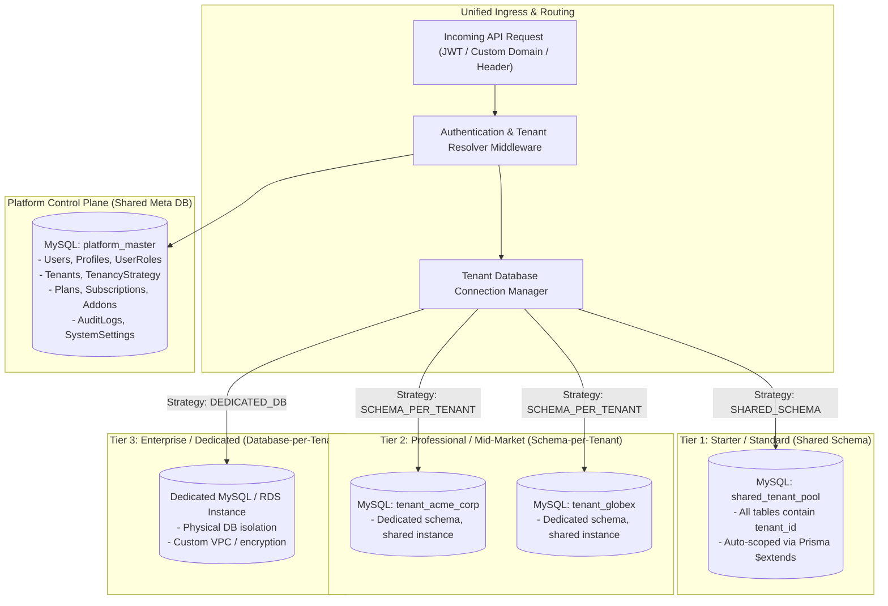

# Phase 0 Blueprint: Enterprise-Grade, Multi-Schema, Multi-Tenant ERP & Business SaaS Platform

**Document Version**: 1.0.0  
**Status**: Completed & Submitted for Application Owner Approval  
**Date**: September 26, 2026  
**Auditor & Systems Architect**: Antigravity Deep Forensic Agent  

---

## Executive Overview

This document establishes the **authoritative architectural blueprint** for transitioning the existing application into a modular, enterprise-grade, multi-schema, multi-tenant ERP and Business SaaS Platform.

This blueprint is grounded 100% in the actual code audited across:
* **Frontend**: React 18 + TypeScript + Vite + TanStack Router (124 routes) + TanStack Query + Tailwind CSS.
* **Backend**: Node.js 20 LTS + Express.js + TypeScript (44 routers, 433 REST endpoints) + Prisma ORM + Socket.io.
* **Database**: MySQL 8.0, 106 Prisma models, single-schema multi-tenancy with logical `tenant_id` foreign keys.

No business logic or database records have been modified in Phase 0.

---

## 1. Verification of the Current Architecture

### 1.1 Technical Stack Verification
* **Frontend Runtime**: Single Page Application (SPA) driven by `@tanstack/react-router` and `@tanstack/react-query`. Client builds with Vite (`vite.config.ts`).
* **Backend Runtime**: Express.js server (`server/src/index.ts`) listening on port 5000, serving modular API routes registered under `/api/*`.
* **Prisma ORM Layer**: Single `PrismaClient` instantiated in `server/src/prisma.ts` connecting to `process.env.DATABASE_URL`.
* **Real-Time Communication**: `socket.io` server attached to the HTTP listener (`server/src/index.ts`) handling real-time push for attendance punches, POS counter updates, and internal chat.

### 1.2 Actual Request Execution Flow


---

## 2. Current Single-Schema Tenancy Implementation

### 2.1 How Tenancy Operates Today
1. **Database Schema**: A single MySQL database (`hrms`) contains all 106 tables.
2. **Tenant Table**: `model Tenant` (`server/prisma/schema.prisma:L71-L154`) stores tenant metadata (`id`, `name`, `slug`, `timezone`, `createdAt`).
3. **Tenant Scoping Field**: 85+ business tables possess a `tenantId` column typed `VARCHAR(36)` with foreign key:
   ```prisma
   tenantId String @map("tenant_id") @db.VarChar(36)
   tenant   Tenant @relation(fields: [tenantId], references: [id], onDelete: Cascade)
   ```
4. **Context Extraction**:
   * In `server/src/middleware/auth.ts:L13-L52`, `requireAuth` decodes the JWT:
     * For regular users, `tenantId` is resolved from `account.profile.tenantId`.
     * For `super_admin`, `tenantId` is dynamically resolved from `req.headers["x-tenant-id"]` or `req.query.tenant_id`.
   * `req.user.tenantId` is populated on the Express request object.
5. **Query-Level Isolation**:
   * Every controller or service query manually appends `tenantId`:
     ```typescript
     await prisma.employee.findMany({ where: { tenantId: req.user.tenantId } });
     ```

### 2.2 Vulnerabilities of the Current Model
* **Developer Oversight Risk**: Because MySQL does not support native Row-Level Security (RLS), if a developer writes `prisma.invoice.findMany({ where: { id } })` and forgets `tenantId`, an authenticated user can read or mutate another tenant's records.
* **Noisy Neighbor**: High-frequency queries (such as POS barcode scans or biometric UDP listener batches) run against the same indexes and tables as all other tenants, competing for MySQL buffer pool memory.
* **Backup & Restore Impossibility**: It is impossible to restore a single tenant's database to a state from 3 hours ago without either affecting all other tenants or executing an error-prone selective table dump and restore script.

---

## 3. Mapping of the Four Existing Portals

| Portal | Route Base | Layout Component | User Roles | Primary Functional Capabilities |
| :--- | :--- | :--- | :--- | :--- |
| **Super Admin Platform** | `/super/*`, `/super-login` | `_authenticated/super.tsx` | `super_admin` | Multi-tenant lifecycle, plan & pricing configuration, tenant provisioning, marketplace add-on enablement, SMTP/email template settings, system audit logging, API Studio (`/super/api-docs`), 1-click tenant impersonation. |
| **Tenant / Vendor Admin** | `/_authenticated/_app/*` | `_authenticated/_app.tsx` | `hr_admin`, `admin`, `manager` | 24 operational modules: HRMS, Payroll, 11 Indian Statutory Tax Forms, Double-Entry Accounting, POS Counter, Inventory, Multi-Warehouse Stock, CRM Deals, Projects, Biometric Device Bridge, Helpdesk, Announcements. |
| **Employee Self-Service (ESS)** | `/employee-dashboard` | Mobile-responsive standalone view | `employee` | GPS geofenced clock-in/out, live leave quotas & time-off applications, monthly payslip jsPDF generation, Form 16 view, reimbursement expense claims, peer shift swap requests, LMS training courses. |
| **Client External Portal** | `/portal`, `/client-dashboard` | `portal.tsx` | External B2B Client contact | Project milestone & deliverable progress tracking, B2B GST tax invoice viewing & PDF download, Razorpay online invoice checkout, direct support ticket creation. |

---

## 4. Existing Modules and Dependency Matrix



### Module Boundary Dependency Rules:
1. **Core Identity & Organization**: Cannot be disabled; required by all tenant operations.
2. **Payroll**: Strictly dependent on Employee, Attendance, and Leave. Generates journal entries directly into Accounting.
3. **Point of Sale (POS)**: Strictly dependent on Products, Warehouses, Cash Registers. Generates balanced double-entry vouchers (Debiting Cash/Bank, Crediting Sales Revenue, Debiting COGS, Crediting Inventory Asset).
4. **Invoicing**: Connects Projects or Sales to Customer records and posts to Accounts Receivable in the Chart of Accounts.

---

## 5. Shared Platform Services & Duplication Analysis

### 5.1 Existing Shared Platform Services
1. **Authentication & RBAC Middleware** (`server/src/middleware/auth.ts`):
   * Validates JWT, verifies workspace status, extracts permissions, guards routes.
2. **Add-on Entitlement Engine** (`server/src/middleware/addons.ts`):
   * Validates whether a tenant has an active subscription or purchased add-on for a given module (`requireAddon`).
3. **Double-Entry Ledger Posting Service** (`server/src/services/ledger-posting.service.ts`):
   * Centralizes balanced debit/credit journal creation across payroll, POS, and invoicing.
4. **Alert & Notification Service** (`server/src/services/alert-notification.service.ts`):
   * Dispatches notifications via In-App WebSockets, Email, and WhatsApp.
5. **Workspace Policy Service** (`server/src/services/workspace-policy.service.ts`):
   * Asserts whether a tenant workspace is active, trialing, expired, or suspended.

### 5.2 Identified Inconsistencies & Duplications
* **Ad-Hoc Tenant Scoping**: Controllers independently format queries (`where: { tenantId: req.user.tenantId }`). There is no Prisma client middleware/extension automatically injecting the tenant filter into all queries.
* **Fragmented File Storage**: Profile avatars, document attachments, and expense claim receipts write directly to local disk with divergent directory paths rather than using an abstract `IStorageService` (supporting Local, S3, or GCS).
* **Duplicated CSV/Export Generation**: Multiple routes (employees, payroll, attendance, inventory) implement their own string-concatenation CSV routines instead of using a unified streamable export utility.
* **Notification Dispatch Drift**: Some controllers call `alertNotificationService`, while others directly write to `prisma.notification.create` and emit on `socket.io`.

---

## 6. Current Technical Limitations

1. **MySQL Single-Schema Scalability**:
   * As table row counts exceed millions (especially `attendance`, `biometric_punch_logs`, and `journal_entries`), shared table indexes grow large, causing query slowdowns and buffer pool thrashing across unrelated tenants.
2. **Lack of Per-Tenant Point-In-Time Backup/Restore**:
   * If Tenant A accidentally deletes their accounting records or runs an incorrect payroll batch, restoring Tenant A from backup without rolling back Tenant B and Tenant C requires manual, complex, error-prone data extraction.
3. **No Database-Level Isolation for Regulated Clients**:
   * Enterprise, banking, or government clients cannot be hosted on the current architecture because compliance standards (HIPAA, SOC2, GDPR, Indian Digital Personal Data Protection Act 2023) require strict physical or schema-level database isolation.
4. **Hardcoded Tenancy Strategy**:
   * The application currently assumes that all tenants reside in the single database configured in `process.env.DATABASE_URL`. There is no mechanism to route a tenant to a separate schema or database.

---

## 7. Target Architecture: Hybrid 3-Tier Multi-Tenancy

To balance cost-efficiency for small businesses with enterprise security for large corporations, we propose a **Configurable Hybrid 3-Tier Tenancy Strategy**:



### Strategy Breakdown:
1. **Platform Control Database (`platform_master`)**:
   * Stores global models: `User`, `Profile`, `UserRole`, `Tenant`, `TenantSubscription`, `Plan`, `TenantModule`, `TenantAddon`, `AuditLog`, `SystemSetting`.
2. **Tier 1 (Shared Schema)**:
   * Suitable for free trials and small businesses (< 50 employees). All business data resides in a shared database with automatic Prisma-level `tenant_id` query scoping.
3. **Tier 2 (Schema-per-Tenant)**:
   * Suitable for growing businesses (50 - 500 employees). Each tenant receives their own MySQL database/schema (e.g., `tenant_123`). Provides independent table namespaces, zero noisy-neighbor data contention, and instant 1-click database dumps/restores.
4. **Tier 3 (Dedicated Database)**:
   * Suitable for enterprise corporations (> 500 employees) requiring dedicated infrastructure, custom database credentials, and compliance isolation.

---

## 8. Comparative Analysis of Tenancy Approaches

| Dimension | Option A: Shared Schema (Current) | Option B: Schema-per-Tenant | Option C: Dedicated Database | Recommended: Hybrid Model |
| :--- | :--- | :--- | :--- | :--- |
| **Data Isolation** | Logical (`tenant_id` filter) | High (Separate DB schemas) | Maximum (Physical DB instance) | **Configurable per tenant tier** |
| **Accidental Leak Risk** | Moderate (developer query error) | Zero (enforced at connection level) | Zero (enforced at network/DB level) | **Zero for Tier 2/3; Mitigated for Tier 1 via Prisma extension** |
| **Per-Tenant Backup / Restore** | Very difficult (custom SQL export) | Trivial (`mysqldump tenant_db`) | Trivial (RDS snapshot / native dump) | **Supported for Tier 2 and Tier 3** |
| **Infrastructure Cost** | Lowest ($) | Low ($$) | High ($$$$) | **Optimized (small tenants pay $, enterprise pays $$$$)** |
| **Connection Pooling** | Single pool (simple) | Dynamic pool cache (managed) | Separate connection pools | **Managed via TenantConnectionManager pool cache** |
| **Schema Migration Complexity** | Single `prisma migrate deploy` | Multi-schema migration runner | Distributed migration runner | **Orchestrated migration runner with schema version tracking** |
| **Maximum Scale** | ~500 tenants / 10M rows | ~5,000 tenants per instance | Unlimited (horizontal database instances) | **Scales from 1 to 50,000+ tenants** |

---

## 9. Migration Risks and Backward-Compatibility

### 9.1 Core Risks
1. **Breaking 433 Existing APIs**: Rewriting every database query simultaneously would cause catastrophic regressions.
   * *Mitigation*: The `TenantConnectionManager` will implement the standard Prisma Client interface. For shared-schema tenants, it transparently returns the shared Prisma instance with zero API alterations.
2. **Connection Starvation in MySQL**: Opening separate Prisma Client connection pools for hundreds of schemas could exhaust MySQL's `max_connections`.
   * *Mitigation*: Implement an LRU Connection Pool Cache with idle disconnection (e.g. max 50 active cached tenant pools, 10-minute idle eviction).
3. **Multi-Schema Migration Drift**: If 100 tenant schemas exist, a database schema update might succeed on 95 schemas and fail on 5 schemas.
   * *Mitigation*: Implement a `TenantSchemaMigrationLog` tracking each tenant's migration version, with rollback support and automated retry queues.

---

## 10. Recommended Phased Development Order

| Phase | Title | Primary Objective | Deliverables |
| :---: | :--- | :--- | :--- |
| **Phase 0** | **Architecture Blueprint** | Complete codebase forensic analysis & multi-tenancy strategy | Comprehensive Blueprint, Flow Maps, Owner Approval Gate. |
| **Phase 1** | **Multi-Tenant Foundation** | Dynamic Tenant DB Router & Prisma client isolation extension | `TenantConnectionManager`, Prisma `$extends` query filter, tenant provisioning orchestrator, multi-schema migration runner. |
| **Phase 2** | **Platform Control Plane** | Centralized Super Admin management & entitlement enforcement | Tenancy tier assignment UI, automated quota limiter, module feature toggling, platform audit logger. |
| **Phase 3** | **Shared Platform Services** | Standardize common cross-module services | `IStorageService` (Local/S3), `INotificationEngine`, `IExportEngine`, central workflow approval engine. |
| **Phase 4** | **Core ERP Modularization** | Formalize module boundaries & decoupled service contracts | Module contracts for HRMS, Payroll, POS, Accounting, CRM, Projects, Inventory. |
| **Phase 5** | **Business Vertical Expansion** | Extend platform to support distinct industries | Retail & E-commerce, Manufacturing/MRP, Logistics/Fleet, Services. |
| **Phase 6** | **Enterprise Readiness** | Production hardening, disaster recovery & performance | Load testing, per-tenant automated backups, Prometheus metrics, rate limiting. |

---

## 11. Acceptance Criteria for Phase 1 (Multi-Tenant Foundation)

When Phase 1 is executed, it must satisfy the following strict acceptance criteria before approval:

1. **Zero Regression on Existing 433 APIs**:
   * All existing tests and workflows (Employee management, Attendance, Payroll runs, POS counter, Invoicing) must pass without modification.
2. **Prisma Client Isolation Extension**:
   * For shared-schema execution, a Prisma `$extends` client extension must automatically inject `tenant_id` into all read and write queries, making accidental data leakage impossible.
3. **Dynamic Tenant Connection Manager**:
   * A service `TenantConnectionManager.getDb(tenantId)` must resolve the correct schema or database connection based on the tenant's configured `tenancyStrategy` ('shared_schema' | 'schema_per_tenant' | 'dedicated_db').
4. **Automated Tenant Provisioning Pipeline**:
   * When Super Admin creates a tenant:
     * If `shared_schema`, tenant record is created in `platform_master` and initialized.
     * If `schema_per_tenant`, a new MySQL schema `tenant_<slug>` is automatically created and all migrations applied.
5. **Multi-Schema Migration Orchestrator**:
   * A CLI/service script capable of running migrations across all tenant schemas sequentially, with logging of migration version per schema.
6. **Cross-Tenant Isolation Test Suite**:
   * Automated tests proving:
     * Tenant A cannot read Tenant B's data even with forged IDs.
     * User authentication tokens from Tenant A are rejected in Tenant B's workspace.

---

## 12. Strategic Decisions Requiring Application Owner Approval

Before starting Phase 1 implementation, the application owner must approve the following key architectural decisions:

* [ ] **Decision 1: Tenancy Strategy Selection**
  * *Option 1A (Recommended)*: Adopt the **Hybrid 3-Tier Model** (Tier 1 Shared Schema for trials/starter; Tier 2 Schema-per-Tenant for mid-market; Tier 3 Dedicated DB for enterprise).
  * *Option 1B*: Remain strictly on **Shared-Schema Multi-Tenancy** with Prisma `$extends` automatic row-level security.
  * *Option 1C*: Migrate 100% of all tenants to **Schema-per-Tenant**.

* [ ] **Decision 2: Default Tenancy Tier for Existing Tenants**
  * *Option 2A (Recommended)*: Existing tenants remain on the verified **Shared-Schema** pool, while new mid-market/enterprise tenants can be provisioned into dedicated schemas.
  * *Option 2B*: Migrate all existing tenants into separate MySQL schemas immediately.

* [ ] **Decision 3: Cloud File Storage Abstraction**
  * *Option 3A (Recommended)*: Implement a multi-driver `IStorageService` supporting Local Disk for development and AWS S3 / Cloudflare R2 / Google Cloud Storage for production.
  * *Option 3B*: Keep local disk filesystem uploads exclusively.

---

**Next Action**: Antigravity is currently paused at the Phase 0 Gate. Implementation of Phase 1 will commence upon the Application Owner's formal review and approval.
