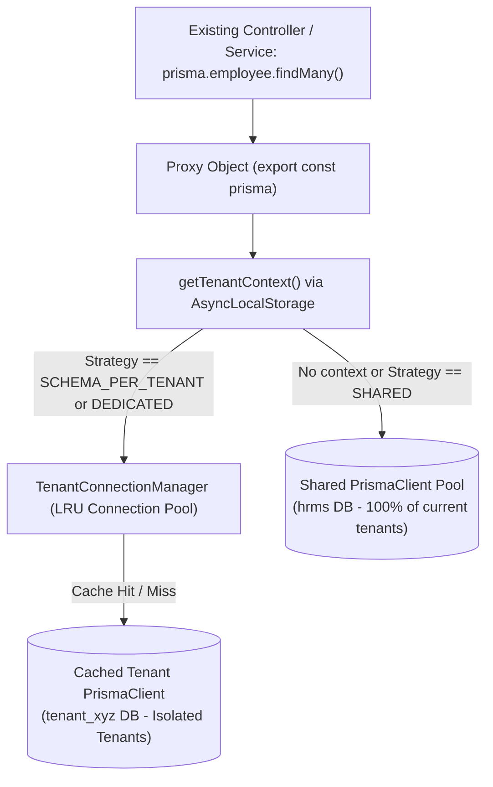

# Phase 1 Connection Manager Design: Dynamic Connection Pool Management & Backward-Compatible Facade

**Document Version**: 1.0.0  
**Status**: Validated & Architecture Finalized  
**Date**: September 26, 2026  
**Auditor & Systems Architect**: Antigravity Deep Forensic Agent  

---

## 1. The Core Architectural Challenge

Across the backend codebase, **64 files directly import the singleton `prisma` instance**:
```typescript
import { prisma } from "../prisma";
```
These imports drive all 433 REST endpoints, 35+ interactive transactions, WebSocket event handlers, and the biometric background auto-sync cron.

### The Fatal Flaw of a Naive Approach:
If we required every route and service to change from:
```typescript
await prisma.employee.findMany(...)
```
to:
```typescript
const db = await tenantConnectionManager.getDb(req.user.tenantId);
await db.employee.findMany(...)
```
we would be forced to rewrite **dozens of controllers, hundreds of service methods, and 35+ transaction blocks in one massive, high-risk code change**. Any missed route would cause runtime crashes or bypass tenant isolation.

---

## 2. The Solution: Dynamic Prisma Proxy Facade

To ensure **100% backward compatibility with zero endpoint rewrites**, Phase 1 implements the **Dynamic Prisma Proxy Facade Pattern** in `server/src/prisma.ts`.

### Architecture Diagram:


### How the Proxy Facade Operates:
1. When any file calls `prisma.employee.findMany()`, the JavaScript `Proxy` intercepts the property access (`employee`).
2. The proxy reads the active request's tenant context from `AsyncLocalStorage`.
3. If no tenant context exists (e.g. platform boot, Super Admin global route, background worker) OR if the tenant's strategy is `SHARED_SCHEMA`:
   * The proxy delegates to the **Default Extended Shared PrismaClient** (which auto-scopes `tenant_id`).
4. If the tenant's strategy is `SCHEMA_PER_TENANT` or `DEDICATED_DB`:
   * The proxy retrieves or instantiates that tenant's dedicated `PrismaClient` from the `TenantConnectionManager` LRU cache and delegates the query to it.
5. **Net Result**: **Zero existing controller files need to be modified.** Every single existing call to `prisma.<model>.<action>` automatically routes to the correct database!

---

## 3. Concrete Implementation of the Proxy Facade

```typescript
// server/src/prisma.ts (Conceptual Implementation)
import { PrismaClient } from "@prisma/client";
import { getTenantContext } from "./context/tenant-context";
import { TenantConnectionManager } from "./services/tenant-connection-manager.service";
import { createTenantScopedExtension } from "./extensions/tenant-isolation.extension";

// 1. Raw default client connected to shared MySQL database
export const baseSharedPrisma = new PrismaClient({
  datasources: { db: { url: process.env.DATABASE_URL } },
});

// 2. Extend shared client with automatic tenant scoping
export const sharedExtendedPrisma = createTenantScopedExtension(baseSharedPrisma);

// 3. Dynamic Proxy Facade: intercepts property access on 'prisma'
export const prisma: PrismaClient = new Proxy({} as PrismaClient, {
  get(_target, prop: string | symbol) {
    const context = getTenantContext();

    // Fast path: No tenant or shared schema -> use shared extended client
    if (!context || !context.tenantId || context.tenancyStrategy === "SHARED_SCHEMA") {
      return (sharedExtendedPrisma as any)[prop];
    }

    // Isolated path: Retrieve or instantiate dedicated client from manager
    const tenantDb = TenantConnectionManager.getInstance().getTenantClient(context.tenantId);
    return (tenantDb as any)[prop];
  }
});
```

---

## 4. `TenantConnectionManager`: LRU Pool Cache Design

Each `PrismaClient` instance maintains its own Rust query engine and connection pool. To prevent exhausting Node.js memory and MySQL `max_connections`, the manager implements an **LRU Connection Cache with Idle Eviction**:

```typescript
// server/src/services/tenant-connection-manager.service.ts
import { PrismaClient } from "@prisma/client";
import { createTenantScopedExtension } from "../extensions/tenant-isolation.extension";

interface CachedTenantConnection {
  client: PrismaClient;
  lastAccessedAt: number;
}

export class TenantConnectionManager {
  private static instance: TenantConnectionManager;
  private poolCache = new Map<string, CachedTenantConnection>();
  private readonly MAX_ACTIVE_CLIENTS = 30; // Max cached isolated instances
  private readonly IDLE_TIMEOUT_MS = 10 * 60 * 1000; // 10 minutes idle eviction

  private constructor() {
    // Start periodic background sweep for idle connections
    setInterval(() => this.evictIdleConnections(), 60 * 1000).unref();
  }

  public static getInstance(): TenantConnectionManager {
    if (!TenantConnectionManager.instance) {
      TenantConnectionManager.instance = new TenantConnectionManager();
    }
    return TenantConnectionManager.instance;
  }

  public getTenantClient(tenantId: string, tenantConfig?: any): PrismaClient {
    const existing = this.poolCache.get(tenantId);
    if (existing) {
      existing.lastAccessedAt = Date.now();
      return existing.client;
    }

    // Cache miss: Check capacity and evict oldest if needed
    if (this.poolCache.size >= this.MAX_ACTIVE_CLIENTS) {
      this.evictOldestConnection();
    }

    // Instantiate new PrismaClient with strict pool limits
    const dbUrl = this.buildTenantDbUrl(tenantConfig);
    const rawClient = new PrismaClient({
      datasources: { db: { url: `${dbUrl}?connection_limit=3&pool_timeout=10` } }
    });

    const extendedClient = createTenantScopedExtension(rawClient);
    this.poolCache.set(tenantId, { client: extendedClient, lastAccessedAt: Date.now() });

    return extendedClient;
  }

  private async evictIdleConnections() {
    const now = Date.now();
    for (const [tenantId, entry] of this.poolCache.entries()) {
      if (now - entry.lastAccessedAt > this.IDLE_TIMEOUT_MS) {
        console.log(`[ConnectionManager] Evicting idle connection pool for tenant ${tenantId}`);
        this.poolCache.delete(tenantId);
        await entry.client.$disconnect();
      }
    }
  }

  private async evictOldestConnection() {
    let oldestKey: string | null = null;
    let oldestTime = Infinity;
    for (const [tenantId, entry] of this.poolCache.entries()) {
      if (entry.lastAccessedAt < oldestTime) {
        oldestTime = entry.lastAccessedAt;
        oldestKey = tenantId;
      }
    }
    if (oldestKey) {
      const entry = this.poolCache.get(oldestKey);
      this.poolCache.delete(oldestKey);
      if (entry) await entry.client.$disconnect();
    }
  }
}
```

---

## 5. Non-HTTP Database Callers & Context Wrapping

Not all database operations originate from an Express HTTP request. We must support three non-HTTP execution contexts:

### 1. Scheduled Background Cron (`server/src/cron/biometric-sync.ts`)
* **Problem**: Runs on a timer via `setInterval`. Has no `req` or `res`.
* **Solution**: The cron queries `baseSharedPrisma` to fetch online biometric devices across all tenants. Then, for each device, it executes the punch processing inside an explicit `tenantStorage.run` scope:
  ```typescript
  for (const device of devices) {
    await tenantStorage.run({ tenantId: device.tenantId }, async () => {
      await processBiometricPunch({ tenantId: device.tenantId, ... });
    });
  }
  ```

### 2. Real-Time WebSockets (`server/src/socket.ts`)
* **Problem**: Socket events occur asynchronously over a persistent TCP connection.
* **Solution**: In `socket.ts`, the connection middleware already resolves and attaches `socket.data.tenantId`. Every socket event handler wraps its execution with `tenantStorage.run`:
  ```typescript
  socket.on("send-chat-message", (payload) => {
    tenantStorage.run({ tenantId: socket.data.tenantId, userId: socket.data.userId }, async () => {
      await prisma.chatMessage.create({ ... });
    });
  });
  ```

### 3. Asynchronous Webhooks (e.g. Razorpay Payments)
* **Problem**: Webhook ingress has no user JWT.
* **Solution**: The payment webhook handler inspects the incoming payload, extracts the `tenantId` from the order metadata or transaction record, and enters the tenant context scope before recording ledger vouchers.
