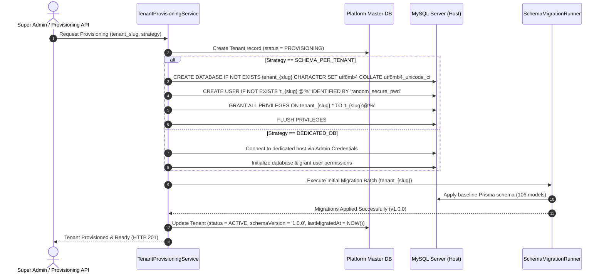

# Phase 1 Database Migration Plan: Multi-Tenant Provisioning & Safe Schema Evolution

**Document Version**: 1.0.0  
**Status**: Completed & Validated  
**Date**: September 26, 2026  
**Auditor & Systems Architect**: Antigravity Deep Forensic Agent  

---

## 1. Migration Principles & Zero-Data-Loss Guarantee

The database migration strategy for Phase 1 is designed under strict enterprise safety constraints:
1. **Zero Data Loss**: The existing MySQL database (`hrms`) containing all active tenant and employee data remains the primary shared cluster. No data is truncated, dropped, or migrated out during Phase 1.
2. **Backward Compatibility**: All existing Prisma models and database relationships continue to operate identically for shared-schema tenants.
3. **Additive Schema Updates Only**: Any schema modifications introduced in Phase 1 (such as `tenancy_strategy` or `database_url` on the `Tenant` model) are nullable or possess safe default values.
4. **Isolated Failure Domains**: When applying migrations across multiple tenant databases (Tier 2/3), a failure on one tenant database must never corrupt or interrupt other tenants.

---

## 2. Platform Schema Additions (Non-Breaking)

To support the configurable hybrid architecture, the `tenants` table in the master platform database is enhanced with four non-breaking fields:

```prisma
enum TenancyStrategy {
  SHARED_SCHEMA
  SCHEMA_PER_TENANT
  DEDICATED_DB
}

enum TenantDatabaseStatus {
  ACTIVE
  PROVISIONING
  MIGRATING
  FAILED
  MAINTENANCE
}

// In schema.prisma (additive updates)
model Tenant {
  id               String               @id @default(uuid()) @db.VarChar(36)
  name             String               @db.VarChar(255)
  slug             String               @unique @db.VarChar(100)
  // ... existing fields ...

  // Tenancy Management Fields (Phase 1 Additions)
  tenancyStrategy  TenancyStrategy      @default(SHARED_SCHEMA) @map("tenancy_strategy")
  databaseStatus   TenantDatabaseStatus @default(ACTIVE) @map("database_status")
  databaseHost     String?              @map("database_host") @db.VarChar(255)
  databaseName     String?              @map("database_name") @db.VarChar(100)
  databaseUsername String?              @map("database_username") @db.VarChar(100)
  databasePasswordEncrypted String?     @map("database_password_encrypted") @db.Text
  schemaVersion    String               @default("1.0.0") @map("schema_version") @db.VarChar(50)
  lastMigratedAt   DateTime?            @map("last_migrated_at")
}
```

* **Default Behavior**: Every existing tenant defaults to `tenancyStrategy = SHARED_SCHEMA` and `databaseStatus = ACTIVE`. They continue executing against the current database with zero migration steps required.

---

## 3. Dynamic Database Provisioning Pipeline (Tier 2 / Tier 3)

When a mid-market or enterprise tenant selects a dedicated database or schema-per-tenant, the backend executes the automated provisioning pipeline:



---

## 4. Multi-Tenant Migration Orchestrator

Because the Prisma CLI operates on a single database at a time, Phase 1 introduces a dedicated Node.js **Multi-Tenant Migration Orchestrator** (`server/src/scripts/tenant-migration-runner.ts`):

```typescript
export async function runMultiTenantMigrations(targetMigrationName?: string) {
  console.log("Starting Multi-Tenant Schema Migration Runner...");

  // 1. Run migrations on Platform Master / Shared Database
  console.log("Step 1: Migrating Platform Master / Shared Pool...");
  await execPrismaMigrate(process.env.DATABASE_URL!);

  // 2. Fetch all tenants with isolated databases
  const isolatedTenants = await prisma.tenant.findMany({
    where: {
      tenancyStrategy: { in: ["SCHEMA_PER_TENANT", "DEDICATED_DB"] },
      databaseStatus: "ACTIVE"
    }
  });

  console.log(`Found ${isolatedTenants.length} isolated tenant databases to migrate.`);

  // 3. Sequentially migrate each tenant database
  for (const tenant of isolatedTenants) {
    const tenantDbUrl = buildTenantDbUrl(tenant);
    console.log(`Migrating tenant: ${tenant.slug} (${tenant.id})...`);

    try {
      await markTenantStatus(tenant.id, "MIGRATING");
      await execPrismaMigrate(tenantDbUrl);
      
      await recordMigrationSuccess(tenant.id, targetMigrationName || "latest");
      await markTenantStatus(tenant.id, "ACTIVE");
      console.log(`Tenant ${tenant.slug} migrated successfully.`);
    } catch (err: any) {
      console.error(`Migration FAILED for tenant ${tenant.slug}:`, err.message);
      await markTenantStatus(tenant.id, "FAILED");
      await recordMigrationFailure(tenant.id, err.message);
      // Abort or continue based on failure policy (do not leave tenant half-migrated)
    }
  }
}
```

---

## 5. Migration History Tracking: `TenantMigrationHistory`

A new audit table in the master platform database tracks every migration applied to each tenant:

```prisma
model TenantMigrationHistory {
  id              String   @id @default(uuid()) @db.VarChar(36)
  tenantId        String   @map("tenant_id") @db.VarChar(36)
  migrationName   String   @map("migration_name") @db.VarChar(255)
  status          String   @db.VarChar(50) // SUCCESS, FAILED, ROLLED_BACK
  executionTimeMs Int      @map("execution_time_ms")
  errorMessage    String?  @map("error_message") @db.Text
  appliedAt       DateTime @default(now()) @map("applied_at")

  tenant          Tenant   @relation(fields: [tenantId], references: [id], onDelete: Cascade)
  @@index([tenantId, appliedAt])
  @@map("tenant_migration_history")
}
```

---

## 6. Failure Recovery and Rollback Procedures

### Scenario: Migration Fails on Tenant 47 of 100
1. **Immediate Quarantine**: The migration runner catches the exception, updates `databaseStatus = 'FAILED'` for Tenant 47, and sends an alert.
2. **Non-Blocking Operation**: Tenants 1 through 46 (already migrated) and Tenants 48 through 100 remain operational.
3. **Automated Rollback Option**:
   * Before running DDL, the runner takes an automated schema snapshot (`mysqldump --no-data`).
   * If a DDL statement fails, the runner can restore the pre-migration schema state from the snapshot.
4. **Maintenance State**: While in `FAILED` status, API requests for Tenant 47 receive `HTTP 503: Workspace database is undergoing scheduled maintenance`, preventing data corruption.
