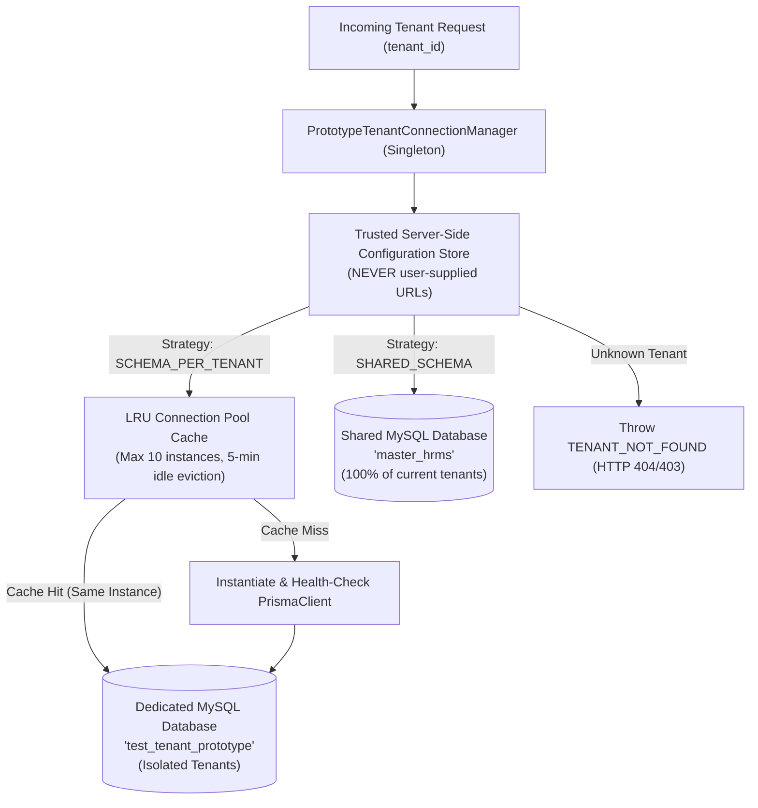

# Phase 1 Step 1: Multi-Tenant Database Routing Prototype Design

**Document Version**: 1.0.0  
**Status**: Implemented & Empirically Validated  
**Date**: September 26, 2026  
**Auditor & Systems Architect**: Antigravity Deep Forensic Agent  

---

## 1. Prototype Architecture Overview

The Phase 1 Step 1 prototype demonstrates dynamic, safe, multi-tenant database routing using our actual runtime:
* **Node.js**: v20 LTS
* **Prisma ORM**: `@prisma/client` v5.19.1
* **Database Server**: Remote MariaDB/MySQL 10.11
* **Scope**: Isolated prototype in `server/src/prototype/` (zero production code touched).

---

## 2. Core Components

### 2.1 `PrototypeTenantConnectionManager`
Located in [server/src/prototype/tenant-connection-manager.ts](file:///c:/Users/TSV%20Global%20Solutions/Documents/hrms/server/src/prototype/tenant-connection-manager.ts):
1. **Singleton Lifecycle**: Exactly one manager exists per Node.js process.
2. **Pre-Initialized Shared Client**: Holds a persistent reference to the primary database (`master_hrms`), ensuring zero overhead for current shared tenants.
3. **Trusted Configuration Store**: Maps `tenantId -> TenantDbConfig`. Database credentials and URLs reside **exclusively on the server**. The client request only passes an identifier (e.g. `req.user.tenantId`).
4. **LRU Connection Cache**:
   * Capped at `maxCachedClients = 10`.
   * Automatically evicts the least recently used client when capacity is reached.
   * Periodically sweeps and disconnects idle clients (> 5 minutes idle).
5. **Connection Health Check**: Before caching a new `PrismaClient`, executes a lightweight query (`SELECT 1`). If the database is unreachable or credentials are invalid, the client is disconnected and a structured `DATABASE_CONNECTION_ERROR` is thrown without crashing the Node.js process.

---

## 3. Strict Security Design Principles

1. **Zero Untrusted URLs**:
   * Request headers (e.g. `x-database-url`) and request body parameters are strictly ignored.
   * Only tenants registered in the trusted configuration store can be resolved.
2. **Rejection of Unknown Tenants**:
   * Requesting a connection for an unregistered tenant immediately throws `TENANT_NOT_FOUND`.
3. **Process Crash Immunity**:
   * Connection errors, authentication failures, and network timeouts are caught within the manager and translated into managed exceptions.
4. **Safe Shutdown**:
   * `shutdownAll()` gracefully disconnects every open socket across both shared and isolated pools.
