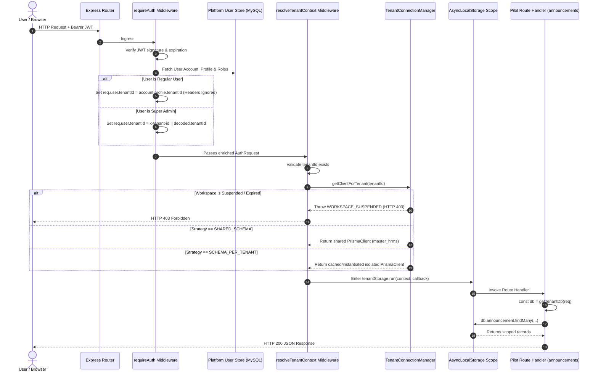

# Phase 1 Step 2: Tenant Context Store & Controlled Database Routing Design

**Document Version**: 1.0.0  
**Status**: Implemented & Empirically Validated  
**Date**: September 26, 2026  
**Auditor & Systems Architect**: Antigravity Deep Forensic Agent  

---

## 1. Executive Summary

Phase 1 Step 2 establishes a **secure, request-scoped Tenant Context Store** and integrates it into a single, low-risk pilot module (**Company Announcements - `/api/announcements`**).

### Core Architectural Decisions:
1. **Thread-Safe Context Storage**: Implemented via Node.js native `AsyncLocalStorage` (`node:async_hooks`), guaranteeing that asynchronous operations and concurrent requests cannot bleed or cross-contaminate tenant context.
2. **Server-Side Authority**: Tenant context is resolved **strictly from authenticated user account records** in the database. Client-supplied headers (`x-tenant-id`) and query parameters (`?tenant_id`) are completely ignored for regular users.
3. **Zero Credential Exposure**: Database connection strings, passwords, and internal routing endpoints are never stored in JWT tokens, never passed to the frontend, and sanitized from all API error responses.
4. **Controlled Pilot Scope**: Only the Announcements module (`server/src/routes/announcements.routes.ts`) was integrated with the context store and database routing. The remaining 432 endpoints continue operating on their existing Prisma singleton without disruption.

---

## 2. Request-Scoped `TenantContext` Data Model

Located in [server/src/context/tenant-context.ts](file:///c:/Users/TSV%20Global%20Solutions/Documents/hrms/server/src/context/tenant-context.ts):

```typescript
export type TenancyStrategy = "SHARED_SCHEMA" | "SCHEMA_PER_TENANT" | "DEDICATED_DB";
export type WorkspaceStatus = "ACTIVE" | "SUSPENDED" | "TRIAL" | "EXPIRED";

export interface TenantContext {
  tenantId: string;
  userId: string;
  roles: string[];
  status: WorkspaceStatus;
  tenancyStrategy: TenancyStrategy;
  db: PrismaClient; // The verified, scoped PrismaClient instance for this request
}
```

### Context Access API:
* `getTenantContext()`: Returns the active `TenantContext` from `AsyncLocalStorage`. Returns `undefined` outside an active request.
* `getTenantDb(req?: Request)`: Returns the verified `PrismaClient` bound to the active request context, or falls back safely to the shared database client if called outside a request scope.

---

## 3. End-to-End Tenant Resolution & Authorization Sequence



---

## 4. Security Principles Enforced

1. **Tamper Proofing**:
   * If a user authenticated for Tenant A sends `x-tenant-id: tenant_b`, the middleware discards the header and executes strictly in Tenant A context.
   * If a user sends `?tenant_id=tenant_b`, the query parameter is discarded.
2. **Suspension Enforcement**:
   * Inactive or suspended tenants are blocked at the middleware gateway with `HTTP 403 (WORKSPACE_SUSPENDED)` before any database query is dispatched.
3. **Database Health Checks & Error Masking**:
   * If a dedicated tenant database is unreachable, the error is trapped gracefully with `HTTP 503 Service Unavailable`.
   * Error messages are sanitized using regex (`/mysql:\/\/.*?@/g`) to strip raw credentials.
4. **Bounded Connection Cache**:
   * The `TenantConnectionManager` enforces a hard limit of 20 cached client pools and runs an unrefed background sweep evicting idle connections (> 10 minutes).
