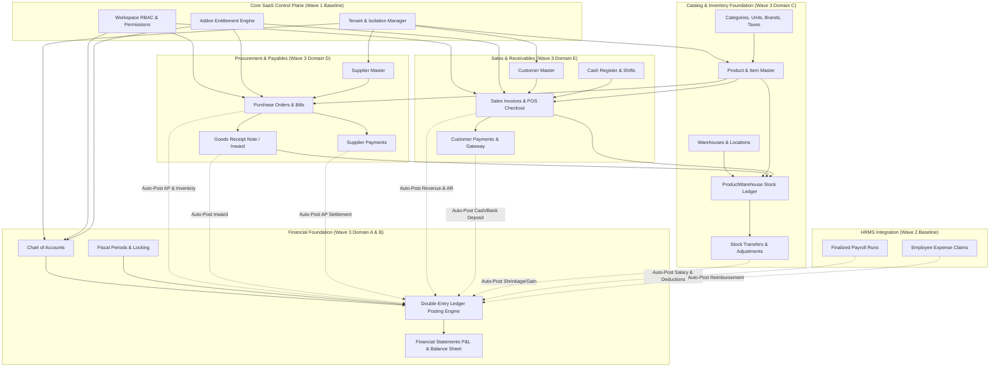

# PHASE C — WAVE 3 MODULE DEPENDENCY MAP
## Cross-Module Dependency Graph, Data Flow, and Lifecycle Migration Topology

**Audit Scope:** Inter-module dependencies across Wave 1 (Core SaaS), Wave 2 (HRMS), and Wave 3 (Financial Accounting, Inventory, Purchases & Sales)  
**Constitutional Rule:** Foundation modules must precede operational modules. Operational modules must precede financial auto-posting.  

---

## 1. COMPREHENSIVE DEPENDENCY TOPOLOGY

The diagram below maps the runtime data and API dependencies across the system:

---

## 2. DETAILED CROSS-MODULE DATA CONTRACTS

### 2.1 Upstream Foundation Dependencies
1. **Multi-Tenant Context Facade:**
   - Source: `tenant-connection-manager.service.ts` & `tenant-context.middleware.ts`.
   - Consumer: Every single Wave 3 router and model.
   - Requirement: `router.use(requireAuth, resolveTenantContext)` must be active so all `DIRECT_TENANT_MODELS` are scoped to `tenant_id`.
2. **Addon Entitlements:**
   - Source: `addons.routes.ts` & `requireAddon()` middleware.
   - Consumer: Wave 3 sub-modules.
     - Accounting / General Ledger: `requireAddon("account")`
     - POS Terminal: `requireAddon("pos")`
     - Inventory Transfers: `requireAddon("productservice")`

### 2.2 Core Operational & Financial Dependencies
1. **Chart of Accounts (Foundational Anchor):**
   - Must be seeded before any sale, purchase, payroll, or expense can be posted.
   - Fixed System Codes:
     - `1010`: Cash on Hand / Petty Cash
     - `1020`: Operating Bank Account
     - `1030`: Accounts Receivable (Debtors)
     - `1040`: Merchandise Inventory Asset
     - `2010`: Accounts Payable (Creditors)
     - `2020`: GST / Tax Payable
     - `2030`: Payroll Deductions Payable
     - `4010`: Product Sales Revenue
     - `5010`: Employee Salaries & Wages
     - `5020`: Inventory Shrinkage & Adjustment
2. **Product Catalog & Stock Deductions:**
   - Products require `TaxRate`, `Unit`, `ProductCategory`.
   - `ProductWarehouse` maintains physical stock count per warehouse.
   - Inward Flow: `Purchase` (status: `received`) increments `ProductWarehouse.quantity`.
   - Outward Flow: `Sale` (status: `paid` or `invoice`) decrements `ProductWarehouse.quantity`.
   - Adjustment Flow: `StockAdjustment` increments or decrements `ProductWarehouse.quantity` and posts difference to GL account `5020`.
3. **Cross-Wave HRMS Integration:**
   - `payroll.routes.ts` calls `autoPostPayrollToLedger()` upon payroll finalization.
   - `expenses.routes.ts` calls `autoPostExpenseToLedger()` upon expense claim reimbursement approval.

---

## 3. CIRCULAR DEPENDENCY ANALYSIS & RESOLUTION ORDER

### Analysis of Potential Circularity:
- **Potential Circularity 1: Sale vs Inventory vs Accounting:**
  - A Sale requires available stock in `ProductWarehouse`. Stock decrement generates COGS. COGS requires Account `5010` and `1040`.
  - *Resolution:* Strictly sequential pipeline: Validate Stock -> Execute Sale & Atomic Stock Decrement -> Trigger Asynchronous/Transaction Ledger Auto-Post.
- **Potential Circularity 2: Purchase vs Inventory vs Accounts Payable:**
  - A Purchase Order creates a payable obligation and adds inventory.
  - *Resolution:* Purchase Order (`pending`) creates no inventory movement. Goods Receipt (`received`) executes inventory increment and posts to AP in the same atomic database transaction.

### Recommended Implementation Sequence:
Based on the dependency topology, implementation must proceed in the following order:
1. **Stage 1:** Router Tenant Isolation Middleware & System Seed Accounts
2. **Stage 2:** Product Catalog, Tax Slabs & Multi-Warehouse Stock Engine
3. **Stage 3:** Procurement Lifecycle (Suppliers, POs, Goods Receipts, Supplier Payments)
4. **Stage 4:** Sales Lifecycle (Customers, Invoicing, POS Registers, Customer Payments)
5. **Stage 5:** Returns Engine (Sales Returns & Purchase Returns)
6. **Stage 6:** Double-Entry Ledger Posting Hardening & Financial Reports
