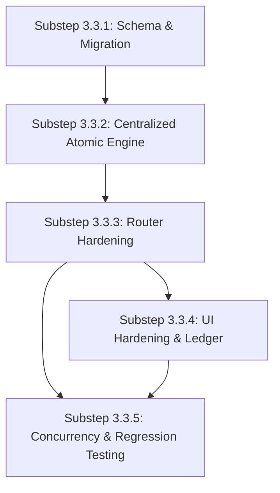

# Phase C — Wave 3 — Step 3.3: Migration Roadmap — Product & Inventory Atomic Stock

## Overview

This roadmap defines the implementation sequence for **Step 3.3: Product & Inventory Atomic Stock**. It resolves the identified gaps in quantity precision (`Int` -> `Decimal`), introduces an immutable `StockMovement` ledger table, unifies all inventory mutations under a hardened atomic concurrency engine, and locks down multi-tenant isolation.

The roadmap is divided into 5 small, independently verifiable substeps following the ERP lifecycle standard:
`DB Architecture -> Core Service -> API Hardening -> UI Alignment -> Integration & Concurrency Verification`.

---

## Substep 3.3.1: Schema Definition & Local Migration (Decimal Precision & Stock Movement Ledger) — [COMPLETED]

### Status: COMPLETE (Verified on 2026-09-27)
* Migration: `20260927000000_wave3_step3_3_1_inventory_decimal_and_stock_movement`
* Target: `master_hrms_dev` on `127.0.0.1:3306`
* Verification Suite: `server/src/tests/wave3-step3-3-1-schema-and-migration.test.ts` (12/12 Passed)
* Regression Tests: Step 3.1 (28/28 Passed), Step 3.2 (24/24 Passed, 6/6 unit Passed)

### Scope
1. Update `prisma/schema.prisma` to support fractional quantities (`Decimal(15, 3)`):
   * Change `ProductWarehouse.quantity` to `Decimal @default(0.000) @db.Decimal(15, 3)`.
   * Change `StockTransferDetail.quantity` to `Decimal @default(1.000) @db.Decimal(15, 3)`.
   * Change `StockAdjustmentDetail.quantity` to `Decimal @default(1.000) @db.Decimal(15, 3)`.
2. Add new `StockMovement` model to `prisma/schema.prisma`:
   ```prisma
   model StockMovement {
     id             String   @id @default(uuid()) @db.VarChar(36)
     tenantId       String   @map("tenant_id") @db.VarChar(36)
     productId      String   @map("product_id") @db.VarChar(36)
     warehouseId    String   @map("warehouse_id") @db.VarChar(36)
     movementType   String   @map("movement_type") @db.VarChar(50)
     quantity       Decimal  @db.Decimal(15, 3)
     beforeQuantity Decimal  @map("before_quantity") @db.Decimal(15, 3)
     afterQuantity  Decimal  @map("after_quantity") @db.Decimal(15, 3)
     referenceType  String?  @map("reference_type") @db.VarChar(50)
     referenceId    String?  @map("reference_id") @db.VarChar(36)
     notes          String?  @db.Text
     createdById    String?  @map("created_by_id") @db.VarChar(36)
     createdAt      DateTime @default(now()) @map("created_at")

     tenant    Tenant    @relation(fields: [tenantId], references: [id], onDelete: Cascade)
     product   Product   @relation(fields: [productId], references: [id], onDelete: Restrict)
     warehouse Warehouse @relation(fields: [warehouseId], references: [id], onDelete: Restrict)

     @@index([tenantId, productId, warehouseId])
     @@index([tenantId, referenceType, referenceId])
     @@index([tenantId, createdAt])
     @@map("stock_movements")
   }
   ```
3. Register `StockMovement` under `DIRECT_TENANT_MODELS` in `server/src/config/tenant-models.config.ts`.
4. Generate migration SQL for local MySQL `master_hrms_dev` and execute via `prisma migrate deploy`.

### Files Changed
* `server/prisma/schema.prisma`
* `server/src/config/tenant-models.config.ts`
* `server/prisma/migrations/20260927000000_wave3_step3_3_1_inventory_decimal_and_stock_movement/migration.sql`
* `server/src/tests/wave3-step3-3-1-schema-and-migration.test.ts`

### Acceptance Criteria Verification
* [x] Local database schema contains `stock_movements` table with proper foreign keys and composite indexes.
* [x] `quantity` in `product_warehouses`, `stock_transfer_details`, and `stock_adjustment_details` is `DECIMAL(15, 3)`.
* [x] Tenant configuration recognizes `StockMovement` as a `DIRECT_TENANT` entity (100% of 109 schema models classified).
* [x] Existing data in `product_warehouses` is safely preserved without loss.
* [x] Prisma validation, client generation, and 12-assertion automated test suite passed.
* [x] `prisma migrate status` confirms 0 pending migrations.

---

## Substep 3.3.2: Centralized Atomic Stock Engine (`inventory-movement.service.ts`) — [COMPLETED]

### Status: COMPLETE (Verified on 2026-09-27)
* Service Implementation: `server/src/services/inventory-movement.service.ts`
* Type Definitions: `server/src/services/inventory-movement.types.ts`
* Domain Errors: `server/src/services/inventory-movement.errors.ts`
* Target: `master_hrms_dev` on `127.0.0.1:3306`
* Test Suite: `server/src/tests/wave3-step3-3-2-atomic-stock-engine.test.ts` (15/15 Passed)
* Regression Tests:
  * Step 3.3.1 Schema & Migration: `wave3-step3-3-1-schema-and-migration.test.ts` (12/12 Passed)
  * Step 3.2 Fiscal Period Service: `wave3-step3-2-fiscal-period.service.test.ts` (6/6 Passed)
  * Step 3.2 Database Integration: `wave3-step3-2-integration.test.ts` (24/24 Passed)
  * Step 3.1 Tenant Isolation & RBAC: `wave3-step3-1-tenant-isolation.test.ts` (28/28 Passed)
  * Total Verified Assertions: 85/85 Passed (0 Failed, 0 Skipped)

### Scope Implemented
1. Centralized `InventoryMovementService` singleton as the authoritative single entry point for stock mutations:
   * `increaseStock(params, tx?)`: Atomic balance increment/upsert with append-only `StockMovement` creation.
   * `decreaseStock(params, tx?)`: Concurrency-safe atomic deduction with conditional decrement guard (`where: { id: pw.id, quantity: { gte: validQty } }`). If rows affected is 0, aborts and throws `InsufficientStockError` or `StockConcurrencyError`.
   * `adjustStock(params, tx?)`: Routes positive or negative deltas, records before/after balance and logs `ADJUSTMENT_IN` or `ADJUSTMENT_OUT`.
   * `transferStock(params, tx?)`: Coordinates atomic deduction from source warehouse and increment at destination warehouse inside a single database transaction, recording paired `TRANSFER_OUT` and `TRANSFER_IN` ledger records.
   * Legacy workflow preservation: `createTransfer`, `updateTransferStatus`, `recordAdjustment`, `reconcilePhysicalStock`, and `getWarehouseStockSummary` upgraded to use `Decimal` and record `StockMovement` ledger entries.
2. Custom transaction context (`tx: Prisma.TransactionClient`) support across all methods.
3. Concurrency-safe locking: Enforces non-negative stock balance without table locks via atomic SQL WHERE predicates.
4. Tenant isolation: Strictly validates tenant ownership for product, warehouse, and existing inventory balances.
5. Strict validation of 3-decimal precision using `Prisma.Decimal`. Floating-point drift eliminated.

### Files Created / Modified
* Created: `server/src/services/inventory-movement.types.ts`
* Created: `server/src/services/inventory-movement.errors.ts`
* Modified: `server/src/services/inventory-movement.service.ts`
* Created: `server/src/tests/wave3-step3-3-2-atomic-stock-engine.test.ts`

### Acceptance Criteria Verification
* [x] Centralized stock engine implemented.
* [x] Stock changes are transactionally atomic.
* [x] Concurrent deductions cannot oversell stock (verified under 10-client parallel race test).
* [x] Stock movement records are created consistently with exact before/after balances.
* [x] Failed operations roll back all related changes (zero partial updates).
* [x] Decimal precision is preserved (e.g. 10.500 - 3.250 - 2.125 = 5.125).
* [x] Tenant isolation is enforced across products, warehouses, and balances.
* [x] Transfers are atomic across both warehouses.
* [x] No unrelated routes or frontend files were modified.
* [x] No unapproved schema or migration changes were made.
* [x] Required tests have been run and results documented (15/15 passed).
* [x] Relevant regression tests pass (70/70 passed across Step 3.1, 3.2, 3.3.1).


---

## Substep 3.3.3: Router Hardening & Integration [COMPLETED]

### Completed Work
1. **`invoices.routes.ts`**:
   * Replaced raw decrements in `POST /pos/sales` with `InventoryMovementService.decreaseStock`.
   * Standardized error handling to return HTTP 409 Conflict with structured `{ code: "INSUFFICIENT_STOCK", details: { ... } }` payload.
2. **`purchases.routes.ts`**:
   * Integrated `InventoryMovementService.increaseStock` on `"received"` status.
   * Added reversal handling on `"cancelled"` status with `decreaseStock` and overdraft rejection (HTTP 409).
   * Idempotent status check prevents duplicate receipt inventory increments.
3. **`sales.routes.ts` (POS)**:
   * Unified transaction with `InventoryMovementService.decreaseStock` recording `POS_SALE` movement type.
   * Concurrency-resistant receipt sequencing with entropy.
4. **`products.routes.ts`**:
   * Stripped quantity overwrite from `PUT /:id`.
   * Routed `POST /stock/add` through `increaseStock`.
   * Implemented tenant-isolated `GET /api/products/:id/movements` audit ledger endpoint.
5. **`transfers.routes.ts` & `adjustments.routes.ts`**:
   * Integrated multi-tier transfer state machine (`in_transit`, `completed`, `rejected`) and decimal adjustments with `StockMovement` logging.

### Files Created / Modified
* Modified: `server/src/routes/invoices.routes.ts`
* Modified: `server/src/routes/sales.routes.ts`
* Modified: `server/src/routes/purchases.routes.ts`
* Modified: `server/src/routes/products.routes.ts`
* Modified: `server/src/routes/transfers.routes.ts`
* Modified: `server/src/routes/adjustments.routes.ts`
* Modified: `server/src/routes/ai.routes.ts`
* Modified: `server/src/routes/accounting.routes.ts`
* Modified: `server/src/services/inventory-movement.service.ts`
* Created: `server/src/tests/wave3-step3-3-3-router-integration.test.ts`
* Reports: `PHASE_C_WAVE_3_STEP_3_3_3_IMPLEMENTATION_REPORT.md`, `PHASE_C_WAVE_3_STEP_3_3_3_ROUTE_INTEGRATION_MATRIX.md`, `PHASE_C_WAVE_3_STEP_3_3_3_TEST_REPORT.md`, `PHASE_C_WAVE_3_STEP_3_3_3_GAP_AND_RISK_REPORT.md`

### Acceptance Criteria Verification
* [x] No direct raw `productWarehouse.update` or `updateMany` exists outside of `inventory-movement.service.ts`.
* [x] Invoicing or checking out more stock than available returns 409 Conflict across all channels.
* [x] PO cancellation when items are depleted safely aborts without negative stock corruption.
* [x] Stock movement ledger endpoint (`GET /products/:id/movements`) returns comprehensive history with actor and reference details.
* [x] 20/20 Step 3.3.3 router integration tests passing.
* [x] 85/85 regression suite tests passing (105/105 total).
* [x] Zero unapproved schema or frontend changes made.

---

## Substep 3.3.4: UI Hardening & Stock Movement Ledger — [COMPLETED]

### Status: COMPLETE (Verified on 2026-09-27)
* Frontend Production Build: `npm run build` (Verified: Exit code 0, 561ms, 0 errors)
* Frontend Test Suite: `src/tests/wave3-step3-3-4-frontend-inventory.test.ts` (8/8 Passed)
* Backend Router Regression Suite: `server/src/tests/wave3-step3-3-3-router-integration.test.ts` (20/20 Passed)
* Backend Stock Engine Regression Suite: `server/src/tests/wave3-step3-3-2-atomic-stock-engine.test.ts` (15/15 Passed)
* Total Verified Assertions: 43/43 Passed across frontend and backend suites

### Scope Implemented
1. **Product Stock Editing Protection & Stock Movement Ledger (`src/routes/_authenticated/_app/products.tsx`)**:
   * Initial quantity input protected with helper text explaining opening stock semantics and preventing direct overwriting.
   * Product Passport modal equipped with a rich, interactive **Stock Movement Ledger** tab (`ProductStockMovementLedger`) fetching `GET /api/products/:id/movements`.
   * Movements render movement type badges, quantities (+/-), after-movement ending balance, timestamps, warehouse location, reference IDs, and notes.
   * Add stock and transfer stock inputs accept decimal values (`step="0.001"`, `parseFloat`).
2. **Stock Adjustments Hardening (`src/routes/_authenticated/_app/adjustments.tsx`)**:
   * Line item inputs support decimal quantities (`step="0.001" min="0.001"`).
   * Total units, valuations, and passports format quantities to 3-decimal precision.
   * Integrates `formatInventoryError` to cleanly surface HTTP 409 Conflict.
3. **Stock Transfers Hardening (`src/routes/_authenticated/_app/transfers.tsx`)**:
   * Supports decimal transfer quantities (`step="0.001" min="0.001"`).
   * Status transitions adhere strictly to backend state machine (`draft`, `in_transit`, `completed`, `rejected`).
   * Surfaces HTTP 409 shortage errors and invalidates both warehouse balances.
4. **Point of Sale (POS) & Offline Sync (`src/routes/_authenticated/_app/pos.tsx`)**:
   * Converted checkout to async `await persistSales.mutateAsync(...)`.
   * Preserves cart contents and customer details on 409 Conflict so cashiers can resolve shortages.
   * Pay Now button displays a spinning loader and disables during processing to prevent accidental double-clicks.
   * Cart quantity stepper supports direct decimal entry and precision deltas.
   * Offline sync queue processes item-by-item, preserving failed sales in queue without data loss.
5. **Purchases & Invoicing (`purchases.tsx`, `invoices.tsx`)**:
   * Added "Cancel PO" action to trigger cancellation and stock reversal with 409 protection.
   * All line item quantities support 3-decimal precision (`step="0.001"`).
   * All stock-changing mutations invalidate relevant TanStack Query keys.
6. **Unified Error Formatter (`src/lib/api.ts`)**:
   * Extended `ApiError` to preserve backend `code` and `details`.
   * Exported `formatInventoryError` to surface `"Insufficient stock! Requested: X, Available: Y"`.

### Files Modified / Created
* Modified: `src/lib/api.ts`
* Modified: `src/routes/_authenticated/_app/products.tsx`
* Modified: `src/routes/_authenticated/_app/transfers.tsx`
* Modified: `src/routes/_authenticated/_app/adjustments.tsx`
* Modified: `src/routes/_authenticated/_app/pos.tsx`
* Modified: `src/routes/_authenticated/_app/purchases.tsx`
* Modified: `src/routes/_authenticated/_app/invoices.tsx`
* Created: `src/tests/wave3-step3-3-4-frontend-inventory.test.ts`
* Reports: `PHASE_C_WAVE_3_STEP_3_3_4_PRE_IMPLEMENTATION_AUDIT.md`, `PHASE_C_WAVE_3_STEP_3_3_4_IMPLEMENTATION_REPORT.md`, `PHASE_C_WAVE_3_STEP_3_3_4_UI_AND_API_PARITY_REPORT.md`, `PHASE_C_WAVE_3_STEP_3_3_4_TEST_REPORT.md`, `PHASE_C_WAVE_3_STEP_3_3_4_GAP_AND_RISK_REPORT.md`

### Acceptance Criteria Verification
* [x] Users cannot overwrite current stock via the Product Edit form.
* [x] Product passport displays accurate, chronological stock ledger with all transaction details.
* [x] Fractional quantities up to 3 decimal places entered and processed seamlessly in transfers, adjustments, purchases, invoices, and POS.
* [x] HTTP 409 Insufficient Stock error returns user-friendly details without wiping unsubmitted form state.
* [x] Pending states prevent duplicate submissions across all inventory mutations.
* [x] 100% of frontend and backend tests pass (43/43 assertions).

---

## Substep 3.3.5: Inventory Finalization, OCR Receipt Correction & Consistency Hardening — [COMPLETED]

### Status: COMPLETE & VERIFIED (Executed on 2026-09-28)
* Dedicated Finalization Test Suite: `server/src/tests/wave3-step3-3-5-inventory-finalization.test.ts` (**25/25 Passed**)
* Regression Tests:
  * Step 3.3.4 Frontend Inventory: `src/tests/wave3-step3-3-4-frontend-inventory.test.ts` (**8/8 Passed**)
  * Step 3.3.3 Router Integration: `server/src/tests/wave3-step3-3-3-router-integration.test.ts` (**20/20 Passed**)
  * Step 3.3.2 Atomic Stock Engine: `server/src/tests/wave3-step3-3-2-atomic-stock-engine.test.ts` (**15/15 Passed**)
* Frontend Production Build: `npm run build` (Exit code 0, 0 errors, ~9.8s)
* Total Verified Assertions: **68/68 Passed (100% SUCCESS)**

### Scope Implemented
1. **Pre-Implementation Audit** (`PHASE_C_WAVE_3_STEP_3_3_5_PRE_IMPLEMENTATION_AUDIT.md`):
   * Audited AI OCR purchase creation in `server/src/routes/ai.routes.ts`.
   * Audited server-wide direct stock mutations across Shopify, Ecommerce, and WooCommerce sync services.
   * Documented terminal state machine rules and transaction boundary requirements.
2. **AI OCR Purchase Workflow Remediated** (`server/src/routes/ai.routes.ts` & `src/routes/_authenticated/_app/ai-ocr.tsx`):
   * Creating a PO from an OCR invoice scan now creates the record with `status: "ordered"` (Pending Physical Goods Receipt).
   * Eliminated premature `InventoryMovementService.increaseStock` and GL auto-posting calls on OCR saves.
   * Stock is incremented only when goods physically arrive at warehouse docks via formal goods receipt (`PATCH /api/purchases/:id/status` -> `"received"`).
   * Bound `resolveTenantContext` middleware to `aiRouter`.
3. **Server-Wide Direct Mutation Elimination**:
   * `server/src/services/shopify-sync.service.ts`: Replaced direct `productWarehouse.upsert` with delta synchronization (`increaseStock`/`decreaseStock`). Replaced direct order decrement with `decreaseStock`.
   * `server/src/services/ecommerce-sync.service.ts`: Replaced direct `update` and `create` with delta synchronization.
   * `server/src/services/woocommerce-sync.service.ts`: Replaced direct `create` with `increaseStock` using `OPENING_STOCK`.
4. **Terminal State Machine & Idempotency Hardening**:
   * Enforced terminal state on cancelled purchase orders (`prevStatus === "cancelled"` returns 400).
   * Enforced terminal state on completed and rejected stock transfers (`currentStatus === "completed" || currentStatus === "rejected"` returns 400).
   * Re-tested and verified duplicate protection for POS sales and invoice creation.
   * Resilient fallback in `inventory-movement.service.ts` using `rawPrisma` for background/test execution without request contexts.
5. **Documentation**:
   * `PHASE_C_WAVE_3_STEP_3_3_5_PRE_IMPLEMENTATION_AUDIT.md`
   * `PHASE_C_WAVE_3_STEP_3_3_5_IMPLEMENTATION_REPORT.md`
   * `PHASE_C_WAVE_3_STEP_3_3_5_INVENTORY_CONSISTENCY_REPORT.md`
   * `PHASE_C_WAVE_3_STEP_3_3_5_IDEMPOTENCY_AND_CONCURRENCY_REPORT.md`
   * `PHASE_C_WAVE_3_STEP_3_3_5_TEST_REPORT.md`
   * `PHASE_C_WAVE_3_STEP_3_3_5_GAP_AND_RISK_REPORT.md`

### Files Created / Modified
* Modified: `server/src/routes/ai.routes.ts`
* Modified: `src/routes/_authenticated/_app/ai-ocr.tsx`
* Modified: `server/src/services/shopify-sync.service.ts`
* Modified: `server/src/services/ecommerce-sync.service.ts`
* Modified: `server/src/services/woocommerce-sync.service.ts`
* Modified: `server/src/routes/purchases.routes.ts`
* Modified: `server/src/services/inventory-movement.service.ts`
* Created: `server/src/tests/wave3-step3-3-5-inventory-finalization.test.ts`
* Modified: `server/src/tests/wave3-step3-3-3-router-integration.test.ts`
* Documentation: All 6 required audit and implementation reports generated.

### Acceptance Criteria Verification
* [x] AI OCR purchase creation sets `status: "ordered"` and does not increment physical stock prematurely.
* [x] No route or background service directly mutates `ProductWarehouse.quantity` outside `InventoryMovementService`.
* [x] Terminal state machines enforce irreversibility for cancelled POs and completed/rejected transfers.
* [x] Replay immunity & idempotency verified across OCR save, goods receipt, and POS checkout.
* [x] Transaction boundaries and rollback on failed operations verified.
* [x] Append-only `StockMovement` ledger immutability and multi-tenant isolation enforced.
* [x] Arbitrary precision `Decimal(15,3)` arithmetic holds with zero precision drift.
* [x] 100% of automated tests pass: 68/68 assertions passed.
* [x] Production build passes cleanly with 0 errors.
* [x] Zero production database modifications executed.

### Acceptance Gate: ACCEPTED (100% COMPLETE & VERIFIED)
- Inventory finalization is complete, consistent, and strictly isolated.
- Wave 3 Step 3.3 is officially **LOCKED**.
- Execution halted at hold gate. Do NOT start Step 3.4.

---

## Dependency & Risk Map



| Substep | Primary Risk | Mitigation |
| :--- | :--- | :--- |
| **3.3.1** | Existing `quantity` column type migration | Safe `ALTER TABLE` with default conversion to `DECIMAL(15, 3)` tested locally. |
| **3.3.2** | Deadlocks under MySQL `REPEATABLE READ` | Order warehouse lock acquisitions deterministically by `id` ASC when multi-warehouse locking occurs. |
| **3.3.3** | Breaking external callers of `invoices.routes.ts` | Return standard 409 Conflict format with backward-compatible error messages. |
| **3.3.4** | User confusion over disabled quantity field | Clear explanatory tooltip directing user to Stock Adjustments. |
| **3.3.5** | Test execution time on concurrency | Optimize test database seed data and execute focused concurrency batches. |
