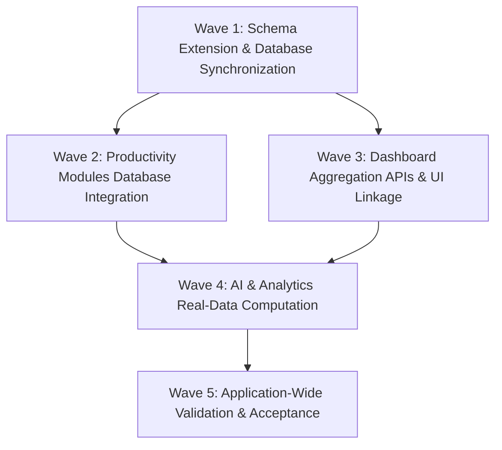

# IMPLEMENTATION WAVE PLAN

This plan defines the structured execution sequence to eliminate all remaining hardcoded data, mock fallbacks, and client-only storage across the Master HRMS workspace.

---

## Wave Architecture Overview

---

## Wave 1: Schema Extension & Database Synchronization

### Objectives
- Add missing Prisma models for productivity utilities without affecting existing 159 models.
- Safely update MySQL database schema via `prisma db push`.
- Register new models in tenant proxy configuration.

### Tasks
1. **Prisma Schema Update**:
   - File: `server/prisma/schema.prisma`
   - Add models:
     - `WorkspaceTodo`
     - `WorkspaceNote`
     - `CalendarEvent`
   - Add reverse relations on `Tenant` and `User`.
2. **Tenant Configuration Update**:
   - File: `server/src/config/tenant-models.config.ts`
   - Register `WorkspaceTodo`, `WorkspaceNote`, and `CalendarEvent` under `DIRECT_TENANT_MODELS`.
3. **Database Schema Sync**:
   - Run `npx prisma db push --skip-generate` and `npx prisma generate`.
   - Verify non-destructive schema update against live MySQL `master_hrms`.

---

## Wave 2: Productivity Modules Database Integration

### Objectives
- Build robust, tenant-isolated REST APIs for Workspace Todos, Workspace Notes, and Calendar Events.
- Refactor frontend components from `localStorage` to `@tanstack/react-query` data mutations.

### Tasks
1. **Backend Implementations**:
   - `server/src/routes/todos.routes.ts`: Complete CRUD (`GET /`, `POST /`, `PUT /:id`, `DELETE /:id`).
   - `server/src/routes/notes.routes.ts`: Complete CRUD with pinned, starred, and trash filters.
   - `server/src/routes/calendar.routes.ts`: Complete CRUD with date-range query filters.
   - Register all three routes in `server/src/index.ts` under `/api/todos`, `/api/notes`, and `/api/calendar/events`.
2. **Frontend Refactorings**:
   - `src/routes/_authenticated/_app/todo.tsx`: Eliminate `INITIAL_TODOS` and `localStorage`. Use `useQuery` and `useMutation`.
   - `src/routes/_authenticated/_app/notes.tsx`: Eliminate `INITIAL_NOTES` and `localStorage`. Use `useQuery` and `useMutation`.
   - `src/routes/_authenticated/_app/calendar.tsx`: Connect calendar to `/api/calendar/events`.

---

## Wave 3: Dashboard Aggregation APIs & UI Linkage

### Objectives
- Implement real backend aggregation endpoints for Procurement, Support, IT Admin, and Recruitment.
- Connect 6 dashboard pages to live database metrics and replace all static `.html` links with TanStack Router `<Link>`.

### Tasks
1. **Backend Dashboard Enhancements**:
   - File: `server/src/routes/dashboard.routes.ts`
   - Implement:
     - `GET /api/dashboard/procurement`: Aggregates PO spend, open PO count, active suppliers.
     - `GET /api/dashboard/support`: Aggregates ticket volume, SLA breach count, resolution rates.
     - `GET /api/dashboard/it-admin`: Aggregates asset counts, maintenance statuses, assignments.
     - `GET /api/dashboard/recruitment`: Aggregates open job positions, active applicants, offer stage metrics.
2. **Frontend Dashboard Connections**:
   - `crm-dashboard.tsx`: Connect to `/api/dashboard/sales-crm`; replace `leads.html` with `<Link to="/crm/leads">`.
   - `project-dashboard.tsx`: Connect to `/api/dashboard/projects`; replace `tasks.html` with `<Link to="/tasks">`.
   - `procurement-dashboard.tsx`: Connect to `/api/dashboard/procurement`; replace static HTML links.
   - `support-dashboard.tsx`: Connect to `/api/dashboard/support`; replace static HTML links.
   - `it-admin-dashboard.tsx`: Connect to `/api/dashboard/it-admin`; replace static HTML links.
   - `recruitment-dashboard.tsx`: Connect to `/api/dashboard/recruitment`; replace static HTML links.

---

## Wave 4: AI & Analytics Real-Data Computation

### Objectives
- Eliminate static sample series in AI insights pages.
- Dynamically calculate trend series from actual database tables.

### Tasks
1. **AI Attendance Insights** (`ai-attendance-insights.tsx`):
   - Replace static `trendSeries` with calculations derived from `/api/attendance` data.
2. **AI Payroll Forecast** (`ai-payroll-forecast.tsx`):
   - Replace static series with historical payroll run data from `/api/payroll/runs`.
3. **AI Team Performance** (`ai-team-performance-insights.tsx`):
   - Replace static series with live rating aggregations.
4. **Learning Analytics** (`learning-analytics.tsx`):
   - Replace static series with course enrollments and completions.

---

## Wave 5: Application-Wide Validation & Acceptance

### Objectives
- Verify that every module compiles cleanly without TypeScript errors.
- Run the full automated test suite (all backend and frontend tests).
- Build the production bundle with Vite.
- Generate final compliance and acceptance reports.

### Tasks
1. Run backend TypeScript check (`npx tsc --noEmit`).
2. Run frontend production build (`npm run build`).
3. Run backend test suite (`npm test`).
4. Write `DATABASE_INTEGRATION_TEST_REPORT.md` and `FINAL_DATABASE_INTEGRATION_REPORT.md`.
